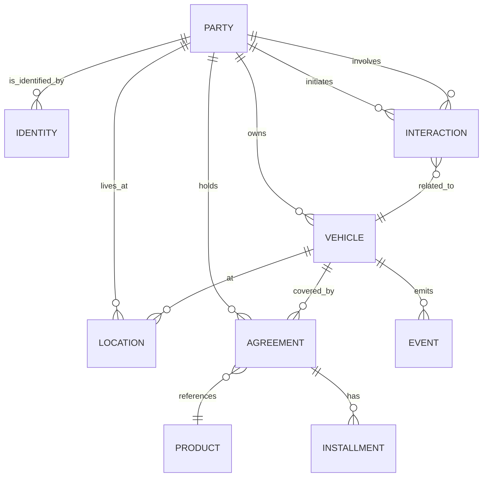

# 4. Data Architecture Document
## Global Customer Unification Platform - Fortune 100 Automotive Manufacturer

**Version:** 1.0  
**Date:** 2026-07-28  
**Architecture Review Board:** Enterprise Salesforce Architecture Council  
**Classification:** Confidential - Board Approved


## 1. Executive Overview

This document defines the enterprise data architecture for 68 million customers, 125 million vehicles, and associated transactional data across 47 countries and 14 brands. It defines the Conceptual Data Model (CDM), Logical Data Model (LDM), Physical Data Model (PDM) considerations, data ownership, data lifecycle, Data Quality framework, and Master Data Management (MDM) strategy.


## 2. Conceptual Data Model (CDM)

### 2.1 Master Data Domains

| Domain | Description | Primary Source of Truth |
|--------|-------------|------------------------|
| **Party** | People, organizations, households | Salesforce Account/Contact (unified) |
| **Vehicle** | Vehicle entities, specifications, telematics | Salesforce Asset + Vehicle Master custom object |
| **Agreement** | Subscription, warranty, loan, lease contracts | Salesforce Subscription + Warranty |
| **Interaction** | Cases, service appointments, campaigns | Salesforce Case, Service Appointment, Campaign |
| **Location** | Dealer, manufacturing, customer address | Salesforce Account (Dealer Location record type) |
| **Identity** | Golden ID, identity mappings | Custom Golden ID object + External ID on Account/Contact |
| **Event** | Platform events, telematics events | Salesforce Platform Events + Big Object archive |
| **Product** | SKU, pricebook, product hierarchy | Salesforce Product2 (standard) |

### 2.2 High-Level ERD (CDM)




## 3. Logical Data Model (LDM)

### 3.1 Primary Entities

| Entity | Salesforce Mapping | Key Attributes |
|--------|--------------------|---------------|
| **Account** | Standard (Account) | IsPersonAccount, AccountNumber, Industry, BillingAddress, ShippingAddress, parentId (hierarchical accounts for dealer groups) |
| **Contact** | Standard (Contact) | FirstName, LastName, Email, Phone, Birthdate, DoNotCall, EmailOptOut, HasOptedOutOfEmail, HasOptedOutOfFax, MailingAddress, MobilePhone |
| **User (Customer)** | Person Account | Combines Account + Contact for individuals |
| **Asset** | Standard (Asset) | VIN (SerialNumber), AccountId, Product2Id, PurchaseDate, InstallationDate, Status, IsDeleted, Quantity |
| **Vehicle Master** | Custom Object | VIN (unique), Make, Model, ModelYear, Trim, Engine, BatteryCapacityKWh, Drivetrain, PaintCode, ProductionPlantId, BodyStyle, GVWR |
| **Case** | Standard (Case) | CaseNumber, Subject, Description, Status, Priority, Origin, ContactId, AccountId, AssetId (custom lookup), IsClosed, ClosedDate, Dealer_Lookup__c (custom lookup to Dealer Location) |
| **Service Appointment** | Standard (Service Appointment) | AppointmentNumber, Status, DurationInMinutes, ArrivalWindowStartTime, ArrivalWindowEndTime, ContactId, AccountId, WorkTypeId, ServiceTerritoryId, ParentRecordId (linked to Case), Dealer__c (custom lookup) |
| **Subscription** | Custom Object (extends Order/OrderItem summary) | ParentId (Account/Contact), AssetId (linked to Vehicle), Name, Status, StartDate, EndDate, AutoRenew, PaymentMethodId, NextBillDate |
| **Warranty** | Custom Object | Name, AccountId, AssetId, Type, Status, StartDate, EndDate, CoverageType, CoverageMiles, CoverageMonths, Deductible, Terms |
| **Recall Campaign** | Custom Object | Name, ManufacturerId, RecallNumber, Title, Description, Status, NHTSA_Campaign_Number__c, Region_Scope__c, Affected_Vehicles_Count__c, Notification_Target__c, Deadline_Date__c |
| **Dealer Location** | Custom Object (or Account record type) | Dealer_Code__c (externalId), Name, AccountId (parent legal entity), Type (Franchise, Service Only), Brands_Authorized__c, Phone, Website, Latitude, Longitude, ServiceHours, PartsHours, IsOpenOnWeekends, Parent_Dealer__c (hierarchy) |
| **Golden ID** | Custom Object (integration key) | Golden_ID__c (externalId, guuid), AccountId (Master), ContactId (Master), Status__c (Active, Merged, Archived), Merge_History__c (JSON), Authoritative_Source__c, Confidence_Score__c, CreatedDate, LastModifiedDate |
| **Customer Consolidated** | Custom Object (MDM staging) | Source_System__c, Source_System_ID__c, FirstName, LastName, Email, Phone, Address, Match_Probability__c, Golden_ID__c, Is_Primary__c, Is_Valid__c, Last_Sync__c |

### 3.2 Entity Attributes (Key Tabular Details)

#### Account Entity (Person + Business)

| Attribute | Data Type | Length | Nullable | Description |
|-----------|-----------|--------|----------|-------------|
| Id | Auto | 18 | No | Salesforce primary key |
| IsPersonAccount | Boolean |  | No | Indicates consumer vs B2B account |
| Name | String | 255 | No | Account name (company or first+last) |
| AccountNumber | String | 40 | Yes | External account identifier |
| Industry | Picklist |  | Yes | B2B industry classification |
| AnnualRevenue | Currency |  | Yes | B2B annual revenue |
| NumberOfEmployees | Integer |  | Yes | B2B employee count |
| BillingStreet | TextArea | 255 | Yes | Billing street |
| BillingCity | String | 40 | Yes | Billing city |
| BillingState | Picklist |  | Yes | Billing state/province |
| BillingPostalCode | String | 20 | Yes | Billing postal code |
| BillingCountry | Picklist |  | Yes | Billing country code |
| ShippingStreet | TextArea | 255 | Yes | Shipping street |
| ShippingCity | String | 40 | Yes | Shipping city |
| ShippingState | Picklist |  | Yes | Shipping state |
| ShippingPostalCode | String | 20 | Yes | Shipping postal code |
| ShippingCountry | Picklist |  | Yes | Shipping country |
| Phone | String | 40 | Yes | Main phone |
| Website | URL | 255 | Yes | Company website |
| OwnerId | Lookup(User) | 18 | No | Record owner |
| CreatedDate | DateTime |  | No | Record creation timestamp |
| LastModifiedDate | DateTime |  | No | Record modification timestamp |
| CreatedById | Lookup(User) | 18 | No | Created by user |
| LastModifiedById | Lookup(User) | 18 | No | Last modified by user |
| Brand__c | Picklist |  | Yes | Brand business unit |
| Region__c | Picklist |  | Yes | Region code |
| Is_Dealer__c | Checkbox |  | Yes | Dealer flag (for Dealer Location) |
| Dealer_Code__c | String | 40 | Yes | External DMS dealer code |
| ParentId | Lookup(Account) | 18 | Yes | Hierarchical parent account |
| MasterRecordId | Lookup(Account) | 18 | Yes | Master record for merged accounts |
| Deletion_Reason__c | Picklist |  | Yes | Hard deletion reason |

#### Contact Entity

| Attribute | Data Type | Length | Nullable | Description |
|-----------|-----------|--------|----------|-------------|
| Id | Auto | 18 | No | Salesforce primary key |
| FirstName | String | 40 | Yes | First name |
| LastName | String | 80 | No | Last name |
| MiddleName | String | 40 | Yes | Middle name |
| Salutation | Picklist |  | Yes | Mr., Ms., Dr., etc. |
| Title | String | 128 | Yes | Job title |
| Email | Email | 80 | Yes | Primary email |
| Phone | Phone | 40 | Yes | Primary phone |
| MobilePhone | Phone | 40 | Yes | Mobile phone |
| Fax | Phone | 40 | Yes | Fax number |
| DoNotCall | Checkbox |  | Yes | Telemarketing exclusion |
| EmailOptOut | Checkbox |  | Yes | Email marketing opt-out |
| HasOptedOutOfEmail | Checkbox |  | Yes | Email opt-out |
| HasOptedOutOfFax | Checkbox |  | Yes | Fax opt-out |
| Birthdate | Date |  | Yes | Date of birth |
| MailingStreet | TextArea | 255 | Yes | Mailing street |
| MailingCity | String | 40 | Yes | Mailing city |
| MailingState | Picklist |  | Yes | Mailing state |
| MailingPostalCode | String | 20 | Yes | Mailing postal code |
| MailingCountry | Picklist |  | Yes | Mailing country |
| AccountId | Lookup(Account) | 18 | No | Associated account |
| ReportsToId | Lookup(Contact) | 18 | Yes | Reporting hierarchy |
| OwnerId | Lookup(User) | 18 | No | Record owner |
| Gender__c | Picklist |  | Yes | Gender (for marketing) |
| Ethnicity__c | Picklist |  | Yes | Ethnicity (marketing) |
| Income_Range__c | Picklist |  | Yes | Self-reported income range |
| Loyalty_Level__c | Picklist |  | Yes | Loyalty tier: Bronze/Silver/Gold/Platinum |
| Is_Consolidated__c | Checkbox |  | Yes | Primary contact in matched set |
| Golden_ID__c | Lookup(Golden_ID__c) | 18 | Yes | Global customer identifier |

#### Asset (Vehicle) Entity

| Attribute | Data Type | Length | Nullable | Description |
|-----------|-----------|--------|----------|-------------|
| Id | Auto | 18 | No | Salesforce primary key |
| Name | String | 80 | No | Display name (Year + Make + Model) |
| SerialNumber | String | 100 | No | VIN (externalID) |
| AccountId | Lookup(Account) | 18 | No | Owner account |
| ContactId | Lookup(Contact) | 18 | Yes | Primary user (if person account) |
| Product2Id | Lookup(Product2) | 18 | Yes | Vehicle product/family |
| PurchaseDate | Date |  | Yes | Date of purchase |
| InstallationDate | Date |  | Yes | Installation date for accessories |
| UsageEndDate | Date |  | Yes | Disposal date |
| Quantity | Number |  | No | Quantity (usually 1) |
| Status | Picklist |  | No | Active, Disposed, Sold, Stolen |
| IsDeleted | Checkbox |  | No | Soft delete flag |
| IsInternal | Checkbox |  | Yes | Internal asset (e.g., test fleet) |
| Description | TextArea(Long) | 32000 | Yes | Asset notes |
| Brand__c | Picklist |  | Yes | Brand of vehicle |
| Model_Year__c | Number | 4 | Yes | Model year |
| Trim_Level__c | String | 50 | Yes | Trim level |
| Color_Exterior__c | String | 50 | Yes | Exterior color |
| Color_Interior__c | String | 50 | Yes | Interior color |
| Mileage__c | Number |  | Yes | Current odometer |
| Mileage_Unit__c | Picklist |  | Yes | Miles or Kilometers |
| Battery_Capacity_kWh__c | Number(L_double) |  | Yes | Battery capacity (EV) |
| Range_Estimate_Miles__c | Number |  | Yes | Estimated range |
| Telematics_Enabled__c | Checkbox |  | Yes | Connected vehicle flag |
| Last_Telematics_Ping__c | DateTime |  | Yes | Last telematics receive |
| Essessories_Installed__c | TextArea(LONG) | 131072 | Yes | Installed accessories list |

#### Case Entity (Service)

| Attribute | Data Type | Length | Nullable | Description |
|-----------|-----------|--------|----------|-------------|
| Id | Auto | 18 | No | Salesforce primary key |
| CaseNumber | Auto | 10 | No | Auto-generated case number |
| Subject | String | 255 | No | Short description |
| Description | TextArea(Long) | 32000 | Yes | Detailed description |
| Status | Picklist |  | No | Status: New, Working, Escalated, Closed, Cancelled |
| Priority | Picklist |  | No | High, Medium, Low |
| Origin | Picklist |  | No | Phone, Email, Web, Dealer Portal |
| ContactId | Lookup(Contact) | 18 | Yes | Primary contact |
| AccountId | Lookup(Account) | 18 | Yes | Account |
| AssetId | Lookup(Asset) | 18 | Yes | Related vehicle |
| OwnerId | Lookup(User/Queue) | 18 | No | Assigned owner |
| IsClosed | Checkbox |  | No | Closed indicator |
| ClosedDate | DateTime |  | Yes | Closure timestamp |
| CreatedDate | DateTime |  | No | Creation timestamp |
| LastModifiedDate | DateTime |  | No | Modification timestamp |
| Type | Picklist |  | Yes | Complaint, Inquiry, Feature Request, Outage |
| SubType__c | Picklist |  | Yes | Roadside, Repair, Warranty, Subscription |
| Dealer_Lookup__c | Lookup(Dealer_Location__c) | 18 | Yes | Dealer handling case |
| Severity__c | Picklist |  | Yes | Severity 1-4 |
| Root_Cause__c | TextArea | 255 | Yes | Root cause summary |
| Resolution_Summary__c | TextArea(Length) |  | Yes | How case was resolved |
| Is_Escalated__c | Checkbox |  | Yes | Has been escalated |
| Escalation_Count__c | Number |  | Yes | Number of escalations |
| Region__c | Picklist |  | Yes | Owner region |
| Language__c | Picklist |  | Yes | Communication language |
| Brand__c | Picklist |  | Yes | Brand owning case |

#### Vehicle Master Entity (Custom)

| Attribute | Data Type | Length | Nullable | Description |
|-----------|-----------|--------|----------|-------------|
| Id | Auto | 18 | No | Salesforce primary key |
| Name | Auto | 80 | No | Vehicle display name |
| VIN__c | String | 17 | No | **VIN (external ID, unique)**, format mask: 17 chars, uppercase, no I/O/Q |
| Make__c | String | 50 | Yes | Vehicle make (Derived from VIN WMI) |
| Model__c | String | 50 | Yes | Vehicle model line |
| Model_Year__c | Number(4) |  | Yes | Model year (Derived from VIN year code) |
| Trim__c | String | 50 | Yes | Trim level |
| Body_Style__c | Picklist |  | Yes | Sedan, SUV, Coupe, Truck, Hatchback, Wagon |
| Engine_Type__c | Picklist |  | Yes | Gasoline, Diesel, Electric, Hybrid, Hydrogen |
| Transmission_Type__c | Picklist |  | Yes | Automatic, Manual, CVT, Single Speed |
| Drivetrain__c | Picklist |  | Yes | FWD, RWD, AWD, 4WD |
| Cylinders__c | Number |  | Yes | Number of cylinders (ICE) |
| Horsepower__c | Number |  | Yes | Horsepower |
| Battery_Capacity_kWh__c | Number(L_double) |  | Yes | Battery capacity (EV) |
| Range_Miles__c | Number |  | Yes | EPA range |
| Charge_Port__c | Picklist |  | Yes | CCS, Tesla NACS, CHAdeMO |
| Charging_Time_Level2__c | String | 20 | Yes | e.g., "8 hours" |
| Charging_Time_DCFC__c | String | 20 | Yes | e.g., "30 min to 80%" |
| Paint_Code__c | String | 20 | Yes | Manufacturer paint code |
| Paint_Name__c | String | 100 | Yes | Paint name (e.g., "Glacier White") |
| Plant_Code__c | String | 5 | Yes | Manufacturing plant code |
| Production_Date__c | Date |  | Yes | Date produced |
| Registration_Status__c | Picklist |  | Yes | Pending, Registered, Exported |
| License_Plate__c | String | 20 | Yes | Current license plate |
| Country__c | Picklist |  | Yes | Registration country |
| GVWR__c | String | 20 | Yes | Gross Vehicle Weight Rating |

#### Subscription Entity (Custom)

| Attribute | Data Type | Length | Nullable | Description |
|-----------|-----------|--------|----------|-------------|
| Id | Auto | 18 | No | Salesforce primary key |
| Name | Auto | 80 | No | Subscription name |
| AccountId | Lookup(Account) | 18 | No | Account |
| ContactId | Lookup(Contact) | 18 | Yes | Primary contact |
| AssetId | Lookup(Asset) | 18 | No | Linked vehicle |
| Subscription_Number__c | String | 30 | No | Subscription number (external ID) |
| Status__c | Picklist |  | No | Draft, Active, Pending, Suspended, Cancelled, Expired |
| Start_Date__c | DateTime |  | No | Subscription start |
| End_Date__c | DateTime |  | Yes | Subscription end (blank = open-ended) |
| Trial_End_Date__c | DateTime |  | Yes | Trial period end |
| Cancel_Date__c | DateTime |  | Yes | Cancellation effective date |
| Auto_Renew__c | Checkbox |  | No | Auto-renewal flag |
| Cancel_At_End__c | Checkbox |  | No | Cancel at term end |
| Cancellation_Reason__c | Picklist |  | Yes | Customer request, non-payment, etc. |
| CurrencyISOCode | Picklist |  | No | ISO 4217 currency code |
| Next_Bill_Date__c | Date |  | Yes | Next billing date |
| Last_Bill_Date__c | Date |  | Yes | Last successful billing |
| Plan_Code__c | String | 30 | No | SKU/plan identifier (external ID) |
| Plan_Name__c | String | 100 | No | Plan display name |
| Plan_Type__c | Picklist |  | No | Recurring, Perpetual, Usage-based |
| Billing_Frequency__c | Picklist |  | No | Monthly, Annual, Weekly |
| Unit_Price__c | Currency |  | No | Price per period |
| Tax_Amount__c | Currency |  | Yes | Tax amount per invoice |
| Discount_Pct__c | Percent |  | Yes | Discount percentage |
| Adjusted_Price__c | Currency |  | Yes | Net price after discount |
| Payment_Status__c | Picklist |  | No | Paid, Pending, Failed, Refunded |
| Payment_Method_Type__c | Picklist |  | Yes | Credit Card, ACH, PayPal, Invoice |

#### Golden ID Entity (Custom)

| Attribute | Data Type | Length | Nullable | Description |
|-----------|-----------|--------|----------|-------------|
| Id | Auto | 18 | No | Salesforce primary key |
| Golden_ID__c | String | 36 | No | **External ID, UUID v4 format, globally unique** |
| AccountId__c | Lookup(Account) | 18 | No | Master Account (Person Account for consumer) |
| ContactId__c | Lookup(Contact) | 18 | No | Master Contact |
| Status__c | Picklist |  | No | Active, Merged, Suspended, Archived |
| Confidence_Score__c | Number(L_double) |  | Yes | 0-100 match confidence |
| Authoritative_Source__c | String | 50 | No | Source system that initiated: MDM, SystemA, SystemB |
| Merge_History__c | LongTextArea | 131072 | Yes | JSON array of merge events |
| Last_Match_Attempt__c | DateTime |  | Yes | Last time match algorithm ran |
| Last_Match_Result__c | Picklist |  | Yes | Matched, Unmatched, PartialMatch |
| CreatedDate | DateTime |  | No | Record creation timestamp |
| CreatedById | Lookup(User) | 18 | No | Created by |
| LastModifiedDate | DateTime |  | No | Modified timestamp |
| LastModifiedById | Lookup(User) | 18 | No | Modified by |


## 4. Physical Data Model (PDM) Considerations

### 4.1 Salesforce Storage Estimates

| Object | Estimated Records | Storage per Record | Total Storage | Notes |
|---------|-------------------|--------------------|---------------|-------|
| Account (Person Accounts) | 52M | ~3 KB | ~156 GB | Includes Mailing/Other address |
| Contact (Person Account=TRUE) | 16M | ~2 KB | ~32 GB | Non-Person contacts (dealers, B2B) |
| Asset (Vehicle) | 125M | ~4 KB | ~500 GB | Large due to description, telematics lookup fields |
| Case | 50M (annual) / ~100M active/last 2 years | ~2 KB | ~200 GB | Keep rolling 2 years; archive older as Big Object |
| Service Appointment | 20M (annual) | ~2 KB | ~40 GB |
| Subscription | 40M active | ~3 KB | ~120 GB |
| Warranty | 125M | ~2 KB | ~250 GB |
| Recall Campaign | 5,000 (historical) | ~1 KB | ~5 MB | Few, but related records large |
| Vehicle Master (custom) | 125M | ~2 KB | ~250 GB |
| Dealer Location | 11,500 | ~5 KB | ~58 MB | | N/A |
| Golden ID | 68M | ~1 KB | ~68 GB |
| Customer Consolidated | 200M (source records) | ~2 KB | ~400 GB | Aggregated from all source systems |
| Platform Event (VehicleEvent) | 10B (5-yr historical) | ~1 KB | ~10,000 GB | Stored in Platform Event Storage; accessible for 72 hours, archived to S3 |
| Platform Event (all other events) | ~500M | ~1 KB | ~500 GB | |

**Total Estimated Storage:** ~1.1 TB (excludes archived event data in S3).

### 4.2 Salesforce Footprint Management

| Mechanism | Purpose | Volume |
|-----------|---------|--------|
| **Contacts merge into Person Accounts** | Reduce dual Account/Contact per person | 16M contacts merged (archive then delete) |
| **Case archival** | Move closed Case > 2 years old to Big Object (Case_History__b) | ~75M |
| **Asset archival** | Move Asset where Status = "Disposed" and sold > 1 year ago to Big Object (Asset_History__b) | ~10M |
| **Platform Event TTL** | Events in Platform Event storage >72 hours automatically deleted; raw data retained in S3 for 7 years | ~10 billion events |
| **Data Cloud** | Offload: telemetry raw data, full engagement history, all marketing interaction history, all clickstream | Unlimited (massively parallel) |
| **Big Objects** | Archive: Case, Asset historical records; vehicle recall audit history | Up to 1 billion |

### 4.3 Data Cloud Storage and Modeling

| Data Space | Purpose | Estimated Records | Update Frequency |
|------------|---------|-------------------|------------------|
| **Customer 360 Space** | Unified customer profile (all PII) | 68M customers | Near-real-time (event stream) |
| **Vehicle 360 Space** | Vehicle registrations, specifications | 125M vehicles | Batch (daily) + async (event) |
| **Interaction Space** | Service requests, appointments | 50M/year | Real-time (stream ingest) |
| **Engagement Space** | Marketing interactions, consent, preferences | 250M/year | Real-time |
| **Subscriber Space** | Subscription details, usage, billing | 40M active | Batch nightly |

Data Cloud ingest pipelines:
- **Streaming Source:** MuleSoft Platform Events → Data Cloud Streaming Ingestion (real-time)
- **Batch Source:** Salesforce Bulk API data export → S3 → Data Cloud batch ingest (nightly)
- **Connected Source:** Salesforce (v2) native connection; pulls Account, Contact, Asset, Case, Subscription

## 5. Data Ownership Model

### 5.1 Ownership by Object

| Object | Data Owner | Business Owner | Steward |
|--------|------------|----------------|---------|
| Golden ID, Customer Consolidated | MDM Team | VP of Customer Experience | Customer Experience Analytics Lead |
| Account, Contact | CRM Admin (by Region) | Regional Customer Lead | Data Governance Council |
| Asset, Vehicle Master | Product Data Team (by Region) | VP of Quality / Product | Data Governance Council |
| Case, Service Appointment | Service Cloud Admin | VP of Customer Service | Service Operations Lead |
| Subscription | Subscription Management Team | VP of Connected Services | Revenue Operations |
| Warranty | Warranty Systems Team | VP of Quality | Quality Data Steward |
| Recall Campaign | Quality/Product Recall Team | VP of Regulatory Affairs | Recall Coordinator |
| Dealer Location | Dealer Operations | VP of Dealer Network | Dealer Ops Data Steward |
| Data Cloud objects | Data Cloud Admin | Chief Data Officer | Data Stewards per domain |

### 5.2 Change Management

- All object-level or field-level changes to the LDM require **Architecture Review Board approval**
- Changes to custom objects must include**: migration script, data mapping, test plan** (see change management policy)
- Data Governance Council (DGC) meets monthly to review schema changes

### 5.3 Record Ownership and Access

- **Record Owner:** Auto-assigned by Region/Brand rules; manually re-assignable by Salesforce administrators
- **Org-Wide Defaults (OWD):** Private for Account, Asset, Case, Subscription (non-dealer visibility controlled by sharing rules)
- **Dealer Location:** Controlled by parent Account hierarchy


## 6. Data Lifecycle Management

### 6.1 Creation

- **Authoritative sources:** Salesforce Service Cloud (cases), ERP (vehicles, production), DMS (dealers), MuleSoft (telematics, warranty), MDM (identity)
- **Data entry:** Primarily system-generated; manual entries into Account, Contact, Case via Lightning Experience, Customer Portal, Dealer Portal, or mobile app
- **Validation:** Validation Rules + Apex triggers enforce mandatory fields + format (e.g., VIN must be 17 chars)
- **Referential integrity:** Lookup relationships valid (no orphan records) enforced at database level

### 6.2 Retention

| Object | Retention Period | Action After Retention |
|--------|------------------|------------------------|
| Account | Indefinite (legal entity life + 7 years) | None (kept live) |
| Contact | Indefinite (copy of Person Account fields, same as Account) | None |
| Asset | Indefinite (vehicle life + 7 years) | None (status = "Disposed" after transfer/sale) |
| Case | **Active retention = 2 years** | Move to **Case_History__b** (Big Object) via nightly batch |
| Service Appointment | **Active retention = 2 years** | Move to **Big Object** |
| Subscription | **Active + 7 years** (financial audit) | Archive to S3 via Data Loader; case closed = 7 years |
| Warranty | Lifetime of vehicle + 10 years | Archive to S3 via Data Loader |
| Recall Campaign | **10 years** (NHTSA legal requirement) | Archive to S3; remove fields from active SF |
| Vehicle Master | Indefinite | None |
| Platform Events | **72 hours** in Platform Event Storage | Archive raw payload to S3 (7 years); parsed data in Data Cloud |
| Golden ID | Indefinite | None |
| Customer Consolidated | Refresh daily; history retained for 90 days for audit | Purge >90 day stale records (null OutboundId) |

### 6.3 Archival

**Process:**
1. Scheduled Apex/Batch identifies eligible records (e.g., `Case.Status = "Closed"` AND `ClosedDate < LAST_N_DAYS:730`)
2. Creates JSON payload (all fields + audit metadata)
3. Uploads to **S3 Glacier Deep Archive** (bucket: `global-auto-archival-prod`) with prefix `salesforce/<object_name>/year/YYYY/MM/`
4. Updates Salesforce record with `Is_Archived__c = TRUE` and `Archive_URL__c` (presigned S3 URL with 1-hour expiry for retrieval)
5. Validates archiving via custom metadata flag `Archival_Enabled__c`

**Retrieval:**
- Legal requests: initiated via Salesforce Flow or Apex; S3 batch job retrieves and processes
- Estimated retrieval time: S3 Standard < 1 minute; Glacier Deep Archive < 12 hours

## 7. Data Quality Framework

### 7.1 Data Quality Dimensions (DAMA-DMBOK)

| Dimension | Definition | Measurement Method |
|-----------|-----------|--------------------|
| **Completeness** | All required fields populated | Field population percentage per object; threshold = 95% |
| **Validity** | Data conforms to allowed values | Validation Rule pass rate; picklist field usage |
| **Uniqueness** | No duplicate customer/vehicle records | Golden ID match ratio; dedup queue size |
| **Accuracy** | Data reflects real-world truth | MDM confidence score; external validation (address verification, VIN decode) |
| **Consistency** | Data same across systems | Cross-system matching (Salesforce vs Data Cloud vs ERP) |
| **Timeliness** | Data current | Staleness indicator (days since last update) per record |
| **Integrity** | Referential consistency | Orphan record checking (e.g., Case with AccountId that doesn't exist) |

### 7.2 Data Quality Tools and Processes

**Automated DQ Checks (Apex Scheduler - hourly/daily):**

```apex
// Example: DQ job for Account completeness
global class DataQualityAccountBatch implements Database.Batchable<SObject>, Database.Stateful {
    global Database.QueryLocator start(Database.BatchableContext bc) {
        return Database.getQueryLocator('SELECT Id, Name, Phone, Email, BillingStreet, BillingCity, BillingPostalCode, BillingCountry FROM Account WHERE IsPersonAccount = TRUE');
    }
    global void execute(Database.BatchableContext bc, List<Account> scope) {
        List<Data_Quality_Metric__c> metrics = new List<Data_Quality_Metric__c>();
        for (Account acc : scope) {
            Data_Quality_Metric__c m = new Data_Quality_Metric__c();
            m.Record_ID__c = acc.Id;
            m.Object_Type__c = 'Account';
            m.Missing_Fields__c = ''; // compute
            m.Timestamp__c = System.now();
            metrics.add(m);
        }
        insert metrics;
    }
    global void finish(Database.BatchableContext bc) {}
}
```

**DQ Dashboard (Tableau CRM):**
- **Golden ID match rate:** % of contacts with Golden ID
- **Missing VIN:** Count of Asset where SerialNumber is null
- **Invalid Email:** Expression-based (contains @ and domain has dot)
- **Duplicate detection:** Query same email or phone across Contacts; display match score
- **Compliance alerting:** GDPR right-to-be-forgotten request status; data residency violations

### 7.3 Data Quality Remediation

| Issue | Detection | Remediation |
|-------|-----------|-------------|
| Duplicate Account/Contact | Automated dedup batch (Apex) | Merge via standard Lead/Contact merge or Dadela account merge |
| Invalid VIN | Validation Rule (17-char alphanumeric, no I/O/Q) | Block creation; notify user; queue for MDM bulk correction |
| Invalid email/phone | Weekly batch regex check | Quarantine record; send consent request to confirm correct email/phone |
| Missing required field (Brand/Region) | Validation Rule | Block save; surface error in UI |
| Stale data (not updated in 90 days) | Data Cloud alert | Flag for review; automatic archival if > 180 days and account inactive |
| Broken lookup (invalid Asset on Case) | Apex batch weekly | Reassign to null; create Platform Event for CRM admin investigation |
| Unverified address | Via address verification service (SmartyStreets API) | Block save with error; auto-retry 3 times; timeout to manual review |

## 8. Master Data Management (MDM) Strategy

### 8.1 Golden ID Design

The **Golden ID** is a globally unique, immutable customer identifier. One Golden ID maps to one master Account (Person Account) and one master Contact.

```
Golden ID (UUID v4) -> Master Account (Person Account)
                       -> Master Contact (consolidated from 3 sources)
```

**Golden ID Generation:**
- Created by **Identity Resolution Manager** component in Data Cloud
- Initial trigger: When two or more person records from different source systems are matched with > 85 confidence
- Format: `550e8400-e29b-41d4-a716-446655440000` (UUID v4)
- Stored as Salesforce GUID (text 36 with externalId=true)

**Identity Resolution Flow:**
```mermaid
flowchart LR
    A[Source A ERP] -->|Records| B[Customer Consolidated]
    C[Source B CRM] -->|Records| B
    D[Source C Dealer Portal] -->|Records| B
    B -->|Batch daily| E[Data Cloud Identity Resolution]
    E -->|Match: >85% confidence| F[Golden ID Hook (Flow)]
    F -->|Create/Update| G[Golden ID (master)]
    G -->|Lightning Trigger| H[Master Account + Master Contact]
    H -->|Merge| I[Customer Unified View]
```

### 8.2 Identity Resolution Rules

**Match Keys (ordered by confidence):**
1. **Exact match on Golden ID (from prior system):** Confidence = 100%
2. **Exact match on SSN/Tax ID + Last Name + DOB:** Confidence = 95%
3. **Exact match on Email (normalized to lowercase):** Confidence = 90%
4. **Soft match on Phone + Name (Levenshtein < 3):** Confidence = 85%
5. **Fuzzy match on First Name + Last Name + Address (street, city, postal):** Confidence = 70%
6. **Fuzzy match on Email prefix + Address:** Confidence = 65%

**Merge Strategy:**
- **Winner:** Source system with highest authority (configurable per brand via Custom Metadata)
- **Losers:** Records marked `Is_Primary__c = FALSE` in Customer Consolidated; not deleted but retained for audit
- **Customer Consolidated** retains all source records; Golden ID points to winner only

### 8.3 Identity Reconciliation

Upon Golden ID creation/change:
- **Master Account** set as Account.IsPersonAccount = TRUE with consolidated Name, Email, Phone, Address
- **Source Accounts** flagged as `IsDuplicate__c = TRUE` (but not deleted during transition period; kept for 12 months)
- **Cases, Assets, Opportunities** moved to master via Apex trigger
- **Platform Event `CustomerUnified`** published for downstream consumers (Data Cloud, marketing systems)
- **Audit trail:** All merge events logged in `customerMerger.Logger` custom object with before/after JSON

### 8.4 Identity Governance

| Control | Implementation |
|--------|--------------|
| **Master Account immutability** | Master Account.Name, .Email, .Phone writeable only via MDM automated process (validation rules + Apex trigger checking MDM source) |
| **Golden ID uniqueness** | External ID (unique) on Golden_ID__c; trigger prevents duplicate creation |
| **Identity change approval** | Changes to Authoritative_Source__c require DGC approval via Flows |
| **Opt-out handling** | Customer with GDPR "right to be forgotten" triggers Platform Event → delete from all master systems; Golden ID retained as tombstone for audit |
| **Cross-brand identity** | Brand-specific attributes (Loyalty, preferences) stored on Account as custom fields; do not conflict with master fields |

## 9. Data Security and Privacy

### 9.1 Data Classification

| Classification | Examples | Protection Level |
|----------------|----------|-----------------|
| Public | Vehicle model information, dealer names | Shared with Anyone via Guest User (public website) |
| Internal | Service appointment times, vehicle location (aggregated) | Authenticated internal users only |
| Confidential | Customer name, vehicle VIN, phone number | Shown only to roles with explicit need; masked in reports |
| Restricted | Payment info, SSI, driving behavior, biometrics | Encrypted (Shield); tokenized in external systems; access only to specific jobs |

### 9.2 Data Residency (47 Countries)

| Data Category | Residency Rule | Salesforce Implementation |
|---------------|----------------|---------------------------|
| Customer PII | Must remain in customer's country/region | Data Cloud Data Space + Data Cloud Regional Configuration; Salesforce Shield for field-level encryption |
| Vehicle telematics | Must remain in vehicle's primary registration region | Data Cloud Data Space ingestion routing based on VIN/region |
| Warranty records | Manufacturer requires legal retention in origin country | Region-specific archival configuration |
| Marketing consent | GDPR/CCPA jurisdiction-specific | Stored in Data Cloud with region flag; Agentforce respects locale |

### 9.3 Data Masking

| Object | Context | Masking Rule |
|--------|---------|--------------|
| Account.Email | Integration user | Masked: `j***@***.com` in logs |
| Contact.Phone | Dev/Sandbox refresh | Replaced with `(555) 019-9999` via sandbox template |
| Asset.VIN | Report export | Last 5 characters visible only: `1HGBH41JXMN*****` |
| Customer.CreditCard | All environments | Never stored; stored in payment gateway only |
| Custom field SSN__c | All | NotFound in deployment; `***-**-****` in all screens |

## 10. Appendix: Glossary

| Term | Definition |
|------|-----------|
| **CDM** | Conceptual Data Model - high-level entities and relationships |
| **LDM** | Logical Data Model - entities, attributes, relationships without physical implementation |
| **PDM** | Physical Data Model - storage-specific details, indexes, partitioning |
| **MDM** | Master Data Management - process for governing master data |
| **Golden ID** | Globally unique, immutable customer identifier |
| **Person Account** | Salesforce Account with IsPersonAccount=true, representing an individual consumer |
| **Big Object** | Salesforce large-scale storage for billions of records, asynchronous query |
| **Data Space** | Data Cloud logical container for brand/regional data isolation |
| **Data Cloud** | Salesforce CDP platform (formerly Customer 360 Audiences) |
| **Platform Event** | Salesforce event-driven messaging (pushTopic replacement) |
