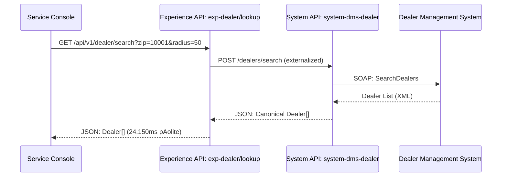
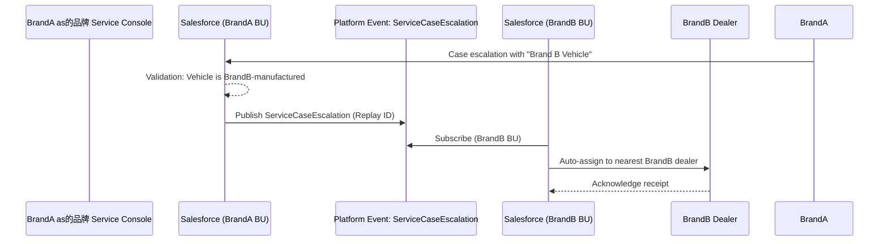
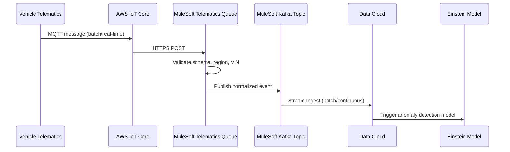
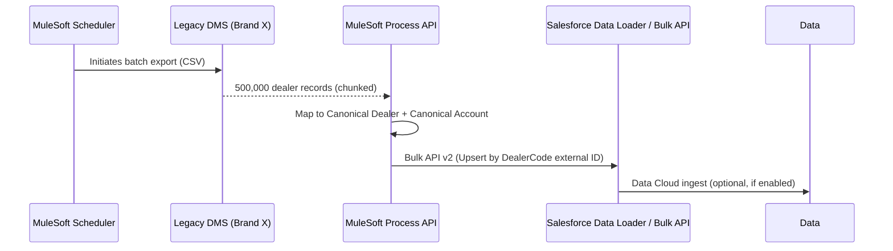
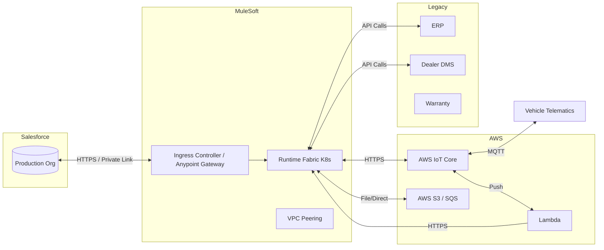

# 2. Integration Design Document
## Global Customer Unification Platform - Fortune 100 Automotive Manufacturer

**Version:** 1.0  
**Date:** 2026-07-28  
**Architecture Review Board:** Enterprise Salesforce Architecture Council  
**Classification:** Confidential - Board Approved


## 1. Executive Overview

This document defines the enterprise integration architecture connecting Salesforce, MuleSoft, legacy systems, Data Cloud, and external ecosystems. It addresses the complexity of 20+ ERP/MRP/DMS systems across 47 countries, raw telematics streams from 125 million vehicles, and real-time dealer requirements. The architecture targets zero business disruption, 25% cost reduction, and scalability for two future EV acquisitions.


## 2. MuleSoft Architecture Overview

### 2.1 Architectural Pattern: API-Led Connectivity

The integration fabric follows the **API-led connectivity** model with three foundational layers:

```
[System APIs] (Expose backend systems)
        |
        v
[Process APIs] (Orchestrate business processes)
        |
        v
[Experience APIs] (Consumable by Salesforce, Agentforce, mobile apps)
```

### 2.2 Runtime Fabric Deployment

- **Primary Region:** AWS US-East-1 (primary Salesforce region)
- **Secondary Region:** AWS EU-West-1 (for GDPR/EU data residency)
- **Tertiary Region:** AWS AP-Southeast-1 (APAC, Japan, South Korea, Australia)
- **Deployment:** MuleSoft Runtime Fabric on self-managed Kubernetes (not CloudHub)
  - Rationale: Required for VPC peering with Salesforce Private Connect, granular network control, and compliance

### 2.3 Hub-and-Spoke Structure

| Environment | Purpose | Runtime | Nodes |
|-------------|---------|---------|-------|
| Production | Live traffic | Runtime Fabric (on K8s) | 8 nodes primary, 4 nodes secondary |
| Staging | Pre-prod, load test | Runtime Fabric | 4 nodes |
| Dev | Developer testing | Runtime Fabric | 2 nodes |
| Shared Services | Reusable connectors | Runtime Fabric | 2 nodes |

### 2.4 Anypoint Platform Components

| Component | Purpose | License |
|-----------|---------|---------|
| API Manager | Publishing, proxy, governance | Included in MuleSoft license |
| Design Center | RAML/OAS authoring | Included |
| Exchange | Asset repository | Included |
| Runtime Manager | Ops, monitoring, autoscaling | Included |
| MUnit | Testing framework | Included |
| Anypoint Monitoring | Observability, dashboards | Included |
| API Governance | Policy enforcement | Included |

## 3. API-Led Connectivity Layers

### 3.1 System APIs

Expose canonical data models from backend systems. Each System API owns its data persistence contract.

| System API Name | Backend System | Protocol | Data Model |
|-----------------|----------------|----------|------------|
| system-erp-vehicle | Manufacturing ERP (SAP or similar) | REST/HTTPS | Canonical Vehicle |
| system-erp-inventory | ERP | REST/HTTPS | Canonical Inventory |
| system-dms-dealer | Dealer Management System (brand-specific) | REST/HTTPS, SOAP | Canonical Dealer |
| system-warranty | Warranty system per brand/region | REST/HTTPS | Canonical Warranty |
| system-roadside | Roadside dispatch system | REST/HTTPS | Canonical Roadside |
| system-payment | Payment gateway | REST/HTTPS | Canonical Payment |
| system-loyalty | Customer loyalty program | REST/HTTPS | Canonical Loyalty |
| system-telematics-ingest | AWS IoT Core / Azure IoT | REST (POST) | Canonical Telematics Event |
| system-email | Email service provider | SMTP/API | Canonical Email |
| system-sms | SMS service provider | REST/HTTPS | Canonical SMS |
| system-push | Push notification service | REST/HTTPS | Canonical Push |

### 3.2 Process APIs

Compose System APIs to fulfill business transactions. Process APIs implement journey logic and coordinate cross-system state.

| Process API Name | Purpose | Orchestration Method |
|------------------|---------|----------------------|
| process-vehicle-onboarding | New vehicle created in ERP → Salesforce Asset + Data Cloud profile | MuleSoft Batch + Salesforce Composite API |
| process-customer-identity-unification | Called when three identity sources agree on a customer identity | Choreography (event-driven) |
| process-service-request-receipt | Customer contact → Case create → Dealer confirm → Roadside dispatch | Orchestration via MuleSoft Flow with error handling |
| process-recall-management | Recall launch → Vehicle matching → Customer notification → Dealer fix tracking | MuleSoft Batch Process |
| process-subscription-provisioning | Order create → Subscription activate → Benefit unlock | Orchestration (tight sync) |
| process-telematics-pipeline | Raw events → normalized → enriched → stored in Data Cloud | Event-driven (Kafka/MQ or queue-based) |
| process-dealer-sync | DMS change → Dealer Location + Account sync → Push to dealer portal | MuleSoft Batch |

### 3.3 Experience APIs

Shape and adapt data for specific consumers, reducing coupling between Salesforce and MuleSoft.

| Experience API Name | Consumer | Key Fields Exposed |
|---------------------|----------|--------------------|
| exp-vehicle/profile | Salesforce Service Cloud, Customer Portal | AccountId, VIN, Model, Model Year, Trim, Subscription Status |
| exp-vehicle/subscription | Sales Console, Marketing Journey Builder | SubscriptionId, Plan, Start Date, End Date, Benefit Status |
| exp-customer/unified | Data Cloud, Einstein, Agentforce | Golden ID, Name, Email, Phone, Address, Consent Status, Lifetime Value |
| exp-dealer/lookup | Dealer Portal (Lightning Web Component) | Dealer Code, Name, Location, Brands Authorized, Stock Count |
| exp-service/case-lightning | Service Console | Case Number, Status, Subject, Priority, Asset, Dealer |
| exp-marketing/journey | Marketing Cloud Journey Builder | Customer Email, Segment, Product Interest, Offer Eligibility |
| exp-integration/dealer-search | Mobile app | Dealer Name, Distance, Services, Contact |

## 4. Integration Patterns

### 4.1 Synchronous Integration

Used for operational requirements with immediate response needs.

**Discovery API (synchronous):**



**Contract:** Synchronous API transaction must complete within 2 seconds (Salesforce callout timeout limit). If DMS returns more than 500 records, paginate. For >5000 records, fall back to async batch.

**Service stitch (Salesforce Named Credential):**
Salesforce Named Credential points to MuleSoft Experience API URL with OAuth 2.0 client credentials. MuleSoft publishes to Salesforce as a Connected App with certificate-based authentication. All outbound Salesforce callouts use Named Credential for URL rotation without deployment.

### 4.2 Asynchronous (Event-Driven) Integration

Used for decoupled brand communication and heavy processing.

**Brand-to-Brand Service Handoff (Async Platform Events):**



**Telematics Ingestion (async queue-based):**



### 4.3 Bulk Data Synchronization (Batch)

Used for daily sales data, overnight dealer cust sync, periodic warranty extracts.

**Daily Dealer Sync Batch Flow:**



**Batch design patterns:**
- Poll each DMS via batch (poll scope → transform → batch job step)
- Batch job step chunk size: 10,000 records (within Salesforce Bulk API v2 limits)
- Error handling: Dead letter queue per DMS; retry 3x with exponential backoff (5 min, 25 min, 2 hours)
- Monitoring: Anypoint Monitoring alerts if batch completes in >2 hours (threshold)

## 5. Middleware Design

### 5.1 MuleSoft Application Architecture

Package MuleSoft applications by domain:

| Mule Application | Depends on | Deployed Region | Required |
|------------------|------------|-----------------|----------|
| mule-erp-vehicle | system-erp-vehicle | All | Yes |
| mule-dealer-sync | system-dms-dealer | All | Yes |
| mule-telematics-ingest | system-telematics-ingest | All | Yes |
| mule-subscription-provisioning | system-payment, process-vehicle-onboarding | All | Yes |
| mule-recall-management | system-warranty, system-erp-vehicle | All | Yes |
| mule-service-request-receipt | system-dms-dealer, system-roadside | All | Yes |
| mule-connect-auth | Internal use only | All | Yes |
| mule-data-cloud-bridge | Salesforce Connect, Data Cloud REST API | All | Yes |

### 5.2 MuleSoft Runtime Fabric Configuration

| Setting | Value | Rationale |
|---------|-------|-----------|
| Worker Type | 0.1 vCore | minimum |
| Worker Count | 8 production | per region |
| Ingress | Anypoint VPC + Private Link | avoid internet exposure |
| Egress | VPC Peering to AWS VPC (Salesforce Private Connect equivalent) | low latency to Salesforce and AWS |

### 5.3 Cache Strategy

| Cache Scope | Use Case | TTL |
|-------------|----------|-----|
| Object Store (MuleSoft) | Brand config, region config, SLA tier lookup | 24 hours (refresh nightly) |
| HTTP Caching (API Manager policy) | GET responses with ETag for dealer lookup, vehicle specs | 300 seconds |
| Connection Pool | HTTP connector pooling for legacy ERP | Idle timeout 30 seconds, max 200 |

## 6. Retry Strategy

### 6.1 Retry Pattern: Exponential Backoff with Circuit Breaker

Apply at three levels:

**A. HTTP Callout Retry (MuleSoft HTTP Request)**
- Retries: 3 total
- Backoff: 1s, 5s, 25s with random jitter (±500ms)
- Circuit breaker: Open after 5 consecutive failures; half-open after 60s
- Error codes retried: 429 (rate limit), 5xx (server error)
- Error codes NOT retried: 4xx (client error), 401 (auth), 403 (forbidden)

**B. Salesforce API Retry (MuleSoft Salesforce Connector)**
- Idempotent operations only (GET, POST with idempotency key, PATCH with external ID)
- Retries: 2 total (Salesforce requests count toward API limits; be conservative)
- Backoff: 2s, 10s
- Error codes retried: 429 (API rate limit), 503 (service unavailable)
- Use Bulk API v2 for large payloads (no retry on bulk job within application; check batch job status)

**C. Database/File System Retry**
- Retries: 5 total
- Backoff: 2s, 4s, 8s, 16s, 32s
- Apply for transient database connection errors

### 6.2 Platform Event Retry

Platform Events guarantee at-least-once delivery. MuleSoft subscriber must:
- Make consumption idempotent (deduplicate by Replay ID)
- Persist processed Replay ID per partition to avoid reprocessing
- Use `Commit` scope to ensure checkpoint only after downstream success

## 7. Error Handling

### 7.1 Error Classification by MuleSoft

| Error Category | MuleSoft Handling | Salesforce Notification |
|----------------|-------------------|------------------------|
| **Transient (retryable)** | Automatic retry with backoff | None (continue silently) |
| **Business validation** | Publish to DLQ; surface to Salesforce Case via Platform Event | Create Case with error details |
| **Schema mismatch** | Log and DLQ | Email to Integration Team |
| **Auth failure** | Alert; rotate credential if expired | None (secure alerting only) |
| **Circuit breaker open** | Return cached data if TTL valid; else HTTP 502/503 | N/A (proxied to caller) |

### 7.2 Salesforce-Side Error Handling

**Platform Event handler (Apex trigger + handler):**
```apex
trigger VehicleEventHandler on VehicleEvent__e (after insert) {
    List<VehicleEventHandler.Request> requests = new List<VehicleEventHandler.Request>();
    for (VehicleEvent__e event : Trigger.new) {
        requests.add(new VehicleEventHandler.Request(event));
    }
    VehicleEventHandler.processRequests(requests);
}
```

Handler logic:
- Wrap in try-catch for individual record processing
- For hard failures (data validation, governor limit), publish `VehicleEventRetry` with retry count
- If 3 retries consumed, publish `VehicleEventDeadLetter` platform event (for Data Cloud or external monitoring)
- Log error details to `Integration_Error_Log__c` custom object with full stack trace and replay ID

**Named Credential error handling:**
- Named Credential with `Generate Authorization Header` and `Allow Admin Nomination`
- Callout failures log to `Callout_Log__c` object (custom) with HTTP status, response body, request ID
- Alert via Salesforce Platform Events → Slack/Mulesoft Monitoring

### 7.3 Error Logging Standard

All error logs across MuleSoft and Salesforce include:

| Field | Format |
|-------|--------|
| Timestamp | ISO 8601 UTC |
| Correlation ID | Unique per transaction (MuleSoft correlation ID forwarded) |
| Component | MuleSoft app / Salesforce trigger name |
| Error Code | HTTP status + internal code |
| Message | Human-readable description |
| Payload | Redacted (no PII) |
| Stack Trace | Full (stored in secure log, available 30 days) |

## 8. Dead Letter Queue (DLQ)

### 8.1 DLQ Strategy: Two-Tier

**Tier 1: MuleSoft Queue DLQ (AWS SQS / MuleSoft Queue)**
- Primary failure storage within MuleSoft
- Auto-retry every 15 minutes for up to 24 hours
- After 24 hours, route to Tier 2

**Tier 2: Salesforce Platform Event DLQ**
- Store failed messages as `Integration_Error__e` or custom object `Dead_Letter_Queue__c`
- Retry manually via MuleSoft console or Apex batch
- Time-based replayer (scheduled Apex reads DLQ objects, re-publishes to original topic)

### 8.2 DLQ Monitoring Dashboard

Key metrics:
- **DLQ depth:** Alert if >100 messages in DLQ for any queue
- **Age:** Alert if any message in DLQ > 24 hours (escalate to Integration Team)
- **Retry rate:** Alert if retry rate > 5% of total throughput

## 9. Connectivity and Security

### 9.1 Network Architecture



### 9.2 Secret Management

- MuleSoft secrets (client secrets, database passwords) stored in Anypoint Secrets Manager (encrypted, versioned)
- Salesforce Named Credentials reference Anypoint Vault by attribute
- AWS secrets (IoT certificates, IAM keys) stored in AWS Secrets Manager with IAM access
- Rotation policy: 90 days for all secrets; immediate rotation on personnel change

## 10. Observability and Monitoring

### 10.1 MuleSoft Observability Stack

| Tool | Use Case |
|------|----------|
| Anypoint Monitoring | API performance, error rate, latency per endpoint |
| Anypoint API Governance | Enforcement of rate limits, query limits, header policies |
| Prometheus + Grafana | Runtime Fabric node and pod metrics (custom) |
| Splunk/ELK | Centralized log aggregation from MuleSoft and Salesforce (via Platform Events) |

### 10.2 Salesforce Monitoring

| Tool | Use Case |
|------|----------|
| Event Monitoring | API usage, login, performance |
| Platform Events to MuleSoft | Push high-severity errors to Slack/Splunk in near-real time |
| Salesforce Optimizer | Weekly automated review for health |
| MuleSoft Connector | Monitor callout rate, timeouts |

### 10.3 Alerting Thresholds

| Metric | Green | Yellow | Red |
|--------|-------|--------|-----|
| MuleSoft API latency p95 | < 500ms | 500-1000ms | > 1000ms |
| MuleSoft error rate | < 0.1% | 0.1-1% | > 1% |
| Salesforce DLQ depth | < 10 | 10-50 | > 50 |
| Telematics event lag | < 5 min | 5-15 min | > 15 min |
| ERP sync lag | < 30 min | 30-120 min | > 2 hours |
| Salesforce callout rate | < 70% of limit | 70-85% | > 85% |

## 11. Performance and Scalability

### 11.1 Throughput Targets

| Integration | Target Throughput | Peak | Notes |
|-------------|-------------------|------|-------|
| Telematics events (normal) | 500 events/sec | 5,000 events/sec | Non-critical; buffered 5 min |
| Telematics events (critical - crash/airbag) | 50 events/sec | 500 events/sec | Real-time, immediate processing |
| CRM API calls (MuleSoft→Salesforce) | 200 req/min | 500 req/min | Within Salesforce governor limits |
| Dealer DMS sync | 50K records/hour | 100K records/hour | Nightly batch |
| Vehicle onboarding | 1,000 new/create per hour | 5,000 per hour | New model day; Scales via Bulk API |
| User login (SSO via MuleSoft proxy) | 50 logins/sec | 500 logins/sec | Not for standard; SSO via MuleSoft IdP proxy |

### 11.2 Capacity Planning

- **Works nodes** autoscale based on CPU and queue depth
- **API rate limits** enforced at Anypoint API Manager (RL = X requests per client per window)
- **Salesforce API** allocation: Monitor daily via Event Monitoring; escalation to Salesforce if nearing org limits
- **Data Cloud:** Streaming ingest supports 1M+ records/sec; use batch ingest for >100K per day

## 12. Future Migration: Acquisition Support

### 12.1 Acquisition Integration Playbook

New EV manufacturer acquisition requires:

| Activation | Action | Timeline | Owner |
|------------|--------|----------|-------|
| **Isolation** | Deploy new MuleSoft VPC per acquisition | Day 1 | Cloud/Integration team |
| **Data Replication** | Replication from source systems to MuleSoft System APIs without writing to Salesforce | Week 1-4 | Data Engineering |
| **Lightweight Unified View** | Create Brand BU in Salesforce; enable limited Data Cloud ingestion for visibility | Week 4-6 | CRM Admin |
| **Customer Unification** | Link accounts via Golden ID mapping | Week 6-12 | MDM Team |
| **Full Integration** | Enable all telematics, warranty, dealer processes | Month 4+ | Integration Team |

### 12.2 Zero-Disruption Migration Strategy

```mermaid
flowchart LR
    A[Legacy System] -->|Dual Write| B[MuleSoft System API]
    B -->|Canonical Data| C[MuleSoft Process API]
    C -->|Read Only| D[Salesforce Read View]
    C -->|Write Enable| D[Salesforce Write Capability]
    D -->|Data Cloud Unification| E[CDP]
    E -->|AI & Action| F[Agentforce]

    style A fill:#f9f,stroke:#333,stroke-width:2px
    style D fill:#bbf,stroke:#333,stroke-width:2px
    style E fill:#bfb,stroke:#333,stroke-width:2px
```


