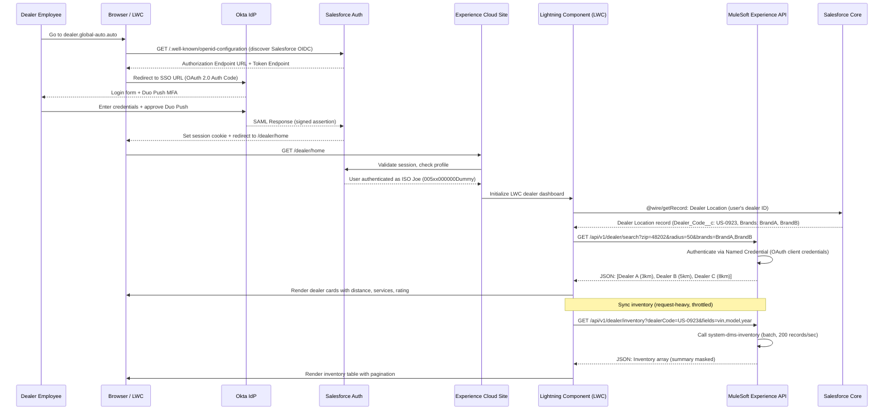
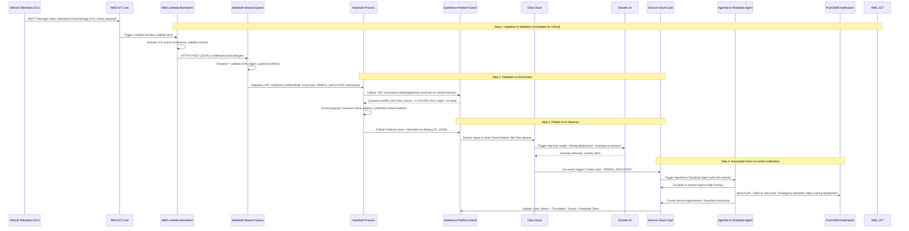

# 6. Sequence Diagrams (Mermaid)
## Global Customer Unification Platform - Fortune 100 Automotive Manufacturer

**Version:** 1.0  
**Date:** 2026-07-28  
**Architecture Review Board:** Enterprise Salesforce Architecture Council  
**Classification:** Confidential - Board Approved


## 1. Customer Unification Flow

A new customer registers on Brand A's website, and the system resolves their existing identity across Brand B and Brand C, creating a unified customer profile with Golden ID.

```mermaid
sequenceDiagram
    participant C as Customer
    participant Web as BrandA Website
    participant Mule as MuleSoft API Gateway
    participant SF as Salesforce Service Cloud
    participant DC as Data Cloud
    participant CRM_B as BrandB CRM
    participant CRM_C as BrandC CRM

    C->>Web: Register / Update Profile (First Name, Last Name, Email, Phone)
    Web->>Mule: POST /customer/register
    Note over Mule,SF: Step 1: Server-side validation & identity bridging
    Mule->>SF: POST /customer/unified/search (query email, phone)
    SF->>CRM_B: (via MuleSoft) Check if customer exists in BrandB
    SF->>CRM_C: (via MuleSoft) Check if customer exists in BrandC
    CRM_B-->>SF: Matched? (Yes, 1 match)
    CRM_C-->>SF: Matched? (No)

    Note over Mule,SF: Step 2: Identity resolution & matching
    SF-->>Mule: Partial match: BrandB (85% confidence), BrandC: no match
    Mule->>DC: Initiate Identity Resolution (Data Cloud Identity Match)
    DC-->>Mule: Match Result: BrandB record (confidence: 92%)
    Mule->>Mule: Create Golden ID (UUID v4)

    Note over Mule,SF: Step 3: Create/merge master record
    Mule->>SF: POST /customer/golden-id/activate (Golden ID, master Account, master Contact)
    SF-->>Mule: Golden ID Created (golden-550e8400-e29b)
    Mule->>Mule: Link BrandB Customer to Golden ID; mark as non-primary

    Note over Mule,SF: Step 4: Publish event & unify data
    Mule->>SF: Publish Platform Event: CustomerUnified
    SF->>Web: Return registration success + unified profile summary
    Web->>C: Welcome email + "Your account is now unified across [3] brands"
```


## 2. Dealer Portal Authentication

Dealer employee authenticates via SSO, accesses dealer-specific vehicle inventory and customer service cases.




## 3. Connected Vehicle Telematics Ingestion

Vehicle sends telematics event (airbag deployment - critical); process flows through AWS IoT Core, MuleSoft, Data Cloud, triggers Agentforce.




## 4. Service Case Escalation

Service agent escalates a complex electrical issue from Brand A to Brand B's technical team (cross-brand escalation via Platform Events).

```mermaid
sequenceDiagram
    participant Agent as Service Agent (BrandA)
    participant UI as Service Console (LWC)
    participant SF as Salesforce Core (BrandA BU)
    participant PF as Platform Event (ServiceCaseEscalation)
    participant SF_B as Salesforce Core (BrandB BU)
    participant Dealer as BrandB Dealer
    participant Mule as MuleSoft
    participant User as BrandB Technician

    Agent->>UI: Click "Escalate to Brand B Decision"
    UI->>SF: PATCH /services/data/vXX.X/sobjects/Case/{caseId}
    SF->>SF: Validation: Case.Asset is Brand B-manufactured vehicle? YES
    SF->>SF: Validation: User has 'service:write' scope? YES
    SF->>PF: Publish ServiceCaseEscalation event (Replay ID: 67890)
    Ordernote: Event Data Fields: {caseId, VIN, brand: BrandB, reason: "Electrical issue requires specialist", region: na-east}
    SF_B->>PF: Subscribe to ServiceCaseEscalation (BrandB BU subscriber)
    PF-->>SF_B: Event received (Replay ID confirmed)
    Note over SF_B,Dealer: Step 1: Dealer assignment within BrandB
    SF_B->>Mule: POST /api/v1/dealer/search?zip=48202&services=service&brand=BrandB
    Mule->>Mule: Authenticate via Named Credential; query DMS for BrandB service dealers
    Mule-->>SF_B: Dealer ID: dealer-0923 (BrandB Downtown)
    SF_B->>SF_B: Assign Case to dealer-0923 queue (BrandB Service Queue)
    SF_B->>Dealer: (via MuleSoft or direct) Send dealer notification (email/SMS)
    Dealer-->>SF_B: Dealer acknowledges: "We'll inspect on 2026-08-02"

    Note over SF_B,User: Step 2: BrandB specialist review
    SF_B->>User: Assign Case to BrandB Senior Technician
    User->>SF_B: Add comment: "Request X-ray diagnostics per BrandB manual"
    User->>SF_B: Update Case: Status = "Under Diagnostics"

    Note over SF_B,SF: Step 3: Cross-BU sync (BrandB updates visible to BrandA for audit)
    SF_B->>PF: Publish CaseStatusChange event (BrandB BU)
    SF_B->>SF: PATCH (cross-BU sharing) Case.comments += "BrandB update: diagnosis pending"
    SF->>Agent: Case detail view updated (BrandB comments visible)
```


## 5. Marketing Journey with Unified Identity

Customer completes service appointment; intelligent journey triggers cross-brand upsell without duplicate identification.

```mermaid
sequenceDiagram
    participant Customer as Customer
    participant Service as Service Cloud
    participant DC as Data Cloud
    participant Journey as Marketing Cloud
    participant Wait as Wait/Pause
    participant Decision as Decision Split
    participant Email as Email Studio
    participant Mule as MuleSoft
    participant Dealer as Dealer

    Note over Service,DC: Step 1: Service event triggers Journey entry
    Service->>Service: Service Appointment marked "Completed"
    Service->>DC: Publish: ServiceAppointmentCompleted event (platform event to Data Cloud)
    DC->>DC: Unify by Golden ID; confirm consent (marketing=yes, telematics=yes)
    DC->>Journey: Trigger Journey Entry: "Post-Service Cross-Sell"
    Journey->>Journey: Wait until 7 days post-service

    Note over Decision,Dealer: Step 2: Journey decision logic
    Journey->>DC: Query engine: Does customer own BrandA vehicle? [Yes]
    Journey->>DC: Query engine: Does customer already have BrandA Subscription? [No]
    Journey->>DC: Query engine: Is customer in high-value segment (LTV > $100k)? [Yes]
    Decision->>Journey: Path: Brand A Connected Services Offer
    Journey->>Customer: Send Email: "Exclusive offer: 3-month Connected Safety Plus"

    Note over Email,Mule: Step 3: Offer redemption via dealer
    Customer->>Email: Clicks link "Redeem with dealer"
    Email->>Journey: Clicks tracked in Email Studio + Data Cloud engagement
    Journey->>Mule: GET /api/v1/dealer/search?zip={customer-location}&brand=BrandA&services=sales
    Mule-->>Journey: Dealer list (nearest: dealer-0923)
    Journey->>Dealer: Create Account: Customer + Linked Dealer Lead
    Dealer->>Customer: Follow-up call within 24 hours
    Customer->>Dealer: Books sales appointment

    Note over DC,Service: Step 4: Subscription provisioning
    Dealer->>Service: Close sales Opportunity (Vehicle + Subscription bundle)
    Service->>DC: Publish: SubscriptionChange event (plan=ConnectedSafetyPlus, action=Create)
    DC->>DC: Update engagement history; validate consent
    DC->>Journey: Update journey member status: "Converted"
    Service->>Mule: POST /subscription/{subId}/activate (benefits)
    Mule->>Mule: Validate payment, initiate backend activation
    Mule-->>Service: Subscription Active
    Service->>Customer: Send confirmation email: "Your subscription is active"
```


## 6. Subscriber Consent & Data Residency Flow

GDPR data processing request flows from Data Cloud through Salesforce to MuleSoft, ensuring residency compliance for an EU customer.

```mermaid
sequenceDiagram
    participant Customer as EU Customer
    participant Portal as Experience Cloud Portal (EU deployment)
    participant SF as Salesforce Core (EU nodes)
    participant DC as Data Cloud (EU Data Space)
    participant Mule as MuleSoft
    participant Legacy as Legacy Brand CRM (BrandC, Germany)

    Customer->>Portal: Update Privacy Preferences (Data Processing Consent: NO)
    Portal->>SF: POST /services/data/vXX.X/sobjects/Contact/{contactId}
    Note over SF,DC: Salesforce processes request with EU-local encryption
    SF->>SF: Run trigger: ConsentTrigger; validate jurisdiction (region=eu-west)
    SF->>DC: Publish: ConsentChange event (to EU Data Space; data residency enforced)
    DC->>DC: Update unified customer profile: consent.dataProcessing = FALSE
    DC->>DC: Isolate profile from global AI models (residency constraint)

    Note over DC,Mule: Step 1: Propagate to backend systems (within EU)
    DC->>Mule: Publish Platform Event: ConsentUpdate (region: eu-west)
    Mule->>Legacy: Call (BrandC GDPR-compliant API endpoint in Germany) REQUEST ICSR removal
    Legacy-->>Mule: 200 OK (data processing disabled in BrandC)

    Note over Mule,SF: Step 2: Confirm & audit
    Mule->>SF: Write Audit Log: Consent_Audit__c (customerId, old consent, new consent, timestamp, region)
    SF->>Portal: Return: "Your data processing preferences updated."
    Portal->>Customer: Display confirmation + privacy dashboard summary
```


## 7. Real-Time Dealer Inventory Sync

Dealer location updates its vehicle inventory through DMS; the change propagates to Dealer Portal, Salesforce, and Data Cloud in real-time.

```mermaid
sequenceDiagram
    participant DMS as Dealer DMS (Legacy)
    participant Connector as MuleSoft DMS Connector
    participant Mule as MuleSoft Process API
    participant SF as Salesforce (Dealer Location + Asset)
    participant Portal as Dealer Portal LWC
    participant DC as Data Cloud

    DMS->>Connector: New vehicle VIN noted: sold to customer, inventory decremented
    Connector->>Mule: Bulk event: inventory-update (dealerCode: US-0923, VIN: 1HGBH41JXMN194251, status: SOLD)
    Note over Mule,SF: MuleSoft processes in real-time (or 5-min batch)
    Mule->>Mule: Validate dealerCode exists in Salesforce (Account lookup)
    Mule->>Mule: Validate VIN 17-char format; lookup Vehicle Master
    Mule->>SF: PATCH /services/data/vXX.X/sobjects/Asset/assetId/
            Status=Purchased, AccountId={Golden ID resolved}
    SF->>SF: Validation trigger: ensure Account is Person Account, VIN exists
    SF-->>Mule: 200 OK (Asset updated)
    Note over SF,Portal: Real-time update to dealer portal
    Mule->>SF: Publish Platform Event: DealerUpdate (to BrandA BU)
    SF->>Portal: @wire refresh: Dealer Dashboard inventory count updated (via Platform Event)
    Portal->>Portal: Update UI: inventoryCount -= 1; show banner "Vehicle sold to [John Doe]"
    Note over DC,DC: Step 3: Data Cloud ingestion
    DC}-->>SF: (via Streaming Ingest) Inventory change event to Data Cloud Sales data space
    DC->>DC: Update brand performance aggregates (dealer-0923 sales increased by 1)
    DC->>SF: (near real-time) Einstein forecast: dealer-0923 will need 2 more units this month
```


## 8. Appendix: Diagram Usage Guide

These sequence diagrams serve multiple purposes:

| Diagram | Primary Audience | Use Case |
|---------|------------------|-----------|
| Customer Unification | Engineering, MDM, CRM | Understand identity matching flow; debug Golden ID creation |
| Dealer Portal Authentication | Security, UX, Dealer Ops | Understand SSO flow; debug login issues |
| Connected Vehicle Telematics | Engineering, IoT, Data Team | Understand real-time event pipeline; latency monitoring |
| Service Case Escalation | Service Ops, Integration | Understand cross-BU event flow; debug escalation failures |
| Marketing Journey | Marketing, Data Cloud | Understand consent-gated journey flow; privacy compliance review |
| Consent & Residency | Legal, Privacy, Data Team | Understand GDPR/CCPA propagation; audit trail for DPA |
| Dealer Inventory Sync | Dealer Ops, Integration | Understand real-time sync; debug inventory discrepancy |

**Reading convention:**
- **Bold brackets** = component communication
- **Note blocks** = key step annotations
- **Dashed lines** = return response or async ack
- **Order notation** (e.g., Ordernote:) = important metadata attached to event
