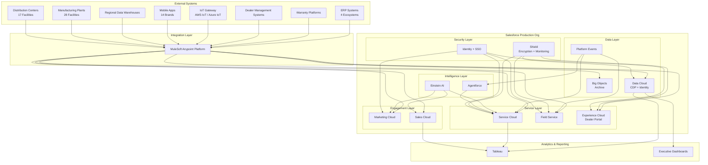

# High Level Design (HLD)
**Global Customer Unification Platform**
**Version:** 1.0
**Date:** 2026-07-28
**Status:** Board Approved

---

## 1. System Context Diagram



## 2. Capability Model

### 2.1 Capability Map

| Domain | Capability | Description | Target State |
|--------|-----------|-------------|--------------|
| **Identity** | Unified Customer Identity | Single golden customer ID across all brands | 68M unified records |
| **Identity** | Single Sign-On | Unified login for customers, employees, dealers | 1 identity provider |
| **Identity** | Identity Governance | Manual review workflows for low-confidence matches | 95%+ auto-match rate |
| **Customer Data** | Customer 360 | Unified customer profile with all interactions | Real-time profile |
| **Customer Data** | Vehicle 360 | Unified vehicle profile with service history | 125M vehicle records |
| **Customer Data** | Data Residency | Regional data zones for 47 countries | Compliance by design |
| **Customer Data** | Data Quality | Automated cleansing, deduplication, validation | 95%+ data quality score |
| **Service** | Unified Case Management | Single case view across all brands | 40% reduction in handle time |
| **Service** | Knowledge Management | Unified knowledge base across brands | Self-service deflection 30% |
| **Service** | Omnichannel Routing | Intelligent routing across channels | First-contact resolution 80% |
| **Service** | Roadside Assistance | Unified dispatch and tracking | 50% faster response |
| **Sales** | Unified Lead Management | Single lead view across brands | 30% conversion improvement |
| **Sales** | Opportunity Management | Cross-sell/upsell across brands | 25% revenue increase |
| **Field Service** | Unified Scheduling | Single schedule for all brands | 20% efficiency gain |
| **Field Service** | Mobile Workforce | Unified mobile app for technicians | 15% productivity gain |
| **Marketing** | Unified Campaign Management | Single customer view for campaigns | 50% duplicate reduction |
| **Marketing** | Journey Orchestration | Brand-specific journeys on unified data | Personalized at scale |
| **Marketing** | Consent Management | Unified consent across all touchpoints | GDPR/CCPA compliant |
| **Dealer** | Unified Dealer Portal | Single portal for multi-brand dealers | 35% productivity gain |
| **Dealer** | Dealer Onboarding | Streamlined onboarding for new dealers | 50% time reduction |
| **Connected Vehicle** | Telematics Integration | Real-time vehicle data ingestion | 125M vehicles connected |
| **Connected Vehicle** | Predictive Maintenance | AI-driven maintenance predictions | 20% cost reduction |
| **Connected Vehicle** | Recall Management | Automated recall coordination | 100% automation |
| **Analytics** | Global CLV Reporting | Customer lifetime value across brands | Real-time dashboards |
| **Analytics** | Operational Dashboards | Unified operational metrics | 9 regional centers unified |
| **Analytics** | Predictive Analytics | Churn, maintenance, fraud prediction | Einstein-driven insights |
| **AI/ML** | Service Automation | Agentforce for routine inquiries | 40% handle time reduction |
| **AI/ML** | Einstein Recommendations | AI-driven product and service recommendations | 25% conversion lift |

### 2.2 Capability Maturity Model

| Capability | Current State | Target State | Timeline |
|-----------|--------------|--------------|----------|
| Identity Unification | Fragmented (3 providers) | Unified golden ID | Months 1-3 |
| Customer 360 | Non-existent | Real-time unified profile | Months 4-6 |
| Service Unification | Brand-specific | Unified across brands | Months 4-6 |
| Marketing Unification | Siloed campaigns | Identity-based orchestration | Months 7-9 |
| Dealer Portal | Brand-specific portals | Unified portal | Months 4-6 |
| Connected Vehicle | Brand-specific telematics | Unified vehicle cloud | Months 4-6 |
| Global Analytics | Fragmented reports | Unified Tableau + Data Cloud | Months 7-9 |
| AI/Automation | Minimal | Einstein + Agentforce | Months 7-18 |

---

## 3. Component Model

### 3.1 Architecture Components

#### 3.1.1 Identity Foundation Layer
```
┌─────────────────────────────────────────────────────────────┐
│                   IDENTITY FOUNDATION                        │
├─────────────────────────────────────────────────────────────┤
│  ┌─────────────┐    ┌─────────────┐    ┌─────────────┐      │
│  │   MDM       │    │   Identity  │    │   Identity  │      │
│  │   Engine    │───▶│  Resolution │───▶│   Bridge    │      │
│  │             │    │   Rules     │    │  (Legacy)   │      │
│  └─────────────┘    └─────────────┘    └─────────────┘      │
│         │                   │                   │            │
│  ┌─────────────┐    ┌─────────────┐    ┌─────────────┐      │
│  │  Survivorship│    │  Confidence │    │  Governance │      │
│  │   Rules     │    │   Scoring   │    │   Workflows │      │
│  └─────────────┘    └─────────────┘    └─────────────┘      │
│         │                   │                   │            │
│  ┌─────────────┐    ┌─────────────┐                          │
│  │   Golden     │    │   Legacy     │                          │
│  │   Customer   │◀──│   Identity   │                          │
│  │     ID       │    │   Mapping    │                          │
│  └─────────────┘    └─────────────┘                          │
└─────────────────────────────────────────────────────────────┘
```

#### 3.1.2 Salesforce Core Layer
```
┌─────────────────────────────────────────────────────────────┐
│                  SALESFORCE PRODUCTION ORG                   │
├─────────────────────────────────────────────────────────────┤
│                                                             │
│  ┌─────────────┐  ┌─────────────┐  ┌─────────────┐         │
│  │   Service    │  │    Sales    │  │  Marketing  │         │
│  │    Cloud     │  │    Cloud    │  │    Cloud    │         │
│  │             │  │             │  │             │         │
│  │ • Cases     │  │ • Leads     │  │ • Journeys  │         │
│  │ • Knowledge │  │ • Opps      │  │ • Campaigns │         │
│  │ • Live Agent│  │ • Accounts  │  │ • Mobile    │         │
│  │ • Agentforce │  │ • Contacts  │  │ • Email     │         │
│  └─────────────┘  └─────────────┘  └─────────────┘         │
│                                                             │
│  ┌─────────────┐  ┌─────────────┐  ┌─────────────┐         │
│  │    Field     │  │ Experience  │  │    Agent    │         │
│  │    Service   │  │    Cloud    │  │   Force     │         │
│  │             │  │             │  │             │         │
│  │ • Work Orders│  │ • Dealer    │  │ • Service   │         │
│  │ • Scheduling │  │   Portal    │  │ • Sales     │         │
│  │ • Inventory  │  │ • Customer  │  │ • Field     │         │
│  │ • Mobile     │  │   Portal    │  │ • Recall    │         │
│  └─────────────┘  └─────────────┘  └─────────────┘         │
│                                                             │
│  ┌─────────────┐  ┌─────────────┐                           │
│  │  Platform    │  │    Big      │                           │
│  │   Events     │  │   Objects   │                           │
│  │             │  │             │                           │
│  │ • Async      │  │ • Historical│                           │
│  │ • Integration│  │ • Archive   │                           │
│  │ • IoT Events │  │ • Telemetry │                           │
│  └─────────────┘  └─────────────┘                           │
│                                                             │
│  ┌─────────────────────────────────────────────┐            │
│  │              Custom Objects                   │            │
│  │  • Unified_Customer__c                       │            │
│  │  • Unified_Vehicle__c                        │            │
│  │  • Identity_Mapping__c                       │            │
│  │  • Brand_Business_Unit__c                    │            │
│  │  • Service_History__c                        │            │
│  └─────────────────────────────────────────────┘            │
│                                                             │
└─────────────────────────────────────────────────────────────┘
```

#### 3.1.3 Data Cloud Layer
```
┌─────────────────────────────────────────────────────────────┐
│                    DATA CLOUD (CDP)                          │
├─────────────────────────────────────────────────────────────┤
│                                                             │
│  ┌─────────────────────────────────────────────────────┐   │
│  │              Regional Data Zones                      │   │
│  │  ┌─────────────┐  ┌─────────────┐  ┌─────────────┐   │   │
│  │  │  Americas   │  │    EMEA     │  │    APAC     │   │   │
│  │  │   Zone      │  │    Zone     │  │    Zone     │   │   │
│  │  │             │  │             │  │             │   │   │
│  │  │ • US/CA     │  │ • EU/UK     │  │ • JP/KR     │   │   │
│  │  │ • BR (LGPD) │  │ • DE/FR     │  │ • AU        │   │   │
│  │  │ • MX/AR     │  │ • Other EU  │  │ • Other APAC│   │   │
│  │  └─────────────┘  └─────────────┘  └─────────────┘   │   │
│  └─────────────────────────────────────────────────────┘   │
│                                                             │
│  ┌─────────────────────────────────────────────────────┐   │
│  │              Identity Resolution                      │   │
│  │  ┌─────────────┐  ┌─────────────┐  ┌─────────────┐   │   │
│  │  │   Graph     │  │  Matching   │  │Survivorship │   │   │
│  │  │   API       │  │   Rules     │  │   Rules     │   │   │
│  │  └─────────────┘  └─────────────┘  └─────────────┘   │   │
│  └─────────────────────────────────────────────────────┘   │
│                                                             │
│  ┌─────────────────────────────────────────────────────┐   │
│  │              Data Sources                             │   │
│  │  ┌─────────────┐  ┌─────────────┐  ┌─────────────┐   │   │
│  │  │ Salesforce  │  │   MuleSoft  │  │   External  │   │   │
│  │  │   Streams   │  │  Streaming  │  │  Connectors │   │   │
│  │  └─────────────┘  └─────────────┘  └─────────────┘   │   │
│  └─────────────────────────────────────────────────────┘   │
│                                                             │
│  ┌─────────────────────────────────────────────────────┐   │
│  │              Unification Outputs                      │   │
│  │  • Unified Customer Profile                          │   │
│  │  • Unified Vehicle Profile                           │   │
│  │  • Identity Resolution Results                       │   │
│  │  • Calculated Insights (CLV, etc.)                   │   │
│  └─────────────────────────────────────────────────────┘   │
│                                                             │
└─────────────────────────────────────────────────────────────┘
```

#### 3.1.4 Integration Layer
```
┌─────────────────────────────────────────────────────────────┐
│                    MULESOFT ANYPOINT                         │
├─────────────────────────────────────────────────────────────┤
│                                                             │
│  ┌─────────────────────────────────────────────────────┐   │
│  │              API-Led Connectivity                     │   │
│  │  ┌─────────────┐  ┌─────────────┐  ┌─────────────┐   │   │
│  │  │   System    │  │   Process   │  │ Experience  │   │   │
│  │  │   APIs      │  │   APIs      │  │   APIs      │   │   │
│  │  │             │  │             │  │             │   │   │
│  │  │ • ERP       │  │ • Service   │  │ • Dealer    │   │   │
│  │  │   Connectors│  │   Orchestration│  │   Portal   │   │   │
│  │  │ • Warranty  │  │ • Identity  │  │ • Mobile    │   │   │
│  │  │   Systems   │  │   Resolution│  │   Apps      │   │   │
│  │  │ • DMS       │  │ • Analytics │  │ • Customer  │   │   │
│  │  │   Systems   │  │   Aggregation│  │   Portal    │   │   │
│  │  └─────────────┘  └─────────────┘  └─────────────┘   │   │
│  └─────────────────────────────────────────────────────┘   │
│                                                             │
│  ┌─────────────────────────────────────────────────────┐   │
│  │              Event Processing                         │   │
│  │  • IoT Event Ingestion                               │   │
│  │  • Platform Event Routing                            │   │
│  │  • Async Processing                                   │   │
│  │  • Circuit Breakers / Retry Logic                     │   │
│  └─────────────────────────────────────────────────────┘   │
│                                                             │
│  ┌─────────────────────────────────────────────────────┐   │
│  │              Governance                               │   │
│  │  • API Management                                    │   │
│  │  • Runtime Monitoring                                 │   │
│  │  • Security Policies                                  │   │
│  │  • Rate Limiting                                      │   │
│  └─────────────────────────────────────────────────────┘   │
│                                                             │
└─────────────────────────────────────────────────────────────┘
```

---

## 4. Data Flow

### 4.1 Customer Unification Data Flow

```
┌──────────────┐     ┌──────────────┐     ┌──────────────┐
│   Brand A    │     │   Brand B    │     │   Brand C    │
│   Systems    │     │   Systems    │     │   Systems    │
│ (Legacy CRM) │     │ (Legacy CRM) │     │ (Legacy CRM) │
└──────┬───────┘     └──────┬───────┘     └──────┬───────┘
       │                     │                     │
       │   Batch/Real-time   │   Batch/Real-time   │
       │   via MuleSoft      │   via MuleSoft      │
       ▼                     ▼                     ▼
┌──────────────────────────────────────────────────────────┐
│                    MuleSoft ESB                          │
│              (Data Ingestion & Transformation)            │
└──────────────────────────┬───────────────────────────────┘
                           │
                           │ Streaming / Batch
                           ▼
┌──────────────────────────────────────────────────────────┐
│                   Salesforce Data Cloud                  │
│                                                          │
│  ┌─────────────┐    ┌─────────────┐    ┌─────────────┐   │
│  │   Identity  │───▶│   Unified   │───▶│   Golden    │   │
│  │ Resolution  │    │   Customer  │    │   Record    │   │
│  │   Engine    │    │   Profile   │    │             │   │
│  └─────────────┘    └─────────────┘    └─────────────┘   │
│         │                  │                   │          │
│         │   ┌──────────────┼──────────────┐    │          │
│         │   │              │              │    │          │
│         ▼   ▼              ▼              ▼    │          │
│  ┌─────────────┐    ┌─────────────┐    ┌─────────────┐   │
│  │  Calculated │    │  Unified    │    │  Calculated │   │
│  │   CLV       │    │  Segments   │    │   Propensity│   │
│  └─────────────┘    └─────────────┘    └─────────────┘   │
│                                                          │
└──────────────────────────────────┬───────────────────────┘
                                   │
                                   │ Real-time Sync
                                   ▼
┌──────────────────────────────────────────────────────────┐
│              Salesforce Production Org                   │
│                                                          │
│  ┌─────────────┐    ┌─────────────┐    ┌─────────────┐   │
│  │ Unified_Cust│    │  Marketing  │    │    Tableau  │   │
│  │  __c Object │    │   Cloud     │    │ Dashboards  │   │
│  │  (Golden ID)│    │  Connect    │    │             │   │
│  └─────────────┘    └─────────────┘    └─────────────┘   │
│                                                          │
└──────────────────────────────────────────────────────────┘
```

### 4.2 Connected Vehicle Data Flow

```
┌────────────────┐     ┌────────────────┐     ┌────────────────┐
│   125M         │     │   IoT Gateway  │     │    MuleSoft    │
│  Connected      │───▶│  (AWS/Azure)   │───▶│  Streaming     │
│   Vehicles     │     │                │     │   Layer        │
└────────────────┘     └────────────────┘     └───────┬────────┘
                                                       │
                              ┌───────────────────────┼───────────────────────┐
                              │                       │                       │
                              ▼                       ▼                       ▼
                       ┌─────────────┐         ┌─────────────┐         ┌─────────────┐
                       │  Platform   │         │  Data Cloud │         │  External   │
                       │   Events    │         │  (Aggregate)│         │  Storage    │
                       │  (Alerts)   │         │  Metrics    │         │  (Raw Data) │
                       └──────┬──────┘         └─────────────┘         └─────────────┘
                              │                       │
                              │                       │
                              ▼                       ▼
                       ┌─────────────┐         ┌─────────────┐
                       │  Agentforce │         │   Tableau   │
                       │  (Recall/   │         │ Dashboards  │
                       │  Service)   │         │             │
                       └─────────────┘         └─────────────┘
```

### 4.3 Dealer Integration Data Flow

```
┌─────────────────────────────────────────────────────────────┐
│                    DEALER ECOSYSTEM                          │
├─────────────────────────────────────────────────────────────┤
│                                                             │
│  ┌──────────────────────────────────────────────────────┐  │
│  │  Existing Dealer Integrations (24-month lock)        │  │
│  │  ┌─────────────┐  ┌─────────────┐  ┌─────────────┐   │  │
│  │  │ Brand A DMS │  │ Brand B DMS │  │ Brand C DMS │   │  │
│  │  │ Integration │  │ Integration │  │ Integration │   │  │
│  │  └─────────────┘  └─────────────┘  └─────────────┘   │  │
│  │         │                  │                  │        │  │
│  │         │  (UNCHANGED)     │  (UNCHANGED)     │        │  │
│  │         ▼                  ▼                  ▼        │  │
│  │  ┌──────────────────────────────────────────────────┐  │  │
│  │  │         Legacy Dealer Management Systems         │  │  │
│  │  └──────────────────────────────────────────────────┘  │  │
│  └──────────────────────────────────────────────────────┘  │
│                                                             │
│  ┌──────────────────────────────────────────────────────┐  │
│  │  New Unified Dealer Portal (Experience Cloud)        │  │
│  │                                                      │  │
│  │  ┌─────────────┐  ┌─────────────┐  ┌─────────────┐   │  │
│  │  │   Unified    │  │   Dealer    │  │   Service   │   │  │
│  │  │   Customer   │  │  Scheduling │  │  Catalog    │   │  │
│  │  │    View      │  │             │  │             │   │  │
│  │  └─────────────┘  └─────────────┘  └─────────────┘   │  │
│  │                                                      │  │
│  │  Connected via: MuleSoft Dealer API Facade            │  │
│  └──────────────────────────────────────────────────────┘  │
│                                                             │
└─────────────────────────────────────────────────────────────┘
```

---

## 5. Integration Landscape

### 5.1 Integration Matrix

| Source System | Integration Type | Protocol | Frequency | Data Volume | MuleSoft API Layer |
|---------------|-----------------|----------|-----------|-------------|-------------------|
| **ERP Systems (4)** | SOAP/REST | HTTPS | Real-time/Batch | High | Process API |
| **Warranty Platforms** | REST | HTTPS | Real-time | Medium | Process API |
| **Dealer Management (Legacy)** | Various | Vendor-specific | Batch | Medium | System API (read-only) |
| **Dealer Portal (New)** | REST | HTTPS | Real-time | High | Experience API |
| **IoT Gateway** | MQTT/WebSocket | MQTT | Streaming | Very High | System API |
| **Mobile Apps (14)** | REST | HTTPS | Real-time | High | Experience API |
| **Regional Data Warehouses** | REST | HTTPS | Daily Batch | High | System API |
| **Manufacturing Systems** | REST/SOAP | HTTPS | Daily Batch | Medium | System API |
| **Distribution Centers** | REST | HTTPS | Daily Batch | Medium | System API |

### 5.2 MuleSoft API-Led Connectivity

```
┌─────────────────────────────────────────────────────────────────────────┐
│                         MULESOFT ANYPOINT PLATFORM                       │
├─────────────────────────────────────────────────────────────────────────┤
│                                                                         │
│  ┌───────────────────────────────────────────────────────────────────┐ │
│  │  EXPERIENCE APIs (Exposed to Salesforce / External Consumers)     │ │
│  │  ┌─────────────┐  ┌─────────────┐  ┌─────────────┐               │ │
│  │  │  Dealer API │  │  Customer   │  │   Vehicle   │               │ │
│  │  │   Facade    │  │   API       │  │    API      │               │ │
│  │  └─────────────┘  └─────────────┘  └─────────────┘               │ │
│  └───────────────────────────────────────────────────────────────────┘ │
│                                    │                                    │
│                                    ▼                                    │
│  ┌───────────────────────────────────────────────────────────────────┐ │
│  │  PROCESS APIs (Orchestration & Business Logic)                    │ │
│  │  ┌─────────────┐  ┌─────────────┐  ┌─────────────┐               │ │
│  │  │   Order     │  │   Service   │  │  Identity   │               │ │
│  │  │  Management │  │  Management │  │ Resolution  │               │ │
│  │  └─────────────┘  └─────────────┘  └─────────────┘               │ │
│  └───────────────────────────────────────────────────────────────────┘ │
│                                    │                                    │
│                                    ▼                                    │
│  ┌───────────────────────────────────────────────────────────────────┐ │
│  │  SYSTEM APIs (Core System Connectivity)                           │ │
│  │  ┌─────────────┐  ┌─────────────┐  ┌─────────────┐               │ │
│  │  │    ERP      │  │  Warranty   │  │     DMS     │               │ │
│  │  │  Connector  │  │  Connector  │  │ Connector   │               │ │
│  │  └─────────────┘  └─────────────┘  └─────────────┘               │ │
│  │  ┌─────────────┐  ┌─────────────┐  ┌─────────────┐               │ │
│  │  │  IoT        │  │   Mobile    │  │   Data      │               │ │
│  │  │ Connector   │  │ Connector   │  │ Warehouse   │               │ │
│  │  └─────────────┘  └─────────────┘  └─────────────┘               │ │
│  └───────────────────────────────────────────────────────────────────┘ │
│                                                                         │
└─────────────────────────────────────────────────────────────────────────┘
```

### 5.3 Integration Patterns

| Pattern | Use Case | Technology |
|---------|----------|------------|
| **API-Led Connectivity** | Expose legacy systems via standardized APIs | MuleSoft |
| **Event-Driven** | Brand-to-brand async communication | Platform Events |
| **Streaming** | IoT telemetry ingestion | MuleSoft Streaming + Kafka |
| **Batch Sync** | Daily manufacturing/distribution data | MuleSoft Batch |
| **Request-Reply** | Real-time service queries | MuleSoft HTTP/REST |
| **Fire-and-Forget** | Non-critical notifications | Platform Events |
| **Circuit Breaker** | Fault tolerance for legacy systems | MuleSoft Retry/Circuit Breaker |
| **Data Transformation** | Format conversion between systems | MuleSoft DataWeave |

---

## 6. Deployment Topology

### 6.1 Regional Deployment Architecture

```
┌─────────────────────────────────────────────────────────────────────────────┐
│                          GLOBAL DEPLOYMENT TOPOLOGY                          │
├─────────────────────────────────────────────────────────────────────────────┤
│                                                                             │
│  ┌───────────────────────────────────────────────────────────────────────┐ │
│  │                        AMERICAS REGION                                  │ │
│  │  ┌─────────────┐    ┌─────────────┐    ┌─────────────────────────┐     │ │
│  │  │ Salesforce  │    │  Data Cloud │    │      MuleSoft           │     │ │
│  │  │   (US)      │    │  (Americas) │    │   (Americas Runtime)    │     │ │
│  │  │ Hyperforce  │    │             │    │                         │     │ │
│  │  └─────────────┘    └─────────────┘    └─────────────────────────┘     │ │
│  │                                                                       │ │
│  │  Coverage: USA, Canada, Brazil, Mexico, Argentina, Other Americas      │ │
│  │  Data Residency: US/CA in US region, BR in Brazil zone (LGPD)         │ │
│  └───────────────────────────────────────────────────────────────────────┘ │
│                                                                             │
│  ┌───────────────────────────────────────────────────────────────────────┐ │
│  │                         EMEA REGION                                     │ │
│  │  ┌─────────────┐    ┌─────────────┐    ┌─────────────────────────┐     │ │
│  │  │ Salesforce  │    │  Data Cloud │    │      MuleSoft           │     │ │
│  │  │   (EU)      │    │    (EMEA)   │    │   (EMEA Runtime)        │     │ │
│  │  │ Hyperforce  │    │             │    │                         │     │ │
│  │  └─────────────┘    └─────────────┘    └─────────────────────────┘     │ │
│  │                                                                       │ │
│  │  Coverage: EU, UK, Germany, France, Other EMEA                         │ │
│  │  Data Residency: All EU data in EU region (GDPR)                       │ │
│  └───────────────────────────────────────────────────────────────────────┘ │
│                                                                             │
│  ┌───────────────────────────────────────────────────────────────────────┐ │
│  │                         APAC REGION                                     │ │
│  │  ┌─────────────┐    ┌─────────────┐    ┌─────────────────────────┐     │ │
│  │  │ Salesforce  │    │  Data Cloud │    │      MuleSoft           │     │ │
│  │  │   (APAC)    │    │    (APAC)   │    │   (APAC Runtime)        │     │ │
│  │  │ Hyperforce  │    │             │    │                         │     │ │
│  │  └─────────────┘    └─────────────┘    └─────────────────────────┘     │ │
│  │                                                                       │ │
│  │  Coverage: Japan, South Korea, Australia, Other APAC                   │ │
│  │  Data Residency: JP/KR in APAC region (APPI/PIPA)                      │ │
│  └───────────────────────────────────────────────────────────────────────┘ │
│                                                                             │
│  ┌───────────────────────────────────────────────────────────────────────┐ │
│  │                      GLOBAL SERVICES                                    │ │
│  │  ┌─────────────┐    ┌─────────────┐    ┌─────────────────────────┐     │ │
│  │  │  Tableau    │    │  IoT        │    │    External Storage     │     │ │
│  │  │   Cloud     │    │  Gateway    │    │    (S3/Blob)            │     │ │
│  │  │             │    │  (AWS/Azure)│    │                         │     │ │
│  │  └─────────────┘    └─────────────┘    └─────────────────────────┘     │ │
│  └───────────────────────────────────────────────────────────────────────┘ │
│                                                                             │
│  ┌───────────────────────────────────────────────────────────────────────┐ │
│  │                      CENTRAL GOVERNANCE                                 │ │
│  │  ┌─────────────┐    ┌─────────────┐    ┌─────────────────────────┐     │ │
│  │  │  MuleSoft   │    │  Salesforce │    │    Architecture         │     │ │
│  │  │  API Manager│    │  Shield     │    │    Review Board         │     │ │
│  │  │  (Global)   │    │  (Global)   │    │    (Governance)         │     │ │
│  │  └─────────────┘    └─────────────┘    └─────────────────────────┘     │ │
│  └───────────────────────────────────────────────────────────────────────┘ │
│                                                                             │
└─────────────────────────────────────────────────────────────────────────────┘
```

### 6.2 Deployment Strategy

| Phase | Deployment Region | Components | Timeline |
|-------|------------------|------------|----------|
| **Track 1** | Americas | Core org, Data Cloud Americas, MuleSoft Americas | Months 1-3 |
| **Track 2** | EMEA | Data Cloud EMEA, MuleSoft EMEA, EU brand onboarding | Months 4-6 |
| **Track 3** | APAC | Data Cloud APAC, MuleSoft APAC, APAC brand onboarding | Months 7-9 |
| **Track 4** | Global | Full deployment, all brands, advanced features | Months 10-18 |

### 6.3 Infrastructure Specifications

| Component | Specification | Quantity | Notes |
|-----------|--------------|----------|-------|
| **Salesforce Org** | Enterprise Edition, Hyperforce | 1 production | BU segmentation for 14 brands |
| **Data Cloud** | Regional instances | 3 (Americas, EMEA, APAC) | Data residency zones |
| **MuleSoft Runtime** | Production runtime | 3 regional | High availability |
| **IoT Gateway** | AWS IoT Core / Azure IoT Hub | 1 global | Multi-region |
| **Big Objects Storage** | Additional storage | ~500TB | Historical data |
| **Tableau** | Enterprise deployment | 1 global | Connected to Data Cloud |
| **Redis Cache** | MuleSoft-managed | Regional | API response caching |

---

## 7. Security Architecture

### 7.1 Security Controls

| Control Category | Implementation | Coverage |
|------------------|----------------|----------|
| **Authentication** | Salesforce Identity + SSO + MFA enforced | All users (92K employees, 11.5K dealers) |
| **Authorization** | Role Hierarchy + Sharing Rules + Record-Level Security | All data objects |
| **Encryption at Rest** | Shield Platform Encryption | All PII fields |
| **Encryption in Transit** | TLS 1.3 minimum | All API communications |
| **Field-Level Encryption** | Shield for SSN, payment data | Sensitive fields only |
| **Event Monitoring** | Shield Event Monitoring | All user activity |
| **Field Audit Trail** | 18-month retention | All critical objects |
| **Data Loss Prevention** | DLP policies | Prevent unauthorized export |
| **IP Restrictions** | Geo-fencing by region | Regional compliance |
| **Session Management** | Timeout, concurrent session limits | All user types |

### 7.2 Compliance Architecture

| Regulation | Requirement | Implementation |
|------------|-------------|----------------|
| **GDPR** | Data residency, right to erasure, consent | Data Cloud EU zone, deletion workflows, consent management |
| **LGPD** | Brazilian data protection | Data Cloud Brazil zone, additional encryption |
| **APPI** | Japanese personal data protection | Data Cloud APAC zone, data localization |
| **PIPA** | South Korean privacy | Data Cloud APAC zone, consent tracking |
| **CCPA** | California consumer privacy | Data subject requests, deletion workflows |
| **SOC 2** | Security controls | Shield, audit logging, access controls |

---

## 8. Event-Driven Architecture

### 8.1 Event Catalog

| Event Name | Event Type | Publisher | Subscribers | Purpose |
|------------|-----------|-----------|-------------|---------|
| `CustomerUnified` | Platform Event | Data Cloud | Service Cloud, Marketing Cloud, Tableau | Notify when customer identity resolved |
| `VehicleAdded` | Platform Event | IoT Gateway | Service Cloud, Agentforce | New vehicle connected |
| `ServiceCaseCreated` | Platform Event | Service Cloud | Marketing Cloud, Data Cloud | Track service interactions |
| `RecallTriggered` | Platform Event | Manufacturing | Agentforce, Service Cloud | Initiate recall process |
| `DealerRegistered` | Platform Event | Experience Cloud | Marketing Cloud, Sales Cloud | New dealer onboarding |
| `BrandOnboarded` | Platform Event | Integration Layer | All clouds | New brand migrated |
| `IdentityBridgeSync` | Platform Event | Identity Bridge | Data Cloud | Legacy identity sync |
| `TelemetryAlert` | Platform Event | IoT Gateway | Agentforce, Service Cloud | Vehicle diagnostic alert |

### 8.2 Event Flow Architecture

```
┌──────────────┐     ┌──────────────┐     ┌──────────────┐
│   Producer   │     │   Platform   │     │  Consumer    │
│   System     │────▶│   Events     │────▶│   System     │
│              │     │   Bus        │     │              │
│ • IoT Gateway│     │              │     │ • Service    │
│ • Data Cloud │     │ • Persistence│     │   Cloud      │
│ • MuleSoft   │     │ • Retry      │     │ • Marketing  │
│ • Custom Code│     │ • Fan-out    │     │   Cloud      │
│              │     │ • Monitoring │     │ • Agentforce │
└──────────────┘     └──────────────┘     │ • Tableau    │
                                             └──────────────┘
```

---

## 9. Monitoring & Observability

### 9.1 Monitoring Stack

| Layer | Tool | Metrics |
|-------|------|---------|
| **Salesforce** | Shield Monitoring, Event Monitoring | Login, API, governor limits, data access |
| **Data Cloud** | Data Cloud Monitoring | Identity resolution, data freshness, sync health |
| **MuleSoft** | Anypoint Monitoring | API latency, throughput, error rates |
| **Infrastructure** | Salesforce Health Check, Hyperforce metrics | Org health, storage, performance |
| **Business** | Tableau dashboards | KPI tracking, adoption metrics |
| **APM** | Custom APM (e.g., New Relic) | End-to-end transaction tracing |

### 9.2 Key Monitoring Dashboards

| Dashboard | Audience | Metrics |
|-----------|----------|---------|
| **Executive Dashboard** | C-Suite | CLV, customer count, brand performance |
| **Operations Dashboard** | Operations Team | Handle time, case volume, resolution rate |
| **Technical Dashboard** | Engineering | API latency, error rates, governor limits |
| **Security Dashboard** | Security Team | Login anomalies, data access, DLP events |
| **Integration Dashboard** | Integration Team | MuleSoft throughput, error rates, latency |
| **Dealer Dashboard** | Dealer Operations | Portal adoption, service requests, satisfaction |

---

## 10. Disaster Recovery

### 10.1 Recovery Objectives

| Metric | Target | Implementation |
|--------|--------|---------------|
| **RTO** | 4 hours | Salesforce Hyperforce multi-region, automated failover |
| **RPO** | 1 hour | Near-real-time replication, Platform Events replay |
| **Backup Frequency** | Daily full, hourly incremental | Salesforce native backup + third-party tool |
| **Data Retention** | 7 years | Big Objects + external archive |

### 10.2 DR Architecture

```
PRIMARY REGION          SECONDARY REGION
┌──────────────┐        ┌──────────────┐
│   Primary    │        │  Secondary   │
│   Salesforce │        │  Salesforce  │
│   Org        │───────▶│   Org        │
│   (Active)   │ Repl.   │  (Standby)   │
└──────────────┘        └──────────────┘
        │                       │
        │  Data Cloud           │  Data Cloud
        │  (Active)             │  (Standby)
        ▼                       ▼
┌──────────────┐        ┌──────────────┐
│   Primary    │        │  Secondary   │
│  MuleSoft    │        │  MuleSoft    │
│  Runtime     │───────▶│   Runtime    │
└──────────────┘ Repl.  └──────────────┘

Failover: RTO 4 hours, RPO 1 hour
```

---

*Document approved by: Enterprise Salesforce Architecture Council*
*Next review: 2026-08-28*
