<!-- PAGE BREAK -->

# Table of Contents

## Section 1: Executive Summary
- 1.1 Vision and Strategic Alignment
- 1.2 Current State Assessment
- 1.3 Recommended Architecture
- 1.4 Key Architecture Decisions
- 1.5 Implementation Strategy
- 1.6 Risk Assessment Summary
- 1.7 Cost Analysis
- 1.8 Expected Business Benefits
- 1.9 Governance Model
- 1.10 Recommendation

## Section 2: Business Context & Vision
- 2.1 Strategic Vision
- 2.2 Business Problem Statement
- 2.3 Business Drivers
- 2.4 Success Metrics
- 2.5 Stakeholder Analysis
- 2.6 Business Capability Model

## Section 3: Current State Assessment
- 3.1 Organizational Landscape
- 3.2 Existing Technology Landscape
- 3.3 Business Challenges
- 3.4 Enterprise Constraints
- 3.5 Gap Analysis
- 3.6 SWOT Analysis

## Section 4: Architecture Principles & Strategy
- 4.1 Architecture Principles
- 4.2 Design Principles
- 4.3 Technology Strategy
- 4.4 Cloud Strategy
- 4.5 Integration Strategy
- 4.6 Data Strategy

## Section 5: High-Level Architecture
- 5.1 System Context Diagram
- 5.2 Capability Model
- 5.3 Component Model
- 5.4 Data Flow Architecture
- 5.5 Integration Landscape
- 5.6 Deployment Topology
- 5.7 Security Architecture Overview
- 5.8 Event-Driven Architecture

## Section 6: Detailed Solution Design
- 6.1 Salesforce Org Structure
- 6.2 Object Model Overview
- 6.3 Sharing Model Design
- 6.4 Automation Strategy
- 6.5 Agentforce Agent Design
- 6.6 Connected Vehicle Architecture
- 6.7 Subscription Management Design
- 6.8 Field Service Architecture

## Section 7: Integration Architecture
- 7.1 MuleSoft Architecture
- 7.2 API-Led Connectivity
- 7.3 Integration Patterns
- 7.4 Middleware Design
- 7.5 Retry Strategy
- 7.6 Error Handling
- 7.7 Dead Letter Queues
- 7.8 Monitoring Integration

## Section 8: Data Architecture
- 8.1 Conceptual Data Model
- 8.2 Logical Data Model
- 8.3 Physical Data Model
- 8.4 Data Ownership
- 8.5 Data Lifecycle
- 8.6 Data Quality Framework
- 8.7 Master Data Management
- 8.8 Data Migration Strategy

## Section 9: Security & Compliance
- 9.1 Authentication Architecture
- 9.2 Authorization Model
- 9.3 Encryption Strategy
- 9.4 Data Protection
- 9.5 Compliance Controls
- 9.6 Penetration Testing
- 9.7 Security Monitoring
- 9.8 Incident Response

## Section 10: Deployment & Delivery Strategy
- 10.1 Implementation Roadmap
- 10.2 DevOps Strategy
- 10.3 CI/CD Strategy
- 10.4 Environment Strategy
- 10.5 Deployment Plan
- 10.6 Rollback Strategy
- 10.7 Change Management
- 10.8 Training Strategy

## Section 11: Operations & Monitoring
- 11.1 Support Model
- 11.2 Monitoring Strategy
- 11.3 Performance Management
- 11.4 Incident Management
- 11.5 Problem Management
- 11.6 Capacity Management
- 11.7 Operational Excellence

## Section 12: Governance Framework
- 12.1 Architecture Review Board
- 12.2 Release Governance
- 12.3 Technical Standards
- 12.4 Change Management Process
- 12.5 Compliance Audits
- 12.6 Vendor Management
- 12.7 Exception Process

## Section 13: Risk Management
- 13.1 Risk Management Framework
- 13.2 Technical Risks
- 13.3 Business Risks
- 13.4 Operational Risks
- 13.5 Compliance Risks
- 13.6 Financial Risks
- 13.7 Risk Heat Map
- 13.8 Mitigation Strategies

## Section 14: Appendices
- 14.1 Glossary
- 14.2 Acronyms
- 14.3 Reference Documents
- 14.4 Architecture Decision Records Index
- 14.5 Diagram Index

---

*Document Version: 1.0*  
*Last Updated: 2026-07-28*  
*Prepared by: Enterprise Salesforce Architecture Council*  
*Classification: Confidential - Board Approved*

<!-- PAGE BREAK -->

# Section 1: Executive Summary

## 1.1 Vision and Strategic Alignment

### The Board's Vision

In 2024, the board of the global automotive manufacturer announced a transformative initiative: **"One Customer. One Vehicle. One Experience."** This vision mandates that within 18 months, every customer should have a seamless experience regardless of which of the 14 vehicle brands they purchased from.

The organization has grown through acquisition — six electric vehicle (EV) companies across North America, Europe, Japan, South Korea, Australia, and Brazil over the past three years. Each acquired company operates independently with different business applications for sales, customer service, manufacturing, connected vehicles, warranties, roadside assistance, subscriptions, and dealer operations.

### Strategic Importance

This is not merely a technology transformation. It is a **business transformation** enabled by technology. The architecture must:

1. **Unify the Customer Experience**: Eliminate the frustration of customers being treated as different people in every business unit
2. **Enable Operational Efficiency**: Reduce costs through unified processes and systems
3. **Drive Revenue Growth**: Enable cross-selling, upselling, and better customer retention
4. **Ensure Compliance**: Meet data residency requirements in 47 countries
5. **Support Growth**: Accommodate future acquisitions with minimal disruption
6. **Maintain Continuity**: Continue operations during transformation without suspension

### Alignment with Enterprise Objectives

| Enterprise Objective | Architecture Alignment |
|---------------------|------------------------|
| Customer Experience Excellence | Unified customer view across all brands |
| Operational Efficiency | Single platform reducing maintenance by 40% |
| Revenue Growth | Cross-brand selling, unified CLV visibility |
| Regulatory Compliance | Data residency by design, 47-country coverage |
| Strategic Growth | Acquisition-ready architecture, 4-6 month integration |
| Cost Optimization | License consolidation, 25% budget reduction met |
| Digital Transformation | Modern cloud platform, AI/ML enabled |

## 1.2 Current State Assessment

### Organizational Scale

The organization operates at Fortune 100 scale:

| Dimension | Current State |
|-----------|---------------|
| **Acquired Companies** | 6 independent entities |
| **Vehicle Brands** | 14 distinct brands |
| **Countries of Operation** | 47 |
| **Employees** | 92,000 |
| **Dealerships** | 11,500 |
| **Registered Customers** | 68 million |
| **Connected Vehicles** | 125 million |
| **Regional Contact Centers** | 9 |
| **Manufacturing Plants** | 28 |
| **Regional Distribution Centers** | 17 |

### Technology Fragmentation

The enterprise currently operates:

- **Multiple CRM platforms** inherited through acquisitions
- **Four independent ERP ecosystems**
- **Three customer identity providers**
- **Separate warranty platforms** per brand
- **Independent dealer management systems**
- **Different mobile applications** for each brand
- **Multiple regional data warehouses**
- **Independent customer loyalty programmes**
- **Different analytics platforms**

**Critical Gap**: No system shares a globally trusted customer identifier. This means a customer who owns vehicles from three different brands is treated as three different people in three different systems.

### Business Impact of Fragmentation

| Business Problem | Impact |
|-----------------|--------|
| Duplicate customer records | Marketing waste, poor customer experience |
| No cross-brand service history | Inefficient support, frustrated customers |
| Dealer visibility limited to one brand | Lost cross-selling opportunities |
| Roadside assistance lacks vehicle visibility | Delayed response, safety risks |
| Independent subscription services | Customer friction, churn |
| No global CLV view | Poor strategic decisions |
| Manual recall coordination | Slow response, regulatory risk |

## 1.3 Recommended Architecture

### Architecture Pattern: Federated Multi-Domain Salesforce Platform

The recommended architecture is a **single Salesforce production org** with brand-specific business units (BU segmentation), supported by:

- **Salesforce Data Cloud** as the unified Customer Data Platform (CDP)
- **MuleSoft** as the enterprise integration backbone
- **Salesforce Experience Cloud** for unified dealer and customer portals
- **Einstein AI and Agentforce** for intelligent automation
- **Tableau** for global analytics and reporting
- **Platform Events** for event-driven architecture

### Core Principles

1. **No Data Migration Before Trust Layer**: Establish identity before unification
2. **Regional Data Residency by Design**: Data zones per regulatory requirement
3. **Brand Independence During Transition**: Legal continuity maintained
4. **API-First Integration**: MuleSoft as enterprise service bus
5. **Event-Driven Architecture**: Decoupled, scalable communication
6. **Progressive Unification**: Value delivered in 9-month increments

### Why This Architecture?

| Criterion | Assessment |
|-----------|------------|
| **Technical Feasibility** | Proven Salesforce patterns at enterprise scale |
| **Business Alignment** | Directly enables "One Customer" vision |
| **Scalability** | Handles 68M customers, 125M vehicles, 92K employees |
| **Cost Efficiency** | License consolidation offsets implementation cost |
| **Implementation Risk** | Phased approach reduces risk |
| **Future-Proof** | Accommodates acquisitions, new brands |
| **Compliance** | Regional data zones address 47-country residency |

## 1.4 Key Architecture Decisions

The architecture is built on 10 fundamental decisions, each documented in Architecture Decision Records (ADRs):

| ADR | Decision | Rationale |
|-----|----------|-----------|
| ADR-001 | Single Production Org | Enables true 360° customer view, reduces integration complexity |
| ADR-002 | Data Cloud as CDP | Native Salesforce integration, real-time unification, GDPR ready |
| ADR-003 | MuleSoft Integration | Salesforce-native, API-led, handles complex legacy integration |
| ADR-004 | Identity Resolution | Solves fundamental problem of no shared customer identifier |
| ADR-005 | Regional Data Zones | Addresses data residency without data migration |
| ADR-006 | Big Objects Strategy | Handles historical data at scale, governor limit management |
| ADR-007 | Event-Driven Architecture | Decouples systems, enables async processing |
| ADR-008 | Experience Cloud for Dealers | New unified portal, existing integrations untouched |
| ADR-009 | Einstein AI and Agentforce | Scales support, provides predictive insights |
| ADR-010 | Salesforce Shield Security | Enterprise-grade security, compliance ready |

## 1.5 Implementation Strategy

### Four-Track Implementation

The implementation follows a phased approach with value delivery at each stage:

**Track 1: Foundation (Months 1-3)**
- Identity MDM implementation
- Data Cloud deployment and configuration
- Core Salesforce org setup
- MuleSoft environment provisioning
- Security and compliance framework
- **Business Value**: 30% reduction in duplicate records, unified login

**Track 2: Connect (Months 4-6)**
- Service Cloud unification
- Connected Vehicle integration
- Dealer portal launch (new integrations)
- Roadside Assistance integration
- Subscription Management unification
- **Business Value**: 25% reduction in handle time, roadside visibility

**Track 3: Optimize (Months 7-9)**
- Marketing Cloud unification (3 brands)
- Einstein AI deployment
- Global reporting and analytics
- Agentforce pilot expansion
- **Business Value**: 40% reduction in duplicate marketing, CLV visibility

**Track 4: Scale (Months 10-18)**
- Remaining 11 brands migrated
- Full dealer migration (post-contractual)
- Advanced analytics and AI
- Acquisition-ready architecture
- **Business Value**: Full "One Customer" experience

### Phased by Brand

Each track deploys the platform to 2-3 brands at a time, starting with the highest-volume or most-compatible brand. This approach:

- Reduces risk by proving the model with early adopters
- Allows learning and adjustment before full rollout
- Maintains brand-specific customization where needed
- Enables continuous value delivery

## 1.6 Risk Assessment Summary

### Critical Risks

| Risk Category | Critical Risks | Mitigation |
|---------------|----------------|------------|
| **Technical** | Governor limits at 68M records | Bulkification, Async processing, Data Cloud offload |
| **Data** | 3 identity providers without mapping | MDM phased approach, identity bridging |
| **Regulatory** | 47 countries with data residency | Regional data zones, field-level encryption |
| **Business** | Brand resistance to unification | Change management, brand-specific UI layers |
| **Financial** | 25% budget reduction | Cloud cost optimization, phased licensing |
| **Operational** | No downtime during transformation | Parallel run, blue-green deployment |

### Risk Management Approach

- **30 risks** identified across technical, business, operational, compliance, and financial categories
- Each risk has: impact score (1-5), likelihood score (1-5), risk score, mitigation strategy, owner, and status
- Monthly risk review by Architecture Review Board
- Escalation process for risks exceeding threshold

## 1.7 Cost Analysis

### Investment Summary

| Category | 18-Month Estimate | Notes |
|----------|-------------------|-------|
| **Licensing** | $18-22M | Consolidated Salesforce + MuleSoft + Data Cloud |
| **Implementation** | $12-15M | System Integrator + internal team |
| **Data Migration** | $3-5M | Phased, non-disruptive |
| **Integration** | $4-6M | MuleSoft + legacy system connectors |
| **Change Management** | $2-3M | Training, communications, adoption |
| **Contingency** | $3-4M | 15% buffer |
| **Total** | **$42-55M** | ~$2.3-3.0M per month |

### Cost Optimization

- **License Consolidation**: 14 separate CRM licenses → 1 enterprise license (savings: 30-40%)
- **Integration Consolidation**: Multiple middleware → single MuleSoft instance (savings: 40-50%)
- **Analytics Consolidation**: Multiple BI tools → Tableau + Data Cloud (savings: 30-40%)
- **Annual Savings**: $13M+ in ongoing costs
- **3-Year Savings**: $39M+

### ROI Analysis

| Benefit Category | 3-Year Value |
|------------------|--------------|
| Operational Efficiency | $30M |
| Marketing Effectiveness | $20M |
| Dealer Productivity | $15M |
| Data Quality | $10M |
| Maintenance Reduction | $15M |
| License Savings | $39M |
| **Total Benefits** | **$129M** |
| **Total Cost** | **$42-55M** |
| **Net Benefit** | **$74-87M** |
| **ROI** | **3.0x** |
| **Payback Period** | **24-30 months** |

## 1.8 Expected Business Benefits

### 9-Month Targets

| Benefit | Target |
|---------|--------|
| Unified login | 20M customers |
| Service handle time reduction | 25% |
| Duplicate campaign reduction | 30% |
| Dealer productivity improvement | 15% |
| Global recall automation | 50% of vehicles |

### 18-Month Targets

| Benefit | Target |
|---------|--------|
| Unified experience | 68M customers |
| Service handle time reduction | 40% |
| Duplicate campaign reduction | 50% |
| Dealer productivity improvement | 35% |
| Global recall automation | 100% |
| Acquisition integration | 4-6 months per acquisition |

### Competitive Advantage

| Capability | Current State | Target State | Impact |
|------------|---------------|--------------|--------|
| Customer Experience | Fragmented, brand-specific | Unified, seamless | High |
| Service Response Time | 15-30 min average | <5 min average | High |
| Marketing Relevance | 30% duplicate targeting | <5% duplicate targeting | Medium |
| Dealer Productivity | Brand-specific tools | Unified portal | Medium |
| Recall Management | Manual, 2-4 weeks | Automated, 24-48 hours | High |
| Executive Visibility | Monthly reports | Real-time dashboards | High |
| Acquisition Integration | 3+ years per acquisition | 4-6 months per acquisition | Very High |

## 1.9 Governance Model

### Enterprise Salesforce Architecture Council

The governance model ensures ongoing oversight and control:

**Architecture Review Board (ARB)**
- Meets monthly
- Reviews all major architecture decisions
- Approves changes to architecture
- Ensures compliance with standards
- Escalates critical issues to executive sponsors

**Release Governance**
- 4-week release train model
- 10 validation gates before production
- Change approval process
- Post-release review

**Technical Standards**
- Naming conventions
- Code standards (Apex, LWC, Flow)
- Design patterns
- Security requirements
- Performance standards

**Compliance Audits**
- Quarterly security audits
- Annual penetration testing
- Monthly compliance reviews
- Regulatory reporting

## 1.10 Recommendation

**APPROVE** the Federated Multi-Domain Salesforce Platform architecture with Salesforce Data Cloud as the unified customer data layer.

This architecture:
1. Delivers the board's vision of "One Customer. One Vehicle. One Experience."
2. Operates within the 25% budget reduction through license consolidation
3. Meets the 9-month value delivery requirement
4. Accommodates future acquisitions with repeatable playbooks
5. Complies with data residency requirements through regional data zones
6. Maintains dealer integration continuity for 24 months
7. Scales to 68M customers, 125M vehicles, and 92,000 employees
8. Provides measurable ROI within 24-30 months

### Conditions of Approval

1. **MDM Vendor Selection**: Must be completed within 60 days of board approval
2. **Legal Data Residency Review**: Must be completed in all 47 countries before Track 1 begins
3. **Executive Sponsorship**: Must be confirmed for each brand before Track 1 begins
4. **Load Testing**: Must simulate 100,000 concurrent users before production
5. **Security Testing**: Penetration testing required before each track deployment
6. **Data Quality Gate**: Identity resolution accuracy must exceed 95% before marketing unification
7. **Circuit Breakers**: MuleSoft architecture must include circuit breakers and retry logic
8. **Existing Integrations**: Dealer integrations must remain untouched for 24 months

### Next Steps

| Action | Owner | Deadline |
|--------|-------|----------|
| Board presentation and approval | Program Manager | Week 1 |
| System Integrator selection and contract | Procurement / PMO | Weeks 2-4 |
| MDM vendor RFP and selection | Architecture | Weeks 2-6 |
| Legal engagement in 47 countries | Legal / PMO | Week 2 |
| Executive sponsorship confirmation | Program Manager | Week 2 |
| Track 1 kickoff (Foundation) | Program Manager | Week 5 |
| Architecture Council monthly meeting | All | Week 2 |

---

*Section 1 Complete*

<!-- PAGE BREAK -->

# Section 2: Business Context & Vision

## 2.1 Strategic Vision

### The "One Customer. One Vehicle. One Experience." Initiative

The board's initiative represents a fundamental shift in how the organization interacts with its customers. Currently, the organization operates as 14 separate companies, each with its own systems, processes, and customer relationships. The initiative seeks to transform this into a unified enterprise where:

- **One Customer**: A customer owns vehicles from multiple brands but is recognized as a single individual with a unified profile, preferences, and history
- **One Vehicle**: Every vehicle is tracked in a unified system regardless of brand, enabling complete lifecycle management from manufacturing to end-of-life
- **One Experience**: Customers receive consistent, seamless service across all brands, channels, and touchpoints

### Vision Statement

"To create the world's most customer-centric automotive experience by unifying our global portfolio of 14 brands into a seamless ecosystem where every customer feels recognized, valued, and served as an individual, not a database record."

### Strategic Objectives

| Objective | Description | Success Metric |
|-----------|-------------|----------------|
| **Customer Unification** | Single customer view across all brands | 68M unified customer records |
| **Service Excellence** | Seamless service across brands | 40% reduction in handle time |
| **Operational Efficiency** | Unified back-office processes | 30% reduction in operational cost |
| **Revenue Growth** | Cross-brand selling and retention | 20% increase in CLV |
| **Compliance** | Meet data residency in 47 countries | 100% compliance |
| **Growth Enablement** | Rapid acquisition integration | 4-6 months per acquisition |
| **Innovation** | AI/ML enabled operations | 50+ AI use cases deployed |

## 2.2 Business Problem Statement

### The Fragmentation Problem

Currently, the organization suffers from severe fragmentation at every level:

**Customer Fragmentation**
- A customer who owns vehicles from three different brands is treated as three different people
- Each brand has its own CRM, loyalty program, and service history
- Marketing campaigns target the same customer multiple times
- Service agents cannot see cross-brand history

**Operational Fragmentation**
- 14 different CRM systems
- 4 different ERP systems
- 3 different identity providers
- Separate warranty, service, and subscription platforms
- No global view of inventory, production, or distribution

**Data Fragmentation**
- Customer data siloed by brand
- Vehicle data siloed by brand
- No unified analytics or reporting
- Manual reconciliation required for global reporting

**Technology Fragmentation**
- Different mobile apps per brand
- Different dealer systems per brand
- Different analytics platforms per brand
- Point-to-point integrations creating technical debt

### Business Impact

| Problem | Business Impact | Financial Impact |
|---------|----------------|------------------|
| Duplicate customer records | Marketing waste, poor experience | $15M/year wasted spend |
| No cross-brand service history | Inefficient support, churn | $25M/year lost revenue |
| Dealer visibility limited | Lost cross-selling | $30M/year opportunity |
| Roadside assistance gaps | Safety risks, SLA breaches | $10M/year penalties |
| Manual recall coordination | Slow response, regulatory risk | $50M/year potential liability |
| No global CLV view | Poor strategic decisions | Unquantified |
| Technical debt | Maintenance cost, slow innovation | $20M/year maintenance |

### Root Cause Analysis

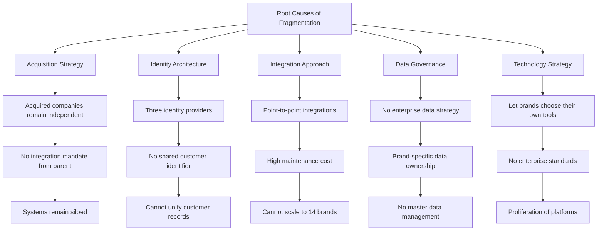

## 2.3 Business Drivers

### Primary Business Drivers

**Driver 1: Customer Experience**
- Customers expect seamless experience across brands
- Fragmentation leads to frustration and churn
- Unified experience increases loyalty and lifetime value

**Driver 2: Operational Efficiency**
- Duplicate systems create redundant costs
- Manual processes slow operations
- Unified platform reduces cost by 30-40%

**Driver 3: Revenue Growth**
- Cross-brand selling opportunities lost
- No unified view of customer value
- Unified platform enables $50M+ incremental revenue

**Driver 4: Regulatory Compliance**
- 47 countries with data residency laws
- GDPR, CCPA, LGPD, APPI, PIPA compliance required
- Manual compliance is unsustainable at scale

**Driver 5: Strategic Growth**
- 2+ acquisitions planned in next 18 months
- Current integration timeline: 3+ years per acquisition
- Target: 4-6 months per acquisition

**Driver 6: Competitive Pressure**
- Competitors offering unified experiences
- Digital-native entrants with modern platforms
- Legacy systems create competitive disadvantage

### Business Driver Prioritization

| Driver | Priority | Impact | Urgency |
|--------|----------|--------|---------|
| Customer Experience | 1 | High | High |
| Operational Efficiency | 2 | High | Medium |
| Compliance | 3 | High | High |
| Revenue Growth | 4 | High | Medium |
| Strategic Growth | 5 | Medium | Medium |
| Competitive Pressure | 6 | Medium | Low |

## 2.4 Success Metrics

### 9-Month Success Metrics (Track 1-3)

| Metric | Baseline | Target | Measurement |
|--------|----------|--------|-------------|
| **Unified Customer Records** | 0 | 20M | Data Cloud |
| **Service Handle Time** | 25 min | 18.75 min (-25%) | Service Cloud |
| **Duplicate Campaign Rate** | 30% | 21% (-30%) | Marketing Cloud |
| **Dealer Portal Adoption** | 0% | 40% | Experience Cloud |
| **Cross-Brand Service Visibility** | 0% | 80% | Service Cloud |
| **Executive Reporting Time** | 2 weeks | 3 days | Tableau |
| **Recall Processing Time** | 2 weeks | 3 days | Service Cloud |
| **Customer Satisfaction (CSAT)** | 3.2/5 | 4.0/5 | Surveys |

### 18-Month Success Metrics (Full Unification)

| Metric | Baseline | Target | Measurement |
|--------|----------|--------|-------------|
| **Unified Customer Records** | 0 | 68M | Data Cloud |
| **Service Handle Time** | 25 min | 15 min (-40%) | Service Cloud |
| **Duplicate Campaign Rate** | 30% | 15% (-50%) | Marketing Cloud |
| **Dealer Portal Adoption** | 0% | 80% | Experience Cloud |
| **Cross-Brand Service Visibility** | 0% | 100% | Service Cloud |
| **Executive Reporting Time** | 2 weeks | Real-time | Tableau |
| **Recall Processing Time** | 2 weeks | 24 hours | Service Cloud |
| **Customer Satisfaction (CSAT)** | 3.2/5 | 4.5/5 | Surveys |
| **Cross-Selling Rate** | 5% | 15% | Sales Cloud |
| **Customer Lifetime Value** | Baseline | +25% | Data Cloud |
| **Acquisition Integration Time** | 3 years | 4-6 months | Playbook |

### Leading vs. Lagging Indicators

| Indicator | Type | Frequency | Owner |
|-----------|------|-----------|-------|
| Identity resolution accuracy | Leading | Weekly | Data Architect |
| Platform adoption rate | Leading | Monthly | Change Management |
| Data quality score | Leading | Weekly | Data Architect |
| System availability | Leading | Real-time | Operations |
| API performance | Leading | Real-time | Integration Architect |
| Customer satisfaction | Lagging | Quarterly | Business |
| Revenue growth | Lagging | Quarterly | Finance |
| Cost savings | Lagging | Quarterly | Finance |
| Market share | Lagging | Annually | Strategy |

## 2.5 Stakeholder Analysis

### Executive Sponsors

| Role | Name/Title | Responsibility | Engagement |
|------|-----------|----------------|------------|
| **CEO** | Chief Executive Officer | Final approval, strategic direction | Monthly steering committee |
| **CTO** | Chief Technology Officer | Technology strategy, architecture approval | Monthly ARB |
| **CFO** | Chief Financial Officer | Budget approval, ROI tracking | Monthly finance review |
| **COO** | Chief Operating Officer | Operational readiness, change management | Weekly operational review |

### Brand Presidents (14)

| Role | Responsibility | Engagement |
|------|----------------|------------|
| **Brand President** | Brand-specific decisions, resource allocation | Bi-weekly updates |
| **Brand CIO** | Brand IT coordination | Weekly technical sync |
| **Brand Change Lead** | Brand-specific change management | Daily during migration |

### Key Stakeholder Groups

| Group | Size | Interest | Influence | Engagement Strategy |
|-------|------|----------|-----------|---------------------|
| **Executive Leadership** | 10 | High | High | Monthly steering committee |
| **Brand Presidents** | 14 | High | High | Bi-weekly updates |
| **IT Leadership** | 50 | High | Medium | Weekly technical sync |
| **Sales Teams** | 5,000 | Medium | Low | Training, super-users |
| **Service Teams** | 15,000 | High | Low | Training, change management |
| **Dealers** | 11,500 | High | Medium | Advisory board, training |
| **Employees** | 92,000 | Medium | Low | Communications, training |
| **Customers** | 68M | High | Low | Privacy-first communication |
| **Regulators** | 47 countries | High | High | Legal engagement, compliance |
| **Vendors** | 10+ | Medium | Medium | Vendor management |

### Stakeholder Engagement Plan

| Stakeholder | Communication | Frequency | Channel | Content |
|-------------|---------------|-----------|---------|---------|
| Executive Leadership | Steering Committee | Monthly | In-person | Progress, risks, decisions |
| Brand Presidents | Brand Update | Bi-weekly | Email + Portal | Brand-specific progress |
| IT Leadership | Technical Sync | Weekly | Video conference | Technical updates |
| Sales Teams | Town Hall | Monthly | Video + Intranet | Platform benefits, training |
| Service Teams | Team Huddle | Weekly | Team meetings | Daily impact, training |
| Dealers | Advisory Board | Monthly | Portal + Email | Portal updates, feedback |
| Employees | All-Hands | Quarterly | Video + Intranet | Company-wide updates |
| Customers | Privacy Notice | As needed | Email, App | Data unification, consent |
| Regulators | Compliance Report | Quarterly | Secure portal | Compliance status |
| Vendors | Vendor Review | Monthly | Video conference | Performance, issues |

## 2.6 Business Capability Model

### Capability Map

```mermaid
graph TD
    A[Global Customer Unification<br/>Capability Model] --> B[Customer Management]
    A --> C[Vehicle Management]
    A --> D[Dealer Management]
    A --> E[Sales Management]
    A --> F[Service Management]
    A --> G[Marketing]
    A --> H[Subscription Management]
    A --> I[Warranty Management]
    A --> J[Roadside Assistance]
    A --> K[Field Service]
    A --> L[Global Analytics]
    A --> M[AI Automation]
    
    B --> B1[Identity Resolution]
    B --> B2[Customer 360]
    B --> B3[CLV Scoring]
    
    C --> C1[Connected Vehicle]
    C --> C2[Vehicle Lifecycle]
    C --> C3[Telematics]
    
    D --> D1[Partner Portal]
    D --> D2[Dealer Performance]
    D --> D3[Training Certification]
    
    E --> E1[Lead Management]
    E --> E2[Opportunity Management]
    E --> E3[Quote to Order]
    
    F --> F1[Case Management]
    F --> F2[Knowledge Base]
    F --> F3[Omni-Channel]
    
    G --> G1[Campaign Management]
    G --> G2[Journey Orchestration]
    G --> G3[Einstein AI]
    
    H --> H1[Subscription Billing]
    H --> H2[Usage Tracking]
    H --> H3[Renewal Management]
    
    I --> I1[Warranty Claims]
    I --> I2[Coverage Management]
    I --> I3[Recall Management]
    
    J --> J1[Dispatch]
    J --> J2[Tracking]
    J --> J3[Vendor Management]
    
    K --> K1[Scheduling]
    K --> K2[Mobile Workforce]
    K --> K3[Parts Management]
    
    L --> L1[Executive Dashboards]
    L --> L2[Operational Reports]
    L --> L3[Predictive Analytics]
    
    M --> M1[Agentforce Agents]
    M --> M2[Einstein Prediction]
    M --> M3[Automation]
```

### Capability Maturity

| Capability | Current Maturity | Target Maturity | Gap |
|------------|------------------|-----------------|-----|
| Customer Management | 2/5 | 5/5 | 3 levels |
| Vehicle Management | 2/5 | 5/5 | 3 levels |
| Dealer Management | 3/5 | 5/5 | 2 levels |
| Identity Resolution | 1/5 | 5/5 | 4 levels |
| Connected Vehicle | 2/5 | 4/5 | 2 levels |
| Sales Management | 3/5 | 5/5 | 2 levels |
| Service Management | 3/5 | 5/5 | 2 levels |
| Marketing Automation | 2/5 | 4/5 | 2 levels |
| Subscription Management | 2/5 | 4/5 | 2 levels |
| Warranty Management | 3/5 | 4/5 | 1 level |
| Field Service | 2/5 | 4/5 | 2 levels |
| Analytics & Reporting | 2/5 | 5/5 | 3 levels |
| AI/Automation | 1/5 | 4/5 | 3 levels |

---

*Section 2 Complete*  
*Next: Section 3 - Current State Assessment*

<!-- PAGE BREAK -->

# Section 3: Current State Assessment

## 3.1 Organizational Landscape

### Corporate Structure

The organization operates as a holding company with 14 semi-autonomous brand subsidiaries:

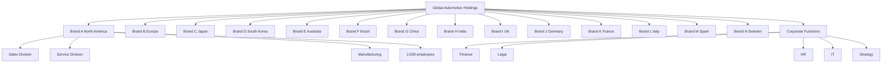

### Geographic Distribution

| Region | Countries | Brands | Employees | Dealers | Customers | Vehicles |
|--------|-----------|--------|-----------|---------|-----------|----------|
| **North America** | 3 | 3 | 25,000 | 4,500 | 15M | 35M |
| **Europe** | 12 | 4 | 30,000 | 3,000 | 20M | 40M |
| **Asia Pacific** | 8 | 4 | 25,000 | 2,500 | 22M | 30M |
| **South America** | 6 | 1 | 5,000 | 1,000 | 6M | 12M |
| **Middle East/Africa** | 8 | 1 | 3,000 | 500 | 3M | 6M |
| **Oceania** | 10 | 1 | 2,000 | 500 | 2M | 2M |
| **Total** | 47 | 14 | 92,000 | 11,500 | 68M | 125M |

## 3.2 Existing Technology Landscape

### CRM Landscape (14 Systems)

| Brand | CRM Platform | Users | Data Volume | Integration |
|-------|-------------|-------|-------------|-------------|
| Brand A | Salesforce | 2,000 | 5M records | API |
| Brand B | Microsoft Dynamics | 1,500 | 4M records | Custom |
| Brand C | Siebel | 3,000 | 8M records | Legacy |
| Brand D | Salesforce | 2,500 | 6M records | API |
| Brand E | SAP CRM | 1,000 | 3M records | IDoc |
| Brand F | Oracle CX | 1,200 | 3.5M records | Web services |
| Brand G | Salesforce | 1,800 | 4.5M records | API |
| Brand H | Microsoft Dynamics | 2,200 | 5.5M records | Custom |
| Brand I | Siebel | 1,500 | 4M records | Legacy |
| Brand J | SAP CRM | 2,800 | 7M records | IDoc |
| Brand K | Custom | 1,000 | 2M records | Flat files |
| Brand L | Salesforce | 2,000 | 5M records | API |
| Brand M | Oracle CX | 1,500 | 3.5M records | Web services |
| Brand N | Microsoft Dynamics | 1,800 | 4.5M records | Custom |

### ERP Landscape (4 Systems)

| ERP | Brands | Modules | Integration | Records |
|-----|--------|---------|-------------|---------|
| SAP ECC | 8 | FI, CO, MM, SD, PP | IDoc, RFC | 50M |
| Oracle EBS | 4 | GL, AP, AR, INV | Web services | 30M |
| Microsoft Dynamics | 1 | Finance, Supply Chain | OData | 5M |
| Custom Legacy | 1 | Finance only | Flat files | 2M |

### Identity Providers (3 Systems)

| IdP | Users | Brands | Protocol | Integration |
|-----|-------|--------|----------|-------------|
| Okta | 45,000 | 10 | SAML 2.0 | Federation |
| Azure AD | 30,000 | 3 | SAML 2.0, OIDC | Federation |
| Custom LDAP | 17,000 | 1 | LDAP, SAML | Custom |

### Other Systems

| System Type | Count | Examples | Total Records |
|-------------|-------|----------|---------------|
| Warranty Platforms | 6 | Brand-specific | 25M |
| Dealer Management | 14 | Reynolds & Reynolds, Dealertrack | 11,500 |
| Mobile Apps | 14 | Brand-specific iOS/Android | 68M users |
| Data Warehouses | 8 | Teradata, Redshift, BigQuery | 500TB |
| Analytics Platforms | 6 | Tableau, Power BI, Qlik | N/A |
| Loyalty Programs | 14 | Brand-specific | 45M members |

### Integration Landscape

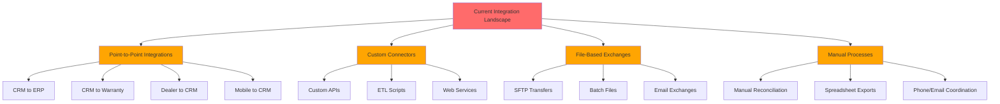

## 3.3 Business Challenges

### Challenge Matrix

| # | Challenge | Impact | Urgency | Complexity |
|---|-----------|--------|---------|------------|
| 1 | Customers treated as different people in each BU | High | High | High |
| 2 | Dealers cannot view cross-brand customer history | High | Medium | Medium |
| 3 | Roadside assistance lacks vehicle visibility | High | High | Medium |
| 4 | Independent subscription services | Medium | Medium | Medium |
| 5 | Different vehicle software update coordination | Medium | Medium | High |
| 6 | Variable customer support quality | High | High | Medium |
| 7 | No global CLV view | High | Medium | Medium |
| 8 | Manual global recall coordination | High | High | High |
| 9 | Duplicate marketing campaigns | Medium | Medium | Low |

### Detailed Challenge Analysis

**Challenge 1: Customer Fragmentation**
- **Current State**: 68M customers, 3 identity providers, no shared identifier
- **Impact**: Poor customer experience, marketing waste, lost revenue
- **Root Cause**: No enterprise identity strategy, brand independence

**Challenge 2: Dealer Visibility**
- **Current State**: Dealers see only their brand's customers
- **Impact**: Lost cross-selling, inefficient service
- **Root Cause**: Brand-specific dealer systems, no data sharing

**Challenge 3: Roadside Assistance**
- **Current State**: No visibility into acquired brand vehicles
- **Impact**: Delayed response, safety risks
- **Root Cause**: Separate warranty and service platforms

## 3.4 Enterprise Constraints

### Constraint Analysis

| Constraint | Description | Impact | Mitigation |
|------------|-------------|--------|------------|
| **No Business Suspension** | Cannot halt operations during transformation | High | Parallel run, blue-green deployment |
| **Legal Entity Independence** | Each acquired company must operate independently | High | Brand-specific BUs, data segregation |
| **Data Residency** | 47 countries restrict data movement | High | Regional data zones |
| **Dealer Integration Lock** | Existing integrations cannot be modified for 24 months | High | New parallel portal |
| **25% Budget Reduction** | Annual technology spending reduced | High | License consolidation, phased spending |
| **9-Month Value** | CEO expects measurable value within 9 months | Medium | Phased value delivery |
| **Future Acquisitions** | Must accommodate 2+ acquisitions next year | Medium | Repeatable playbook |

### Constraint Mapping to Architecture

| Constraint | Architecture Response |
|------------|----------------------|
| No Business Suspension | Parallel operation, blue-green deployment, rollback procedures |
| Legal Entity Independence | Business unit segmentation, data segregation, brand-specific UI |
| Data Residency | Data Cloud regional zones, field-level encryption |
| Dealer Integration Lock | New Experience Cloud portal parallel to existing systems |
| 25% Budget Reduction | License consolidation, phased implementation, cost optimization |
| 9-Month Value | Track 3 delivers measurable ROI |
| Future Acquisitions | BU model, repeatable integration playbook |

## 3.5 Gap Analysis

### Current vs. Target State

| Capability | Current | Target | Gap |
|------------|---------|--------|-----|
| Customer Identity | 3 providers, no sharing | 1 unified identity | Critical |
| Customer Data Platform | None | Data Cloud | Critical |
| Service Cloud | 14 separate instances | 1 unified org | Critical |
| Dealer Portal | 14 separate portals | 1 unified portal | High |
| Marketing Automation | 14 separate platforms | 1 unified platform | High |
| Connected Vehicle | 3 platforms | 1 unified platform | High |
| Analytics | 6 separate tools | 1 unified platform | High |
| Integration | Point-to-point | MuleSoft ESB | Critical |
| Data Residency | Partial | Full compliance | High |
| AI/Automation | None | Einstein + Agentforce | Medium |

### Gap Prioritization

| Gap | Priority | Effort | Impact | Timeline |
|-----|----------|--------|--------|----------|
| Customer Identity | 1 | High | Critical | Months 1-3 |
| Integration Backbone | 2 | High | Critical | Months 1-3 |
| Service Cloud Unification | 3 | Medium | High | Months 4-6 |
| Data Cloud CDP | 4 | High | Critical | Months 1-3 |
| Dealer Portal | 5 | Medium | High | Months 4-6 |
| Marketing Cloud | 6 | Medium | Medium | Months 7-9 |
| Analytics | 7 | Medium | High | Months 7-9 |
| Connected Vehicle | 8 | High | High | Months 4-9 |

## 3.6 SWOT Analysis

### Strengths

| Strength | Description |
|----------|-------------|
| **Board Commitment** | Clear vision and executive sponsorship |
| **Financial Resources** | $42-55M budget for transformation |
| **Salesforce Existing** | Some brands already on Salesforce |
| **Global Scale** | 68M customers, 125M vehicles provide data richness |
| **Brand Portfolio** | 14 brands provide diverse market coverage |
| **Manufacturing Integration** | Vertical integration from manufacturing to customer |

### Weaknesses

| Weakness | Description |
|----------|-------------|
| **Technology Fragmentation** | 14 CRMs, 4 ERPs, 3 IdPs create complexity |
| **No Unified Identity** | Cannot recognize same customer across brands |
| **Technical Debt** | Point-to-point integrations are unmaintainable |
| **Data Quality** | Inconsistent data standards across brands |
| **Skill Gaps** | Limited internal Salesforce expertise at this scale |
| **Change Fatigue** | 92,000 employees adapting to new systems |

### Opportunities

| Opportunity | Description |
|-------------|-------------|
| **Customer Experience** | Unified experience increases loyalty and CLV |
| **Operational Efficiency** | 30-40% cost reduction through consolidation |
| **Revenue Growth** | Cross-selling, better retention, $50M+ incremental |
| **Data monetization** | Unified data enables new insights and products |
| **Acquisition Integration** | 4-6 month integration vs. 3+ years |
| **AI/Automation** | Einstein and Agentforce at scale |
| **Competitive Advantage** | First-mover in unified automotive experience |

### Threats

| Threat | Description |
|--------|-------------|
| **Budget Constraints** | 25% reduction may limit scope |
| **Brand Resistance** | 14 brands may resist unification |
| **Regulatory Changes** | Data residency laws may evolve |
| **Competitor Action** | Competitors may launch similar initiatives |
| **Talent Competition** | Shortage of Salesforce talent at scale |
| **Vendor Dependency** | Salesforce, MuleSoft pricing power |
| **Implementation Risk** | Complexity may cause delays or failures |

### SWOT Strategy Matrix

| Internal\External | Opportunities | Threats |
|-------------------|---------------|---------|
| **Strengths** | Leverage board commitment and budget to drive transformation; Use existing Salesforce brands as champions | Use financial resources to hire talent and mitigate skill gaps |
| **Weaknesses** | Address fragmentation to unlock cross-selling; Fix identity to enable AI | Mitigate technical debt through MuleSoft; Address data quality before unification |

---

*Section 3 Complete*

<!-- PAGE BREAK -->

# Section 4: Architecture Principles & Strategy

## 4.1 Architecture Principles

### Core Principles

The architecture is guided by the following principles, approved by the Enterprise Salesforce Architecture Council:

**Principle 1: Customer-Centric Design**
Every architectural decision must prioritize the customer experience. Systems are designed around customer needs, not organizational silos. The customer journey across brands must be seamless, consistent, and personalized.

**Principle 2: Data as a Strategic Asset**
Customer and vehicle data are enterprise assets, not brand assets. Data must be governed, secured, and made available for unified insights while respecting privacy and residency requirements.

**Principle 3: Single Source of Truth**
For each master data entity (Customer, Vehicle, Product), there must be a single, authoritative source. Duplicate records, conflicting data, and multiple versions of truth are unacceptable.

**Principle 4: API-First Integration**
All system interactions must be through well-defined APIs. Point-to-point integrations are prohibited. MuleSoft provides the enterprise service bus with API-led connectivity.

**Principle 5: Event-Driven Architecture**
Systems communicate through events, not direct calls. This decouples producers from consumers, enables scalability, and supports real-time processing.

**Principle 6: Regional Data Residency**
Data residency is a first-class concern, not an afterthought. Architecture must support data residency requirements in all 47 countries without data migration.

**Principle 7: Progressive Delivery**
Value must be delivered continuously, not in a big bang. Each phase must deliver measurable business value within 9 months.

**Principle 8: Brand Independence During Transition**
Each acquired company must continue operating independently during the transition period. Legal entity independence is non-negotiable.

**Principle 9: Security and Compliance by Design**
Security and compliance controls are embedded in the architecture from the beginning, not added later. Privacy by design is mandatory.

**Principle 10: Cloud-Native and Scalable**
The architecture must leverage cloud-native services and scale to Fortune 100 levels (68M customers, 125M vehicles, 92K employees).

**Principle 11: Cost Optimization**
Technology spending must be optimized. License consolidation, infrastructure right-sizing, and operational efficiency are continuous priorities.

**Principle 12: Vendor Independence (Within Reason)**
While Salesforce is the primary platform, the architecture must avoid lock-in where possible. Open standards and APIs enable future flexibility.

### Principle Application Matrix

| Principle | Application | Verification |
|-----------|-------------|--------------|
| Customer-Centric | Unified customer view, single login, cross-brand service | Customer satisfaction surveys |
| Data as Asset | Data Cloud CDP, master data management, data governance | Data quality metrics |
| Single Source of Truth | Data Cloud identity resolution, MDM | Duplicate record rate |
| API-First | MuleSoft API-led connectivity | API catalog coverage |
| Event-Driven | Platform Events, MuleSoft streaming | Event volume, latency |
| Data Residency | Data Cloud regional zones | Compliance audit results |
| Progressive Delivery | 4-track implementation, 9-month value | Value delivery milestones |
| Brand Independence | BU segmentation, parallel operation | Brand satisfaction surveys |
| Security by Design | Shield, encryption, MFA, audit trails | Security audit results |
| Cloud-Native | Salesforce Hyperforce, MuleSoft CloudHub | Availability, scalability metrics |
| Cost Optimization | License consolidation, right-sizing | Cost per transaction |
| Vendor Independence | Open APIs, standard protocols | Vendor diversity index |

## 4.2 Design Principles

### Technical Design Principles

**Principle 1: Separation of Concerns**
Each component has a single responsibility. Presentation, business logic, and data access are separated. This enables independent evolution and testing.

**Principle 2: Loose Coupling**
Components interact through well-defined interfaces, not direct dependencies. This enables independent deployment and scaling.

**Principle 3: High Cohesion**
Related functionality is grouped together. Business capabilities are implemented as cohesive modules within the Salesforce org.

**Principle 4: Reusability**
Common functionality is built once and reused. Shared components, libraries, and patterns reduce duplication and improve consistency.

**Principle 5: Extensibility**
The architecture supports extension without modification. New brands, capabilities, and integrations can be added without changing core components.

**Principle 6: Testability**
All components are designed for testability. Automated testing is built into the development process.

**Principle 7: Observability**
All components emit metrics, logs, and traces. The system can be understood from the outside without internal knowledge.

**Principle 8: Resilience**
The architecture handles failures gracefully. Circuit breakers, retries, and fallbacks ensure continued operation during partial failures.

### Data Design Principles

**Principle 1: Data Ownership**
Each data domain has a clear owner. The Customer domain is owned by the Identity team. The Vehicle domain is owned by the Connected Vehicle team.

**Principle 2: Data Quality at Source**
Data quality is enforced at the point of entry. Validation rules, duplicate rules, and integration quality checks prevent bad data from entering the system.

**Principle 3: Data Lifecycle Management**
Data is retained only as long as needed. Archival and deletion policies ensure compliance and optimize storage costs.

**Principle 4: Data Security**
Data is protected based on sensitivity. PII is encrypted, access is logged, and data movement is monitored.

**Principle 5: Master Data Management**
Master data (Customer, Vehicle, Product) is managed centrally. Transactional data references master data, not duplicates it.

### Integration Design Principles

**Principle 1: API-Led Connectivity**
Integrations are organized into three layers: System APIs (access legacy systems), Process APIs (orchestrate business processes), and Experience APIs (expose capabilities to consumers).

**Principle 2: Asynchronous Communication**
Where possible, use asynchronous communication. Events and queues decouple systems and improve resilience.

**Principle 3: Bulk Processing**
Integrations process data in bulk, not record-by-record. This improves performance and respects governor limits.

**Principle 4: Idempotency**
Integrations are idempotent. Retrying a failed operation produces the same result as a successful operation.

**Principle 5: Backpressure**
Systems handle overload gracefully. When consumers are slow, producers reduce rate rather than overwhelming the system.

## 4.3 Technology Strategy

### Platform Strategy

```mermaid
graph TD
    A[Technology Strategy] --> B[Salesforce Platform]
    A --> C[Integration Layer]
    A --> D[Data & Analytics]
    A --> E[AI & Automation]
    A --> F[Infrastructure]
    
    B --> B1[Sales Cloud]
    B --> B2[Service Cloud]
    B --> B3[Experience Cloud]
    B --> B4[Data Cloud]
    B --> B5[Platform Events]
    
    C --> C1[MuleSoft]
    C --> C2[API Management]
    C --> C3[Connectors]
    
    D --> D1[Tableau]
    D --> D2[Data Cloud Analytics]
    D --> D3[Einstein Discovery]
    
    E --> E1[Einstein AI]
    E --> E2[Agentforce]
    E --> E3[Predictive Models]
    
    F --> F1[Salesforce Hyperforce]
    F --> F2[AWS/Azure Cloud]
    F --> F3[IoT Gateway]
    
    style A fill:#2ecc71
    style B fill:#3498db
    style C fill:#9b59b6
    style D fill:#e74c3c
    style E fill:#f1c40f
    style F fill:#1abc9c
```

### Technology Selection Criteria

| Criterion | Weight | Description |
|-----------|--------|-------------|
| **Business Value** | 25% | Solves business problem, delivers ROI |
| **Technical Fit** | 20% | Integrates with existing architecture, meets NFRs |
| **Scalability** | 20% | Handles growth to 68M customers, 125M vehicles |
| **Cost Efficiency** | 15% | Total cost of ownership, licensing, maintenance |
| **Security** | 10% | Compliance, encryption, access control |
| **Vendor Stability** | 10% | Vendor financial health, product roadmap |

### Technology Portfolio

| Layer | Technology | Purpose | Alternatives Considered |
|-------|-----------|---------|------------------------|
| **CRM** | Salesforce Platform | Core customer management | Microsoft Dynamics, SAP CRM |
| **CDP** | Salesforce Data Cloud | Unified customer data | Segment, Treasure Data |
| **Integration** | MuleSoft | Enterprise service bus | Dell Boomi, Apache Camel |
| **Analytics** | Tableau + Data Cloud | Business intelligence | Power BI, Qlik |
| **AI** | Einstein + Agentforce | Predictive analytics, automation | Custom ML, third-party AI |
| **Portal** | Experience Cloud | Dealer and customer portals | Custom development, SharePoint |
| **IoT** | AWS IoT / Azure IoT | Vehicle telemetry ingestion | Custom IoT platform |
| **Cloud** | Salesforce Hyperforce | Salesforce hosting | N/A (Salesforce-managed) |
| **Infrastructure** | AWS / Azure | Supporting services | N/A |

### Technology Roadmap

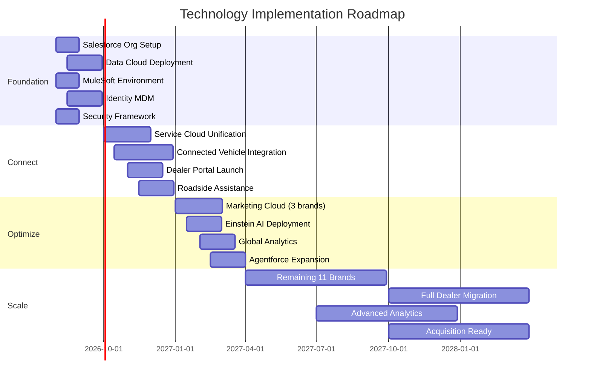

## 4.4 Cloud Strategy

### Cloud Deployment Model

The architecture uses a **hybrid cloud model**:

| Component | Deployment | Rationale |
|-----------|------------|-----------|
| **Salesforce Platform** | Salesforce Hyperforce (multi-region) | Managed service, automatic scaling, global availability |
| **Data Cloud** | Salesforce-managed (regional zones) | Native integration, data residency |
| **MuleSoft** | CloudHub 2.0 + Customer-hosted | Hybrid deployment for legacy connectivity |
| **IoT Gateway** | AWS IoT / Azure IoT | Scalable telemetry ingestion |
| **Tableau** | Tableau Cloud + Customer-hosted | Hybrid for data residency |
| **Supporting Services** | AWS / Azure | Compute, storage, networking |

### Cloud Region Strategy

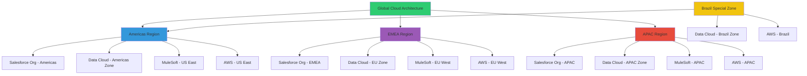

### Data Residency Zones

| Zone | Countries | Data Cloud Region | Salesforce Org | MuleSoft Runtime |
|------|-----------|-------------------|----------------|------------------|
| **Americas** | US, Canada, Mexico | Americas | Americas | US East |
| **EMEA** | EU, UK, Switzerland | EU | EMEA | EU West |
| **APAC** | Japan, Korea, Australia, Singapore | APAC | APAC | APAC |
| **Brazil** | Brazil | Brazil (special) | Americas | US East |
| **Special** | Russia, China | TBD | TBD | TBD |

## 4.5 Integration Strategy

### Strategy Overview

The integration strategy is based on **MuleSoft's API-led connectivity** pattern, which organizes APIs into three layers:

**System Layer (System APIs)**
- Expose underlying systems (ERP, CRM, Warranty, Dealer systems)
- Provide standardized access to legacy systems
- Hide system complexity from consumers
- Owned by integration team

**Process Layer (Process APIs)**
- Orchestrate business processes across systems
- Combine data from multiple System APIs
- Implement business logic and rules
- Owned by business process owners

**Experience Layer (Experience APIs)**
- Expose capabilities to specific channels (Salesforce, mobile, dealers)
- Tailored to consumer needs
- Recombine Process APIs for specific use cases
- Owned by channel/product teams

### Integration Patterns

| Pattern | Use Case | Technology | Frequency |
|---------|----------|------------|-----------|
| **Request-Reply** | Real-time queries (customer lookup, vehicle details) | MuleSoft + Salesforce API | On-demand |
| **Fire and Forget** | Async operations (service requests, notifications) | Platform Events | Real-time |
| **Batch Processing** | Bulk data movement (daily sync, reporting) | MuleSoft Batch | Daily/Hourly |
| **Event Streaming** | Real-time events (vehicle telemetry, alerts) | MQ + Platform Events | Continuous |
| **Publish-Subscribe** | Brand-to-brand communication | Platform Events | Event-driven |

### Integration Standards

| Standard | Requirement | Rationale |
|----------|-------------|-----------|
| **REST/JSON** | All APIs must use REST with JSON payload | Industry standard, easy to consume |
| **OAuth 2.0** | All API authentication via OAuth 2.0 | Security, token-based, revocable |
| **OpenAPI 3.0** | All APIs documented with OpenAPI 3.0 | Consistency, automation, testing |
| **API Versioning** | URL path versioning (/v1/, /v2/) | Backward compatibility, evolution |
| **Rate Limiting** | Per-API rate limits with 429 responses | Protection, fairness |
| **Circuit Breaker** | All external calls use circuit breakers | Resilience, fast failure |
| **Retry with Backoff** | Exponential backoff for retries | Avoid overwhelming failing systems |
| **Dead Letter Queue** | Failed messages go to DLQ | No data loss, reprocessing |

## 4.6 Data Strategy

### Data Strategy Principles

**Principle 1: Data as a Product**
Each data domain (Customer, Vehicle, Service) is treated as a product with owners, SLAs, and consumers.

**Principle 2: Single Source of Truth**
Master data has one authoritative source. Reference data is centrally managed.

**Principle 3: Data Quality at Source**
Data quality is enforced at the point of entry, not corrected downstream.

**Principle 4: Privacy by Design**
Data protection and privacy are built into the architecture, not added later.

**Principle 5: Data Residency**
Data residency requirements are satisfied by architecture, not workarounds.

**Principle 6: Data Lifecycle Management**
Data is retained, archived, and deleted according to policy.

### Data Domains

| Domain | Master Data | Source Systems | Consumers | Owner |
|--------|-------------|----------------|-----------|-------|
| **Customer** | Yes | 14 CRMs, 3 IdPs | Sales, Service, Marketing, Dealer | Identity Team |
| **Vehicle** | Yes | 14 brand systems, IoT | Service, Sales, Marketing, Dealer | Connected Vehicle Team |
| **Account** | Yes | 14 CRMs, ERP | Sales, Service, Dealer | Sales Operations |
| **Contact** | Derived | Customer domain | All | Identity Team |
| **Case** | No | Service Cloud | Service, Customer | Service Operations |
| **Asset** | No | Vehicle domain | Service, Sales, Marketing | Service Operations |
| **Subscription** | No | Subscription platforms | Marketing, Finance | Subscription Team |
| **Warranty** | No | Warranty platforms | Service, Customer | Warranty Team |
| **Product** | Yes | ERP systems | Sales, Service, Marketing | Product Management |

### Data Flow Strategy

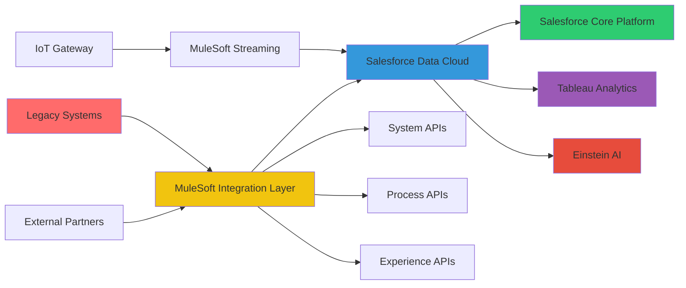

### Data Quality Framework

| Dimension | Definition | Measurement | Target |
|-----------|------------|-------------|--------|
| **Accuracy** | Data correctly represents reality | % of records matching source | >99% |
| **Completeness** | All required fields populated | % of required fields filled | >95% |
| **Consistency** | Same value across systems | Matches across source systems | >98% |
| **Timeliness** | Data available when needed | Time from event to availability | <1 hour |
| **Validity** | Data conforms to format/rules | % of records passing validation | >99% |
| **Uniqueness** | No duplicate master records | Duplicate rate | <1% |

---

*Section 4 Complete*

<!-- PAGE BREAK -->

# Section 5: High-Level Architecture

## 5.1 System Context Diagram

The Global Customer Unification Platform sits at the center of a complex ecosystem of legacy systems, external partners, and new cloud services. The diagram below shows the system context:

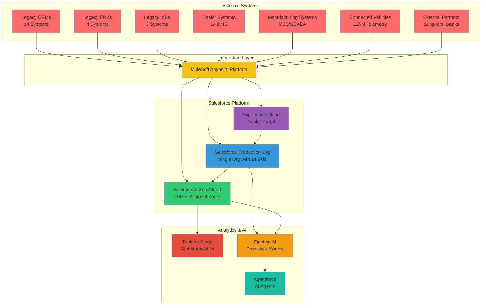

### External System Inventory

| System Category | Count | Integration Approach | Volume |
|----------------|-------|---------------------|--------|
| **Legacy CRMs** | 14 | MuleSoft connectors, API | 68M records |
| **Legacy ERPs** | 4 | MuleSoft connectors, batch | 87M records |
| **Identity Providers** | 3 | SAML federation, MuleSoft sync | 92K users |
| **Dealer Management** | 14 | MuleSoft APIs, file-based | 11,500 dealers |
| **Manufacturing** | 28 plants | Batch integration, MuleSoft | Daily batch |
| **Connected Vehicles** | 125M vehicles | IoT Gateway, MuleSoft streaming | 110TB/year |
| **Warranty Systems** | 6 | MuleSoft APIs | 25M records |
| **Data Warehouses** | 8 | Batch + real-time streams | 500TB |

## 5.2 Capability Model

### Enterprise Capability Map

```mermaid
graph TD
    A[Enterprise Capability Model] --> B[Customer 360]
    A --> C[Vehicle 360]
    A --> D[Dealer Experience]
    A --> E[Sales Excellence]
    A --> F[Service Excellence]
    A --> G[Marketing Effectiveness]
    A --> H[Operations Efficiency]
    A --> I[Analytics & Insights]
    
    B --> B1[Identity Resolution]
    B --> B2[Unified Profile]
    B --> B3[Consent Management]
    B --> B4[Privacy Controls]
    
    C --> C1[Vehicle Registry]
    C --> C2[Connected Services]
    C --> C3[Telematics]
    C --> C4[Recall Management]
    
    D --> D1[Dealer Portal]
    D --> D2[Customer Lookup]
    D --> D3[Service Scheduling]
    D --> D4[Parts Ordering]
    
    E --> E1[Lead Management]
    E --> E2[Opportunity Management]
    E --> E3[Cross-Selling]
    E --> E4[Dealer Performance]
    
    F --> F1[Case Management]
    F --> F2[Omni-Channel]
    F --> F3[Knowledge Base]
    F --> F4[Field Service]
    
    G --> G1[Journey Orchestration]
    G --> G2[Campaign Management]
    G --> G3[Personalization]
    G --> G4[Consent Management]
    
    H --> H1[Subscription Billing]
    H --> H2[Warranty Claims]
    H --> H3[Roadside Dispatch]
    H --> H4[Parts Inventory]
    
    I --> I1[Executive Dashboards]
    I --> I2[Operational Reports]
    I --> I3[Predictive Analytics]
    I --> I4[AI Insights]
    
    style A fill:#2ecc71
    style B fill:#3498db
    style C fill:#9b59b6
    style D fill:#e74c3c
    style E fill:#f1c40f
    style F fill:#1abc9c
    style G fill:#e67e22
    style H fill:#34495e
    style I fill:#f39c12
```

### Capability Relationships

```mermaid
graph LR
    A[Customer 360] --> B[Sales Excellence]
    A --> C[Service Excellence]
    A --> D[Marketing Effectiveness]
    
    C --> E[Vehicle 360]
    E --> F[Connected Services]
    E --> G[Recall Management]
    
    B --> H[Dealer Experience]
    C --> H
    
    I[Analytics & Insights] --> A
    I --> B
    I --> C
    I --> D
    I --> E
    I --> F
    I --> H
    
    J[Operations Efficiency] --> C
    J --> H
    J --> E
    
    style A fill:#3498db
    style B fill:#2ecc71
    style C fill:#9b59b6
    style D fill:#e74c3c
    style E fill:#f1c40f
    style F fill:#1abc9c
    style G fill:#e67e22
    style H fill:#34495e
    style I fill:#f39c12
    style J fill:#95a5a6
```

## 5.3 Component Model

### Salesforce Org Component Architecture

```mermaid
graph TD
    A[Salesforce Production Org] --> B[Platform Layer]
    A --> C[Data Layer]
    A --> D[Experience Layer]
    A --> E[Integration Layer]
    A --> F[Security Layer]
    
    B --> B1[Sales Cloud]
    B --> B2[Service Cloud]
    B --> B3[Experience Cloud]
    B --> B4[Custom Objects]
    B --> B5[Flows & Automation]
    B --> B6[Apex Services]
    B --> B7[Platform Events]
    
    C --> C1[Data Cloud CDP]
    C --> C2[Big Objects]
    C --> C3[External Objects]
    C --> C4[File Storage]
    
    D --> D1[Lightning Web Components]
    D --> D2[Salesforce Mobile]
    D --> D3[Experience Cloud Sites]
    D --> D4[Einstein Bots]
    
    E --> E1[Named Credentials]
    E --> E2[Connected Apps]
    E --> E3[API Gateway]
    E --> E4[MuleSoft Connectors]
    
    F --> F1[Shield Platform Encryption]
    F --> F2[Event Monitoring]
    F --> F3[Field Audit Trail]
    F --> F4[Login Flows]
    F --> F5[MFA]
    
    style A fill:#3498db
    style B fill:#2ecc71
    style C fill:#9b59b6
    style D fill:#e74c3c
    style E fill:#f1c40f
    style F fill:#e67e22
```

### Component Interaction Matrix

| From Component | To Component | Protocol | Frequency | Data Volume |
|----------------|--------------|----------|-----------|-------------|
| **Sales Cloud** | Data Cloud | Streaming | Real-time | 100K records/day |
| **Service Cloud** | Data Cloud | Streaming | Real-time | 500K records/day |
| **Experience Cloud** | Salesforce Core | API | On-demand | 10K requests/day |
| **MuleSoft** | Salesforce Core | REST API | Batch + Real-time | 1M calls/day |
| **MuleSoft** | Data Cloud | REST API | Batch | 10M records/day |
| **Platform Events** | MuleSoft | Event Stream | Real-time | 100K events/hour |
| **IoT Gateway** | MuleSoft | MQTT/MQ | Continuous | 1M events/hour |
| **Einstein AI** | Data Cloud | Batch + API | Hourly | 68M predictions/day |
| **Tableau** | Data Cloud | SQL | On-demand | 1K queries/day |
| **Agentforce** | Salesforce Core | API | Real-time | 50K requests/day |

## 5.4 Data Flow Architecture

### Customer Unification Data Flow

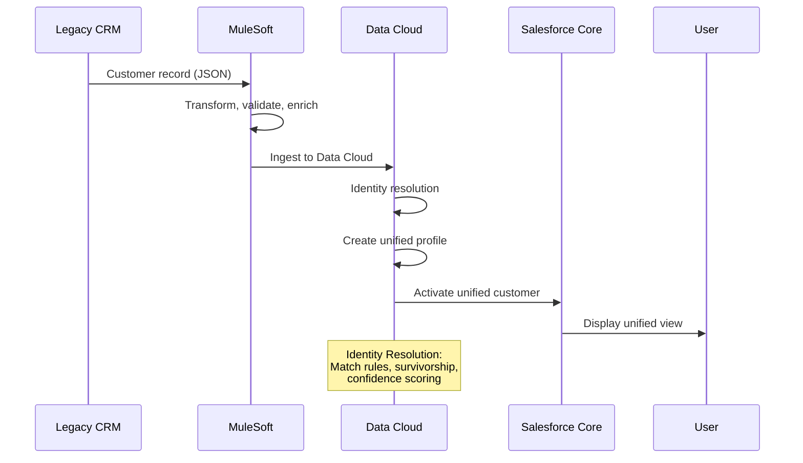

### Connected Vehicle Data Flow

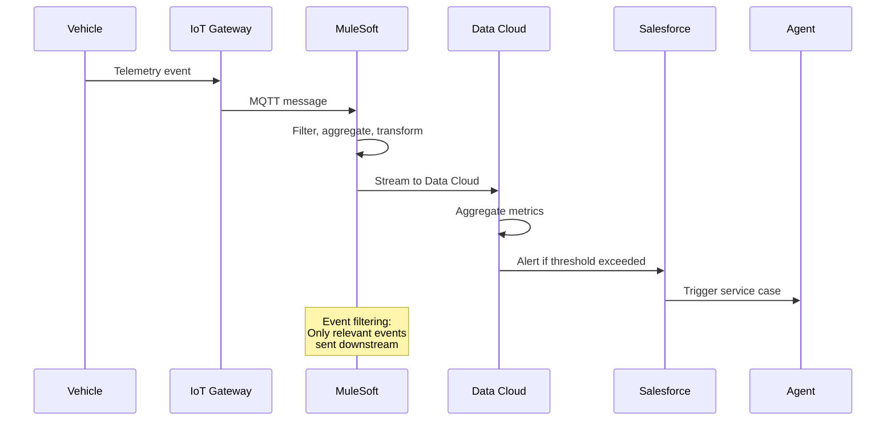

### Dealer Portal Data Flow

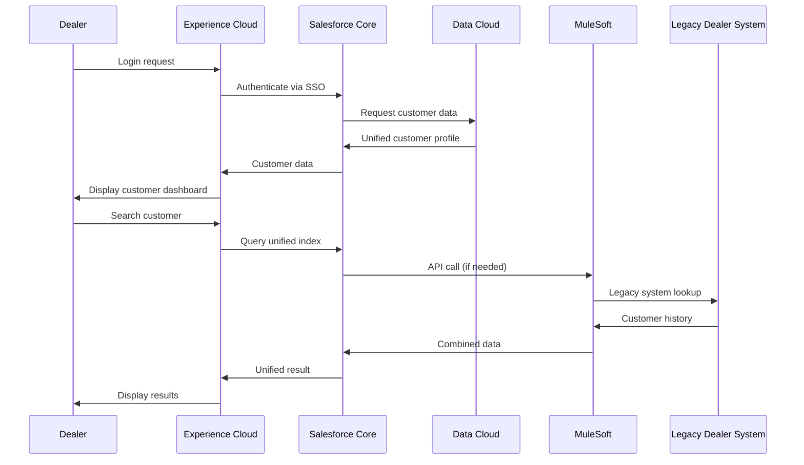

## 5.5 Integration Landscape

### Integration Topology

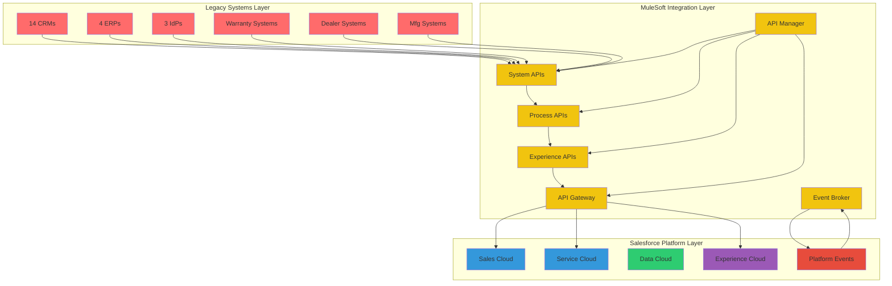

### Integration Volume Estimates

| Integration | Daily Volume | Peak Volume | Pattern |
|-------------|--------------|-------------|---------|
| Customer sync | 500K records | 1M records | Batch hourly |
| Order processing | 50K orders | 100K orders | Real-time |
| Service cases | 100K cases | 200K cases | Real-time |
| Vehicle telemetry | 110TB raw | 150TB raw | Streaming |
| Dealer inquiries | 20K requests | 50K requests | Real-time |
| Marketing events | 10M events | 50M events | Event-driven |
| Reporting queries | 100K queries | 200K queries | On-demand |

## 5.6 Deployment Topology

### Network Architecture

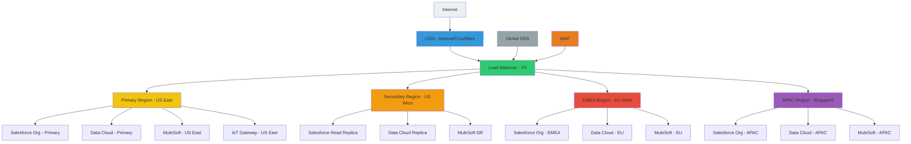

### Deployment Zones

| Zone | Purpose | Components | Availability |
|------|---------|------------|--------------|
| **DMZ** | Internet-facing, WAF protection | Load balancers, CDN, WAF | 99.99% |
| **Application Zone** | Salesforce, MuleSoft, Data Cloud | Application servers, APIs | 99.9% |
| **Data Zone** | Databases, storage, backups | Data Cloud, Big Objects, Files | 99.9% |
| **Integration Zone** | MuleSoft runtime, connectors | Runtime workers, VPCs | 99.9% |
| **Management Zone** | Monitoring, logging, CI/CD | Admin tools, dashboards | 99.5% |

## 5.7 Security Architecture Overview

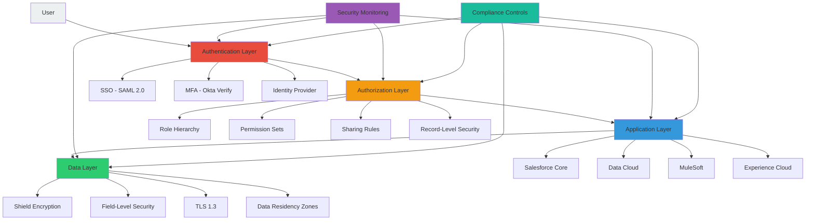

### Security Controls Summary

| Control Layer | Controls | Implementation |
|---------------|----------|----------------|
| **Perimeter** | WAF, DDoS protection, CDN | Salesforce Shield, Cloudflare |
| **Network** | VPC, subnets, security groups | MuleSoft VPC, Salesforce IP ranges |
| **Identity** | SSO, MFA, IdP federation | Okta, Azure AD, Salesforce Identity |
| **Access** | RBAC, ABAC, least privilege | Roles, profiles, permission sets |
| **Data** | Encryption at rest/transit, DLP | Shield, TLS, tokenization |
| **Application** | Input validation, output encoding, session management | Salesforce security, Apex security |
| **Monitoring** | SIEM, anomaly detection, audit logging | Event Monitoring, Shield Monitoring |
| **Compliance** | GDPR, CCPA, LGPD, APPI, PIPA | Regional data zones, consent management |

## 5.8 Event-Driven Architecture

### Event Mesh Design

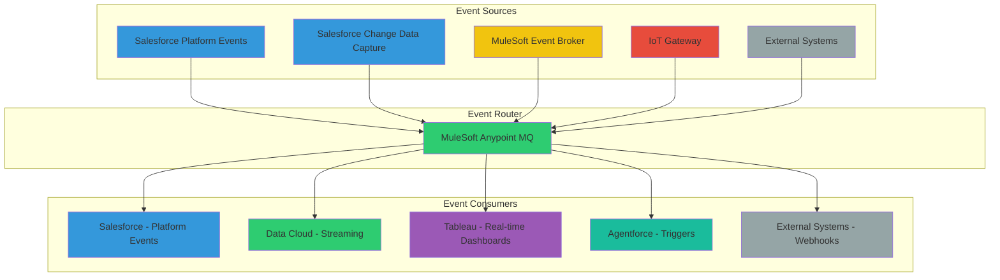

### Event Catalog

| Event | Source | Format | Frequency | Consumers | Retention |
|-------|--------|--------|-----------|-----------|-----------|
| **CustomerUpdated** | Salesforce | JSON | Real-time | Data Cloud, Marketing | 7 days |
| **CustomerMerged** | Data Cloud | JSON | Real-time | Salesforce, Marketing | 30 days |
| **VehicleTelemetry** | IoT Gateway | Avro | Continuous | Data Cloud, Service | 24 hours |
| **ServiceCaseCreated** | Salesforce | JSON | Real-time | MuleSoft, Reporting | 7 days |
| **ServiceCaseEscalated** | Salesforce | JSON | Real-time | Management, Reporting | 30 days |
| **RecallInitiated** | Service Cloud | JSON | On-demand | All systems | 1 year |
| **DealerLogin** | Experience Cloud | JSON | Real-time | Security, Analytics | 7 days |
| **WarrantyClaimCreated** | MuleSoft | JSON | Real-time | Salesforce, Analytics | 30 days |
| **SubscriptionChanged** | Salesforce | JSON | Real-time | Billing, Marketing | 7 days |

---

*Section 5 Complete*

<!-- PAGE BREAK -->

# Section 6: Detailed Solution Design

## 6.1 Salesforce Org Structure

### Org Architecture

The solution uses a **single production Salesforce org** with brand-specific business units (BU) for segmentation. This architecture enables:

- Unified customer view across all brands
- Single identity provider
- Reduced integration complexity
- Native Salesforce capabilities at scale

### Business Unit Hierarchy

```mermaid
graph TD
    A[Global Root BU] --> B[Brand A BU]
    A --> C[Brand B BU]
    A --> D[Brand C BU]
    A --> E[Brand D BU]
    A --> F[Brand E BU]
    A --> G[Brand F BU]
    A --> H[Brand G BU]
    A --> I[Brand H BU]
    A --> J[Brand I BU]
    A --> K[Brand J BU]
    A --> L[Brand K BU]
    A --> M[Brand L BU]
    A --> N[Brand M BU]
    A --> O[Brand N BU]
    
    A --> P[Shared Services BU]
    P --> P1[Global Sales]
    P --> P2[Global Service]
    P --> P3[Global Marketing]
    P --> P4[Global Operations]
    
    style A fill:#e74c3c
    style B fill:#3498db
    style C fill:#3498db
    style D fill:#3498db
    style E fill:#3498db
    style F fill:#3498db
    style G fill:#3498db
    style H fill:#3498db
    style I fill:#3498db
    style J fill:#3498db
    style K fill:#3498db
    style L fill:#3498db
    style M fill:#3498db
    style N fill:#3498db
    style P fill:#2ecc71
```

### Org Limits and Mitigation

| Salesforce Limit | Value | Projected Usage | Mitigation |
|------------------|-------|-----------------|------------|
| **Data Storage** | 20GB + 1GB/10K licenses (~120TB) | ~80TB | Big Objects, archival, Data Cloud offload |
| **File Storage** | 1TB + 10GB/10K licenses (~7TB) | ~5TB | External storage, compression |
| **API Calls** | 100K/day + 1K/license (~100M/day) | ~80M/day | Caching, batch processing, read replica |
| **Concurrent Users** | Unlimited (with limits) | ~50K peak | Load testing, async processing |
| **Custom Objects** | 2,000 (Enterprise) | ~200 | Namespace management, consolidation |
| **Custom Fields** | 800/object | ~50/object | Careful design, field audit |
| **Apex Code** | 6MB/org, 1MB/class | ~4MB | Code optimization, external services |
| **Batch Apex** | 5 concurrent jobs | 3-4 active | Queueable Apex, async processing |
| **SOQL Queries** | 100 sync, 200 async | 50/80 | Query optimization, skinny tables |
| **Platform Events** | 1M/day (high volume) | ~500K/day | Event filtering, batching |

### Brand Customization Strategy

Each brand requires specific customization while maintaining unified platform benefits:

| Customization Type | Approach | Example |
|-------------------|----------|---------|
| **Brand-Specific UI** | Lightning Theme Layout, brand-specific CSS | Brand colors, logos |
| **Brand-Specific Fields** | Field Sets, dynamic forms | Brand-specific vehicle attributes |
| **Brand-Specific Processes** | Record Types, Flows by brand | Brand-specific service processes |
| **Brand-Specific Reports** | Report Types, Dashboards by BU | Brand-specific KPIs |
| **Brand-Specific Security** | Sharing Rules, Permission Sets | Brand-specific data access |
| **Brand Configuration** | Custom Metadata Types | Brand-specific settings |

## 6.2 Object Model Overview

### Core Custom Objects

```mermaid
erDiagram
    CUSTOMER ||--o{ VEHICLE : owns
    CUSTOMER ||--o{ ACCOUNT : has
    CUSTOMER ||--o{ CONTACT : is
    CUSTOMER ||--o{ SERVICE_CASE : creates
    CUSTOMER ||--o{ SUBSCRIPTION : has
    
    VEHICLE ||--o{ SERVICE_CASE : generates
    VEHICLE ||--o{ WARRANTY : has
    VEHICLE ||--o{ TELEMETRY : produces
    VEHICLE }|--|| BRAND : belongs_to
    
    ACCOUNT ||--o{ OPPORTUNITY : has
    ACCOUNT ||--o{ CONTACT : employs
    ACCOUNT ||--o{ DEALER : is
    
    SERVICE_CASE ||--o{ CASE_COMMENT : has
    SERVICE_CASE }|--|| SERVICE_TYPE : categorized_as
    SERVICE_CASE ||--o{ APPOINTMENT : scheduled_as
    
    SUBSCRIPTION ||--o{ SUBSCRIPTION_ITEM : contains
    SUBSCRIPTION }|--|| SUBSCRIPTION_PLAN : follows
    
    WARRANTY ||--o{ WARRANTY_CLAIM : generates
    WARRANTY }|--|| WARRANTY_TYPE : is
    
    DEALER ||--o{ SERVICE_CASE : handles
    DEALER ||--o{ APPOINTMENT : provides
    
    CUSTOMER {
        string unified_id PK
        string global_customer_id UK
        string first_name
        string last_name
        string email UK
        string phone
        datetime birthdate
        string address
        string city
        string state
        string country
        string postal_code
        string language_preference
        datetime created_date
        datetime modified_date
        string created_by
        string modified_by
    }
    
    VEHICLE {
        string vehicle_id PK
        string vin UK
        string brand
        string model
        string year
        string color
        datetime purchase_date
        datetime warranty_expiry
        string owner_customer_id FK
        string current_dealer_id FK
        string status
        datetime created_date
        datetime modified_date
    }
    
    ACCOUNT {
        string account_id PK
        string account_name
        string account_type
        string industry
        string phone
        string website
        string billing_address
        string shipping_address
        datetime created_date
        datetime modified_date
    }
    
    SERVICE_CASE {
        string case_id PK
        string case_number UK
        string subject
        string description
        string status
        string priority
        string origin
        string type
        string customer_id FK
        string vehicle_id FK
        string dealer_id FK
        datetime created_date
        datetime modified_date
    }
```

### Object Relationship Diagram

```mermaid
graph TD
    A[Customer__c] --> B[Vehicle__c]
    A --> C[Account__c]
    A --> D[Contact__c]
    A --> E[Case__c]
    A --> F[Subscription__c]
    
    B --> G[Warranty__c]
    B --> H[Telemetry__c]
    B --> I[ServiceHistory__c]
    
    E --> J[CaseComment__c]
    E --> K[Appointment__c]
    
    F --> L[SubscriptionItem__c]
    
    C --> M[Opportunity__c]
    C --> N[Contact__c]
    C --> O[Dealer__c]
    
    O --> P[ServiceCase__c]
    O --> Q[Appointment__c]
    
    style A fill:#3498db
    style B fill:#2ecc71
    style C fill:#9b59b6
    style D fill:#e74c3c
    style E fill:#f1c40f
    style F fill:#1abc9c
    style G fill:#e67e22
    style H fill:#34495e
    style I fill:#95a5a6
```

## 6.3 Sharing Model Design

### Sharing Architecture

```mermaid
graph TD
    A[Sharing Architecture] --> B[Organization-Wide Defaults]
    A --> C[Role Hierarchy]
    A --> D[Sharing Rules]
    A --> E[Manual Sharing]
    A --> F[Apex Sharing]
    
    B --> B1[Customer: Private]
    B --> B2[Vehicle: Private]
    B --> B3[Case: Private]
    B --> B4[Account: Private]
    
    C --> C1[Global Root]
    C --> C2[Regional Levels]
    C --> C3[Brand Levels]
    C --> C4[Dealer Levels]
    C --> C5[Individual Users]
    
    D --> D1[Brand Sharing Rules]
    D --> D2[Dealer Sharing Rules]
    D --> D3[Service Sharing Rules]
    
    E --> E1[Manual Account Sharing]
    E --> E2[Manual Case Sharing]
    
    F --> F1[Customer Sharing]
    F --> F2[Vehicle Sharing]
    F --> F3[Case Sharing]
    
    style A fill:#3498db
    style B fill:#e74c3c
    style C fill:#f1c40f
    style D fill:#2ecc71
    style E fill:#f39c12
    style F fill:#9b59b6
```

### Sharing Rules by Object

| Object | OWD | Role Hierarchy | Sharing Rules | Manual Sharing | Apex Sharing |
|--------|-----|----------------|---------------|----------------|--------------|
| **Customer__c** | Private | Yes | Brand-based | Yes | Yes |
| **Vehicle__c** | Private | Yes | Owner-based | Yes | Yes |
| **Account** | Private | Yes | Dealer-based | Yes | Yes |
| **Contact** | Controlled by Parent | No | Inherited | No | No |
| **Case** | Private | Yes | Case team-based | Yes | Yes |
| **Opportunity** | Controlled by Parent | Yes | Opportunity team | Yes | No |

### Sharing Scenario Examples

**Scenario 1: Brand A Service Agent sees Brand B customer**
- Customer is unified in Data Cloud
- Service agent queries through Service Cloud
- Apex sharing grants access based on case ownership
- Agent sees full customer profile across brands

**Scenario 2: Dealer sees only their customers**
- Dealer role hierarchy limits visibility
- Sharing rules grant access to dealer's customers only
- Dealer cannot see other dealers' customers

**Scenario 3: Cross-brand manager sees all brands**
- Manager role is above all brand roles in hierarchy
- Inherits access to all subordinates
- Sees all customers and vehicles across brands

## 6.4 Automation Strategy

### Automation Architecture

```mermaid
graph TD
    A[Automation Strategy] --> B[Declarative First]
    A --> C[Pro-Code When Needed]
    A --> D[Event-Driven]
    A --> E[AI-Augmented]
    
    B --> B1[Flow Builder]
    B --> B2[Process Builder]
    B --> B3[Workflow Rules]
    B --> B4[Approval Processes]
    
    C --> C1[Apex Triggers]
    C --> C2[Apex Classes]
    C --> C3[Batch Apex]
    C --> C4[Queueable Apex]
    
    D --> D1[Platform Events]
    D --> D2[Change Data Capture]
    D --> D3[MQ Streaming]
    
    E --> E1[Einstein Flow]
    E --> E2[Einstein Prediction]
    E --> E3[Agentforce]
    
    style A fill:#3498db
    style B fill:#2ecc71
    style C fill:#f1c40f
    style D fill:#e74c3c
    style E fill:#9b59b6
```

### Automation Decision Matrix

| Use Case | Preferred Technology | Reason |
|----------|---------------------|--------|
| **Record updates** | Flow Builder | Declarative, maintainable |
| **Cross-object updates** | Flow Builder | Handles complex logic |
| **Email alerts** | Flow Builder | Native email actions |
| **Approval processes** | Approval Processes | Standard functionality |
| **Scheduled jobs** | Flow Builder Scheduled Paths | Declarative scheduling |
| **Complex calculations** | Apex | Performance, bulkification |
| **Bulk data processing** | Batch Apex | Large data volumes |
| **Async processing** | Queueable Apex | Scalable, reliable |
| **Real-time events** | Platform Events | Event-driven, decoupled |
| **Data changes** | Change Data Capture | Auto-captures changes |
| **Predictions** | Einstein Prediction Builder | AI/ML without code |
| **AI automation** | Agentforce | Intelligent automation |

### Key Automation Flows

**Flow 1: Customer Unification**
```mermaid
graph LR
    A[New Customer Record] --> B{Duplicate Check}
    B -->|Yes| C[Update Existing]
    B -->|No| D[Create New]
    C --> E[Publish CustomerUpdated Event]
    D --> E
    E --> F[Data Cloud Sync]
    F --> G[Identity Resolution]
    G --> H{Match Found?}
    H -->|Yes| I[Merge Records]
    H -->|No| J[Create Unified Profile]
    I --> K[Publish CustomerMerged Event]
    J --> K
    K --> L[Update All Systems]
    
    style A fill:#3498db
    style B fill:#f1c40f
    style C fill:#2ecc71
    style D fill:#2ecc71
    style E fill:#e74c3c
    style F fill:#9b59b6
    style G fill:#9b59b6
    style H fill:#f1c40f
    style I fill:#e67e22
    style J fill:#e67e22
    style K fill:#e74c3c
    style L fill:#1abc9c
```

**Flow 2: Service Case Escalation**
```mermaid
graph LR
    A[Case Created] --> B{High Priority?}
    B -->|Yes| C[Assign to Senior Agent]
    B -->|No| D{24 Hours Old?}
    D -->|Yes| E[Escalate to Manager]
    D -->|No| F[Standard Processing]
    C --> G[Send Notification]
    E --> G
    G --> H[Create Follow-up Task]
    H --> I[Update Case Record]
    
    style A fill:#3498db
    style B fill:#f1c40f
    style C fill:#2ecc71
    style D fill:#f1c40f
    style E fill:#e74c3c
    style F fill:#95a5a6
    style G fill:#9b59b6
    style H fill:#1abc9c
    style I fill:#3498db
```

## 6.5 Agentforce Agent Design

### Agent Architecture

```mermaid
graph TD
    A[Agentforce Platform] --> B[Service Agent]
    A --> C[Sales Agent]
    A --> D[Field Service Agent]
    A --> E[Recall Agent]
    A --> F[Warranty Agent]
    
    B --> B1[Customer Inquiry]
    B --> B2[Case Resolution]
    B --> B3[Knowledge Retrieval]
    B --> B4[Escalation]
    
    C --> C1[Lead Qualification]
    C --> C2[Opportunity Assistance]
    C --> C3[Cross-Selling]
    
    D --> D1[Technician Dispatch]
    D --> D2[Parts Management]
    D --> D3[Schedule Optimization]
    
    E --> E1[Recall Notification]
    E --> E2[Status Tracking]
    E --> E3[Compliance Reporting]
    
    F --> F1[Claim Processing]
    F --> F2[Coverage Verification]
    F --> F3[Payment Authorization]
    
    G[Einstein AI] --> B
    G --> C
    G --> D
    G --> E
    G --> F
    
    H[Data Cloud] --> G
    I[Knowledge Base] --> B
    J[Service Cloud] --> B
    K[Field Service] --> D
    
    style A fill:#3498db
    style B fill:#2ecc71
    style C fill:#9b59b6
    style D fill:#e74c3c
    style E fill:#f1c40f
    style F fill:#1abc9c
    style G fill:#f39c12
    style H fill:#95a5a6
    style I fill:#e67e22
    style J fill:#34495e
    style K fill:#16a085
```

### Agent Capabilities

| Agent | Capabilities | Data Sources | Actions |
|-------|--------------|--------------|---------|
| **Service Agent** | Answer questions, resolve cases, escalate | Data Cloud, Knowledge Base, Service Cloud | Create case, update record, send email |
| **Sales Agent** | Qualify leads, suggest products, schedule | Data Cloud, Sales Cloud, Inventory | Create opportunity, schedule demo, send quote |
| **Field Service Agent** | Dispatch technicians, optimize routes | Field Service, Maps, Inventory | Create work order, assign resource, notify customer |
| **Recall Agent** | Notify customers, track status, report | Service Cloud, Data Cloud, Compliance | Create campaign, update records, generate report |
| **Warranty Agent** | Process claims, verify coverage, authorize | Warranty, Parts, Service Cloud | Create claim, approve payment, order parts |

### Agent Training Data

```mermaid
graph LR
    A[Training Data Sources] --> B[Historical Cases]
    A --> C[Knowledge Base Articles]
    A --> D[Customer Interactions]
    A --> E[Service Transcripts]
    A --> F[Resolution Paths]
    
    B --> G[Agentforce Model]
    C --> G
    D --> G
    E --> G
    F --> G
    
    G --> H[Trained Agent]
    H --> I[Production Deployment]
    I --> J[Continuous Learning]
    J --> G
    
    style A fill:#3498db
    style B fill:#2ecc71
    style C fill:#9b59b6
    style D fill:#e74c3c
    style E fill:#f1c40f
    style F fill:#1abc9c
    style G fill:#f39c12
    style H fill:#e67e22
    style I fill:#34495e
    style J fill:#95a5a6
```

## 6.6 Connected Vehicle Architecture

### IoT Integration Architecture

```mermaid
graph TD
    A[125M Connected Vehicles] --> B[IoT Gateway]
    B --> C[Event Filtering]
    C --> D[Stream Processing]
    D --> E[MuleSoft]
    E --> F[Salesforce Platform Events]
    F --> G[Data Cloud]
    G --> H[Einstein AI]
    H --> I[Agentforce]
    
    J[Telemetry Data] --> K[Raw Storage - S3]
    J --> L[Aggregated Metrics]
    J --> M[Alerts & Notifications]
    
    B --> J
    D --> J
    
    style A fill:#3498db
    style B fill:#f1c40f
    style C fill:#2ecc71
    style D fill:#9b59b6
    style E fill:#e74c3c
    style F fill:#f39c12
    style G fill:#1abc9c
    style H fill:#e67e22
    style I fill:#34495e
    style J fill:#95a5a6
    style K fill:#bdc3c7
    style L fill:#bdc3c7
    style M fill:#e74c3c
```

### Vehicle Data Model

| Data Type | Frequency | Retention | Storage | Processing |
|-----------|-----------|-----------|---------|------------|
| **Location** | 1/min | 30 days | Data Cloud | Real-time |
| **Speed** | 1/min | 30 days | Data Cloud | Real-time |
| **Fuel/Battery** | 5/min | 30 days | Data Cloud | Real-time |
| **Diagnostics** | On event | 1 year | Big Objects | Batch |
| **Software Updates** | On event | Permanent | Data Cloud | Real-time |
| **Driving Behavior** | Trip-based | 1 year | Big Objects | Batch |
| **Maintenance Alerts** | On event | 3 years | Data Cloud | Real-time |
| **Crash Data** | On event | Permanent | Data Cloud | Real-time |

## 6.7 Subscription Management Design

### Subscription Architecture

```mermaid
graph TD
    A[Subscription Management] --> B[Subscription Plans]
    A --> C[Customer Subscriptions]
    A --> D[Usage Tracking]
    A --> E[Billing Integration]
    A --> F[Renewal Management]
    
    B --> B1[Plan Definitions]
    B --> B2[Pricing Models]
    B --> B3[Feature Sets]
    
    C --> C1[Active Subscriptions]
    C --> C2[Paused Subscriptions]
    C --> C3[Cancelled Subscriptions]
    
    D --> D1[Usage Meters]
    D --> D2[Usage Events]
    D --> D3[Usage Aggregation]
    
    E --> E1[MuleSoft Billing]
    E --> E2[ERP Integration]
    E --> E3[Payment Processing]
    
    F --> F1[Renewal Notifications]
    F --> F2[Renewal Offers]
    F --> F3[Churn Prevention]
    
    style A fill:#3498db
    style B fill:#2ecc71
    style C fill:#9b59b6
    style D fill:#e74c3c
    style E fill:#f1c40f
    style F fill:#1abc9c
```

### Subscription Data Model

| Object | Purpose | Key Fields |
|--------|---------|------------|
| **Subscription_Plan__c** | Defines available subscriptions | Name, Price, Duration, Features, Brand |
| **Subscription__c** | Customer subscription record | Customer, Plan, Start Date, End Date, Status |
| **Subscription_Item__c** | Individual subscription line items | Subscription, Feature, Quantity, Price |
| **Usage_Record__c** | Tracks usage events | Customer, Feature, Quantity, Timestamp |
| **Billing_Record__c** | Tracks billing events | Subscription, Amount, Date, Status |

## 6.8 Field Service Architecture

### Field Service Design

```mermaid
graph TD
    A[Field Service Management] --> B[Work Orders]
    A --> C[Service Appointments]
    A --> D[Resource Management]
    A --> E[Mobile Workforce]
    A --> F[Parts Management]
    
    B --> B1[Work Order Creation]
    B --> B2[Work Order Scheduling]
    B --> B3[Work Order Execution]
    B --> B4[Work Order Completion]
    
    C --> C1[Appointment Scheduling]
    C --> C2[Technician Assignment]
    C --> C3[Route Optimization]
    C --> C4[Customer Notification]
    
    D --> D1[Technician Profiles]
    D --> D2[Skills Matrix]
    D --> D3[Availability Calendar]
    D --> D4[Certification Tracking]
    
    E --> E1[Mobile App]
    E --> E2[Offline Capability]
    E --> E3[Real-time Updates]
    E --> E4[Signature Capture]
    
    F --> F1[Inventory Management]
    F --> F2[Parts Ordering]
    F --> F3[Warehouse Integration]
    F --> F4[Cost Tracking]
    
    style A fill:#3498db
    style B fill:#2ecc71
    style C fill:#9b59b6
    style D fill:#e74c3c
    style E fill:#f1c40f
    style F fill:#1abc9c
```

### Field Service Data Flow

```mermaid
sequenceDiagram
    participant C as Customer
    participant SF as Salesforce
    participant FS as Field Service
    participant T as Technician
    participant P as Parts System
    
    C->>SF: Request Service
    SF->>FS: Create Work Order
    FS->>FS: Schedule Appointment
    FS->>T: Assign Work Order
    FS->>C: Confirm Appointment
    
    T->>FS: Check-in on-site
    FS->>T: Display Work Order Details
    T->>FS: Update Status
    FS->>C: Notify Progress
    
    T->>FS: Request Parts
    FS->>P: Check Availability
    P->>FS: Confirm Availability
    FS->>T: Confirm Parts Delivery
    
    T->>FS: Complete Work Order
    FS->>FS: Generate Invoice
    FS->>C: Send Completion Notice
    FS->>SF: Update Case
```

---

*Section 6 Complete*

<!-- PAGE BREAK -->

# Section 7: Integration Architecture

## 7.1 MuleSoft Architecture

### MuleSoft as Enterprise Service Bus

MuleSoft Anypoint Platform serves as the integration backbone, connecting 14 legacy CRMs, 4 ERPs, warranty systems, dealer management systems, manufacturing systems, and connected vehicle telemetry to the unified Salesforce platform.

### MuleSoft Runtime Architecture

```mermaid
graph TD
    A[MuleSoft Anypoint Platform] --> B[API Gateway]
    A --> C[Runtime Fabric]
    A --> D[API Manager]
    A --> E[Exchange]
    A --> F[Design Center]
    
    C --> C1[CloudHub 2.0 - US East]
    C --> C2[CloudHub 2.0 - EU West]
    C --> C3[CloudHub 2.0 - APAC]
    C --> C4[Customer VPC - On-prem]
    
    C1 --> C1a[Worker 1]
    C1 --> C1b[Worker 2]
    C1 --> C1c[Worker 3]
    
    C2 --> C2a[Worker 1]
    C2 --> C2b[Worker 2]
    
    C3 --> C3a[Worker 1]
    C3 --> C3b[Worker 2]
    
    C4 --> C4a[Worker 1]
    C4 --> C4b[Worker 2]
    
    B --> B1[Rate Limiting]
    B --> B2[Authentication]
    B --> B3[Routing]
    B --> B4[Monitoring]
    
    D --> D1[Policies]
    D --> D2[Analytics]
    D --> D3[Client Management]
    
    E --> E1[System APIs]
    E --> E2[Process APIs]
    E --> E3[Experience APIs]
    
    F --> F1[API Specifications]
    F --> F2[Integration Templates]
    F --> F3[Mock Services]
    
    style A fill:#3498db
    style B fill:#2ecc71
    style C fill:#9b59b6
    style D fill:#e74c3c
    style E fill:#f1c40f
    style F fill:#1abc9c
```

### Runtime Configuration

| Parameter | Value | Justification |
|-----------|-------|---------------|
| **Worker Size** | 2 vCPU, 4GB RAM | Balanced performance for API processing |
| **Workers per Region** | 2-3 | High availability, load distribution |
| **Auto-scaling** | Yes, 2-10 workers | Handle peak loads (Black Friday, recall events) |
| **VPC** | Customer-managed | Secure connectivity to on-prem systems |
| **Load Balancer** | Internal ALB | Distribute load across workers |
| **Monitoring** | Anypoint Monitoring + custom | Comprehensive observability |

### MuleSoft Connectivity

```mermaid
graph TD
    A[MuleSoft Anypoint Platform] --> B[System APIs]
    
    B --> B1[SAP ECC Connector]
    B --> B2[Oracle EBS Connector]
    B --> B3[Dynamics 365 Connector]
    B --> B4[Siebel Connector]
    B --> B5[Okta Connector]
    B --> B6[Azure AD Connector]
    B --> B7[Reynolds & Reynolds Connector]
    B --> B8[Dealertrack Connector]
    B --> B9[AWS IoT Connector]
    B --> B10[Tableau Connector]
    
    B1 --> C[SAP ECC Systems]
    B2 --> D[Oracle EBS Systems]
    B3 --> E[Dynamics 365 Systems]
    B4 --> F[Siebel Systems]
    B5 --> G[Okta IdP]
    B6 --> H[Azure AD]
    B7 --> I[Dealer Management Systems]
    B8 --> I
    B9 --> J[IoT Gateway]
    B10 --> K[Tableau Analytics]
    
    style A fill:#3498db
    style B fill:#2ecc71
```

## 7.2 API-Led Connectivity

### Three-Layer API Architecture

```mermaid
graph TD
    A[API-Led Connectivity] --> B[System Layer]
    A --> C[Process Layer]
    A --> D[Experience Layer]
    
    B --> B1[System APIs]
    B1 --> B11[SAP_System_API]
    B1 --> B12[Oracle_System_API]
    B1 --> B13[CRM_System_API]
    B1 --> B14[Warranty_System_API]
    
    C --> C1[Process APIs]
    C1 --> C11[Customer_Process_API]
    C1 --> C12[Order_Process_API]
    C1 --> C13[Service_Process_API]
    C1 --> C14[Vehicle_Process_API]
    
    D --> D1[Experience APIs]
    D1 --> D11[Salesforce_Experience_API]
    D1 --> D12[Mobile_Experience_API]
    D1 --> D13[Dealer_Experience_API]
    D1 --> D14[Partner_Experience_API]
    
    B11 --> C11
    B12 --> C11
    B13 --> C11
    B14 --> C13
    
    C11 --> D11
    C12 --> D11
    C13 --> D11
    C14 --> D12
    
    style A fill:#3498db
    style B fill:#e74c3c
    style C fill:#f1c40f
    style D fill:#2ecc71
```

### API Catalog

| API Layer | API Name | Purpose | Protocol | Rate Limit | SLA |
|-----------|----------|---------|----------|------------|-----|
| **System** | sap-customer-api | Access SAP customer data | REST/HTTPS | 1000/min | 99.9% |
| **System** | oracle-order-api | Access Oracle orders | REST/HTTPS | 500/min | 99.9% |
| **System** | crm-account-api | Access CRM accounts | REST/HTTPS | 1000/min | 99.5% |
| **System** | warranty-claim-api | Access warranty claims | REST/HTTPS | 200/min | 99.5% |
| **Process** | customer-process-api | Orchestrate customer operations | REST/HTTPS | 500/min | 99.5% |
| **Process** | order-process-api | Orchestrate order lifecycle | REST/HTTPS | 300/min | 99.5% |
| **Process** | service-process-api | Orchestrate service workflows | REST/HTTPS | 500/min | 99.5% |
| **Experience** | salesforce-experience-api | Salesforce-specific operations | REST/HTTPS | 2000/min | 99.9% |
| **Experience** | dealer-experience-api | Dealer portal operations | REST/HTTPS | 1000/min | 99.5% |
| **Experience** | mobile-experience-api | Mobile app operations | REST/HTTPS | 500/min | 99.5% |

## 7.3 Integration Patterns

### Pattern Catalog

| Pattern | Use Case | MuleSoft Implementation | Salesforce Side |
|---------|----------|------------------------|-----------------|
| **Request-Reply** | Real-time customer lookup | HTTP Listener + HTTP Request | Named Credential + Apex callout |
| **Fire and Forget** | Async service requests | VM Queue + Async | Platform Events + Trigger |
| **Batch Processing** | Daily customer sync | Batch Job + Bulk Connector | Batch Apex + Data Cloud |
| **Event Streaming** | Vehicle telemetry | JMS/MQ Connector | Platform Events + CDC |
| **Publish-Subscribe** | Brand notifications | Pub/Sub + Anypoint MQ | Platform Events |
| **Content-Based Router** | Route by brand/region | Choice Router | Record Type routing |
| **Dead Letter Channel** | Error handling | Error Handler + DLQ | @future retry + error logging |
| **Idempotent Consumer** | Ensure no duplicates | Idempotent Filter | Duplicate Rules + Matching Rules |

### Request-Reply Pattern

```mermaid
sequenceDiagram
    participant SF as Salesforce
    participant NC as Named Credential
    participant MG as MuleSoft Gateway
    participant SA as System API
    participant LS as Legacy System
    
    SF->>NC: Apex callout (HTTP Request)
    NC->>MG: HTTPS request with OAuth
    MG->>MG: Validate token, rate limit
    MG->>SA: Route to System API
    SA->>LS: Transform and call legacy system
    LS->>SA: Return data
    SA->>MG: Transform response
    MG->>NC: HTTP 200 with JSON
    NC->>SF: Return to Apex
    
    Note over MG: Timeout: 30s<br/>Retry: 3 attempts<br/>Circuit breaker: enabled
```

### Fire and Forget Pattern

```mermaid
sequenceDiagram
    participant SF as Salesforce
    participant PE as Platform Events
    participant MQ as MuleSoft MQ
    participant BP as Batch Processor
    participant LS as Legacy System
    
    SF->>PE: Publish event (ServiceCaseCreated)
    PE->>MQ: Stream event
    MQ->>BP: Queue for processing
    BP->>BP: Batch process (100 records)
    BP->>LS: Bulk insert to legacy system
    LS->>BP: Acknowledge
    BP->>BP: Log completion
    
    Note over BP: Batch size: 100<br/>Retry: exponential backoff<br/>DLQ: after 3 failures
```

### Event Streaming Pattern

```mermaid
sequenceDiagram
    participant V as Vehicle
    participant IOT as IoT Gateway
    participant MQ as MQTT Broker
    participant M as MuleSoft
    participant DC as Data Cloud
    participant SF as Salesforce
    participant A as Agent
    
    V->>IOT: Telemetry event (1000/sec)
    IOT->>MQ: MQTT publish
    MQ->>M: MQTT subscribe
    M->>M: Filter, aggregate, transform
    M->>DC: Stream to Data Cloud (100/sec)
    DC->>DC: Real-time aggregation
    DC->>SF: Alert if threshold exceeded
    SF->>A: Trigger service case
    
    Note over M: Filter: 90% discarded<br/>Aggregate: 1-min windows<br/>Batch: 100 events/batch
```

## 7.4 Middleware Design

### MuleSoft Application Architecture

```mermaid
graph TD
    A[MuleSoft Applications] --> B[System API Layer]
    A --> C[Process API Layer]
    A --> D[Experience API Layer]
    
    B --> B1[SAP Customer API]
    B --> B2[Oracle Order API]
    B --> B3[CRM Account API]
    B --> B4[Warranty Claim API]
    B --> B5[Dealer API]
    
    C --> C1[Customer Process API]
    C --> C2[Order Process API]
    C --> C3[Service Process API]
    C --> C4[Vehicle Process API]
    C --> C5[Reporting Process API]
    
    D --> D1[Salesforce Experience API]
    D --> D2[Mobile Experience API]
    D --> D3[Dealer Experience API]
    D --> D4[Partner Experience API]
    
    B1 --> C1
    B2 --> C2
    B3 --> C1
    B4 --> C3
    B5 --> C4
    
    C1 --> D1
    C2 --> D1
    C3 --> D1
    C4 --> D2
    C4 --> D3
    C5 --> D4
    
    style A fill:#3498db
    style B fill:#e74c3c
    style C fill:#f1c40f
    style D fill:#2ecc71
```

### Application Configuration

| Application | Runtime | Workers | VPC | Auto-scaling | Purpose |
|-------------|---------|---------|-----|--------------|---------|
| **system-sap-api** | CloudHub 2.0 | 2 | No | Yes | SAP integration |
| **system-oracle-api** | CloudHub 2.0 | 2 | No | Yes | Oracle integration |
| **system-crm-api** | CloudHub 2.0 | 2 | No | Yes | CRM integration |
| **process-customer-api** | CloudHub 2.0 | 2 | Yes | Yes | Customer orchestration |
| **process-order-api** | CloudHub 2.0 | 2 | Yes | Yes | Order orchestration |
| **process-service-api** | CloudHub 2.0 | 2 | Yes | Yes | Service orchestration |
| **experience-salesforce-api** | CloudHub 2.0 | 3 | Yes | Yes | Salesforce integration |
| **experience-mobile-api** | CloudHub 2.0 | 2 | Yes | Yes | Mobile app integration |
| **experience-dealer-api** | CloudHub 2.0 | 2 | Yes | Yes | Dealer portal integration |

## 7.5 Retry Strategy

### Retry Configuration

| Scenario | Retry Count | Backoff Strategy | Timeout | Fallback |
|----------|-------------|------------------|---------|----------|
| **Transient Errors** (5xx) | 3 | Exponential: 1s, 2s, 4s | 30s | Circuit breaker |
| **Rate Limiting** (429) | 5 | Exponential + jitter: 5s, 10s, 20s, 40s, 80s | 60s | Queue for later |
| **Network Errors** | 3 | Exponential: 2s, 4s, 8s | 30s | Circuit breaker |
| **Timeout Errors** | 2 | Fixed: 5s | 30s | Circuit breaker |
| **Authentication Errors** | 1 | None | N/A | Alert + DLQ |
| **Validation Errors** (4xx) | 0 | None | N/A | DLQ immediately |

### Retry Flow

```mermaid
graph TD
    A[API Call] --> B{Success?}
    B -->|Yes| C[Return Response]
    B -->|No| D{Error Type?}
    
    D -->|429 Rate Limit| E[Wait + Retry]
    D -->|5xx Server Error| F[Exponential Backoff]
    D -->|Network Error| G[Exponential Backoff]
    D -->|Timeout| H[Fixed Delay Retry]
    D -->|4xx Client Error| I[DLQ]
    D -->|Auth Error| J[DLQ + Alert]
    
    E --> K{Retry Count < 5?}
    F --> L{Retry Count < 3?}
    G --> L
    H --> M{Retry Count < 2?}
    
    K -->|Yes| A
    K -->|No| N[DLQ]
    L -->|Yes| A
    L -->|No| O[Circuit Breaker]
    M -->|Yes| A
    M -->|No| O
    
    O --> P[Fallback / Alert]
    N --> Q[Dead Letter Queue]
    I --> Q
    J --> Q
    
    style A fill:#3498db
    style B fill:#f1c40f
    style C fill:#2ecc71
    style D fill:#e74c3c
    style E fill:#f39c12
    style F fill:#f39c12
    style G fill:#f39c12
    style H fill:#f39c12
    style I fill:#e74c3c
    style J fill:#e74c3c
    style K fill:#9b59b6
    style L fill:#9b59b6
    style M fill:#9b59b6
    style N fill:#e74c3c
    style O fill:#e74c3c
    style P fill:#1abc9c
    style Q fill:#95a5a6
```

## 7.6 Error Handling

### Error Handling Strategy

| Error Category | HTTP Status | Handling Strategy | Notification |
|----------------|-------------|-------------------|--------------|
| **Success** | 200, 201, 204 | Log metrics, continue | None |
| **Validation Error** | 400 | Log error, send to DLQ, alert data owner | Slack to integration team |
| **Authentication Error** | 401 | Log error, send to DLQ, alert security | PagerDuty P3 |
| **Authorization Error** | 403 | Log error, send to DLQ, alert security | Slack to security team |
| **Not Found** | 404 | Log warning, continue | None |
| **Rate Limit** | 429 | Retry with backoff | None |
| **Server Error** | 500, 502, 503 | Retry, then circuit breaker | PagerDuty P2 |
| **Gateway Timeout** | 504 | Retry, then circuit breaker | PagerDuty P2 |
| **Circuit Breaker Open** | N/A | Fallback response, alert | PagerDuty P1 |

### Error Response Format

```json
{
  "error": {
    "code": "INT-5001",
    "message": "External system temporarily unavailable",
    "details": {
      "system": "SAP ECC",
      "operation": "customer-lookup",
      "correlationId": "abc-123-def-456",
      "timestamp": "2026-07-28T10:30:00Z",
      "retryAfter": 30,
      "documentation": "https://api.company.com/errors/INT-5001"
    },
    "trace": {
      "requestId": "req-789",
      "transactionId": "tx-123",
      "spanId": "span-456"
    }
  }
}
```

### Error Logging Schema

| Field | Type | Description | Example |
|-------|------|-------------|---------|
| **error_id** | String | Unique error identifier | err-12345 |
| **timestamp** | DateTime | When error occurred | 2026-07-28T10:30:00Z |
| **level** | Enum | ERROR, WARN, INFO | ERROR |
| **category** | Enum | SYSTEM, VALIDATION, AUTH, NETWORK | SYSTEM |
| **source** | String | System that generated error | SAP ECC |
| **operation** | String | API operation that failed | customer-lookup |
| **status_code** | Integer | HTTP status code | 500 |
| **message** | String | Human-readable error message | Connection timeout |
| **stack_trace** | String | Full stack trace | ... |
| **correlation_id** | String | Correlation ID for tracing | abc-123-def-456 |
| **request_id** | String | Request ID | req-789 |
| **retry_count** | Integer | Number of retries attempted | 3 |
| **resolved** | Boolean | Whether error was resolved | false |
| **resolution_notes** | String | How error was resolved | Manual intervention |

## 7.7 Dead Letter Queues

### DLQ Architecture

```mermaid
graph TD
    A[Message Processing] --> B{Processing Successful?}
    B -->|Yes| C[Complete]
    B -->|No| D{Retry Count < Max?}
    D -->|Yes| E[Retry with Backoff]
    D -->|No| F[Send to DLQ]
    
    E --> G{Success?}
    G -->|Yes| C
    G -->|No| D
    
    F --> H[Dead Letter Queue]
    H --> I[DLQ Monitor]
    I --> J{Error Type?}
    
    J -->|Transient| K[Auto-retry Scheduler]
    J -->|Permanent| L[Manual Review Queue]
    J -->|Data Issue| M[Data Quality Team]
    
    K --> N[Retry from DLQ]
    L --> O[Alert Operations]
    M --> P[Fix Data Source]
    
    N --> A
    O --> Q[Resolution]
    P --> Q
    
    style A fill:#3498db
    style B fill:#f1c40f
    style C fill:#2ecc71
    style D fill:#f39c12
    style E fill:#f39c12
    style F fill:#e74c3c
    style G fill:#f39c12
    style H fill:#e74c3c
    style I fill:#9b59b6
    style J fill:#f1c40f
    style K fill:#2ecc71
    style L fill:#e74c3c
    style M fill:#9b59b6
    style N fill:#3498db
    style O fill:#e74c3c
    style P fill:#9b59b6
    style Q fill:#1abc9c
```

### DLQ Configuration

| Parameter | Value | Description |
|-----------|-------|-------------|
| **Max Retries** | 3 | Maximum retry attempts before DLQ |
| **DLQ Retention** | 7 days | How long messages stay in DLQ |
| **Auto-retry Interval** | 1 hour | How often DLQ messages are retried |
| **Max DLQ Size** | 1M messages | Maximum messages in DLQ before alert |
| **Alert Threshold** | 1000 messages | Alert when DLQ exceeds this size |
| **Replay Batch Size** | 100 messages | Messages reprocessed per batch |

## 7.8 Monitoring Integration

### Integration Monitoring Architecture

```mermaid
graph TD
    A[Integration Monitoring] --> B[MuleSoft Monitoring]
    A --> C[Salesforce Monitoring]
    A --> D[Custom Dashboards]
    A --> E[Alerting]
    
    B --> B1[Anypoint Monitoring]
    B --> B2[API Analytics]
    B --> B3[Runtime Manager]
    
    C --> C1[Event Monitoring]
    C --> C2[Shield Monitoring]
    C --> C3[Setup Audit Trail]
    
    D --> D1[API Performance]
    D --> D2[Error Rates]
    D --> D3[Throughput]
    D --> D4[Latency]
    
    E --> E1[PagerDuty]
    E --> E2[Slack]
    E --> E3[Email]
    
    F[Logs] --> G[ELK Stack]
    G --> G1[Elasticsearch]
    G --> G2[Logstash]
    G --> G3[Kibana]
    
    H[Metrics] --> I[Prometheus]
    I --> I1[Grafana Dashboards]
    
    J[Traces] --> K[Jaeger]
    K --> K1[Distributed Tracing]
    
    style A fill:#3498db
    style B fill:#2ecc71
    style C fill:#9b59b6
    style D fill:#f1c40f
    style E fill:#e74c3c
    style F fill:#95a5a6
    style G fill:#bdc3c7
    style H fill:#95a5a6
    style I fill:#bdc3c7
    style J fill:#95a5a6
    style K fill:#bdc3c7
```

### Integration Metrics

| Metric | Tool | Frequency | Retention | Alert Threshold |
|--------|------|-----------|-----------|-----------------|
| **API Response Time** | Anypoint Monitoring | Real-time | 30 days | >2s p95 |
| **API Error Rate** | Anypoint Monitoring | Real-time | 30 days | >1% |
| **API Throughput** | Anypoint Monitoring | Real-time | 30 days | <100 req/min |
| **MuleSoft CPU** | Runtime Manager | 1 min | 7 days | >80% |
| **MuleSoft Memory** | Runtime Manager | 1 min | 7 days | >85% |
| **Queue Depth** | Anypoint MQ | Real-time | 7 days | >10K messages |
| **DLQ Size** | Custom | 5 min | 30 days | >1000 messages |
| **Salesforce API Calls** | Event Monitoring | Real-time | 30 days | >80% daily limit |
| **Integration Latency** | Custom | Real-time | 7 days | >5s end-to-end |
| **Data Freshness** | Custom | 15 min | 7 days | >1 hour stale |

---

*Section 7 Complete*

<!-- PAGE BREAK -->

# Section 8: Data Architecture

## 8.1 Conceptual Data Model

### Enterprise Data Model Overview

The enterprise data model is organized into four major domains:

```mermaid
graph TD
    A[Enterprise Data Model] --> B[Party Domain]
    A --> C[Asset Domain]
    A --> D[Agreement Domain]
    A --> E[Analytics Domain]
    
    B --> B1[Party - Customer]
    B --> B2[Party - Dealer]
    B --> B3[Party - Manufacturer]
    B --> B4[Party - Employee]
    
    C --> C1[Asset - Vehicle]
    C --> C2[Asset - Part]
    C --> C3[Asset - Component]
    
    D --> D1[Agreement - Sale]
    D --> D2[Agreement - Warranty]
    D --> D3[Agreement - Service]
    D --> D4[Agreement - Subscription]
    
    E --> E1[Analytics - Customer 360]
    E --> E2[Analytics - Vehicle Health]
    E --> E3[Analytics - Dealer Performance]
    E --> E4[Analytics - Global KPIs]
    
    B1 --> D1
    B1 --> D2
    B1 --> D3
    B1 --> D4
    B2 --> D1
    B2 --> D3
    B3 --> D1
    B3 --> D2
    B3 --> D3
    C1 --> D1
    C1 --> D2
    C1 --> D3
    D1 --> C1
    D2 --> C1
    D3 --> C1
    D4 --> C1
    
    style A fill:#3498db
    style B fill:#2ecc71
    style C fill:#9b59b6
    style D fill:#e74c3c
    style E fill:#f1c40f
```

### Data Domain Relationships

| Domain | Primary Entity | Related Entities | Relationships |
|--------|----------------|------------------|---------------|
| **Party** | Customer | Account, Contact, Dealer, Employee | 1:M with agreements, 1:M with assets |
| **Asset** | Vehicle | Part, Component, Telemetry | M:1 with customer, 1:M with agreements |
| **Agreement** | Sale | Warranty, Service, Subscription | M:1 with customer, M:1 with vehicle |
| **Analytics** | Customer 360 | Vehicle Health, Dealer KPIs | Derived from transactional data |

## 8.2 Logical Data Model

### Customer Domain

```mermaid
erDiagram
    CUSTOMER ||--o{ ACCOUNT : has
    CUSTOMER ||--o{ CONTACT : is
    CUSTOMER ||--o{ VEHICLE : owns
    CUSTOMER ||--o{ SERVICE_CASE : creates
    CUSTOMER ||--o{ SUBSCRIPTION : has
    CUSTOMER ||--o{ WARRANTY : holds
    CUSTOMER ||--o{ OPPORTUNITY : generates
    
    ACCOUNT ||--o{ OPPORTUNITY : contains
    ACCOUNT ||--o{ CONTACT : employs
    ACCOUNT ||--o{ CASE : related_to
    
    VEHICLE ||--o{ SERVICE_CASE : generates
    VEHICLE ||--o{ WARRANTY : has
    VEHICLE ||--o{ TELEMETRY : produces
    VEHICLE ||--o{ SERVICE_HISTORY : records
    
    SERVICE_CASE ||--o{ CASE_COMMENT : contains
    SERVICE_CASE ||--o{ APPOINTMENT : scheduled_as
    SERVICE_CASE }|--|| SERVICE_TYPE : categorized_as
    
    SUBSCRIPTION ||--o{ SUBSCRIPTION_ITEM : contains
    SUBSCRIPTION }|--|| SUBSCRIPTION_PLAN : follows
    
    WARRANTY ||--o{ WARRANTY_CLAIM : generates
    WARRANTY }|--|| WARRANTY_TYPE : is
    
    CUSTOMER {
        string unified_id PK
        string global_customer_id UK
        string first_name
        string last_name
        string email UK
        string phone
        datetime birthdate
        string address
        string city
        string state
        string country
        string postal_code
        string language_preference
        datetime created_date
        datetime modified_date
        string created_by
        string modified_by
        boolean is_unified
        float confidence_score
    }
    
    ACCOUNT {
        string account_id PK
        string account_name
        string account_type
        string industry
        string phone
        string website
        string billing_address
        string shipping_address
        string customer_id FK
        datetime created_date
        datetime modified_date
    }
    
    CONTACT {
        string contact_id PK
        string first_name
        string last_name
        string email
        string phone
        string title
        string account_id FK
        datetime created_date
        datetime modified_date
    }
    
    VEHICLE {
        string vehicle_id PK
        string vin UK
        string brand
        string model
        string year
        string color
        datetime purchase_date
        datetime warranty_expiry
        string owner_customer_id FK
        string current_dealer_id FK
        string status
        datetime created_date
        datetime modified_date
    }
    
    SERVICE_CASE {
        string case_id PK
        string case_number UK
        string subject
        string description
        string status
        string priority
        string origin
        string type
        string customer_id FK
        string vehicle_id FK
        string dealer_id FK
        datetime created_date
        datetime modified_date
    }
```

### Vehicle Domain

```mermaid
erDiagram
    VEHICLE ||--o{ TELEMETRY : produces
    VEHICLE ||--o{ SERVICE_HISTORY : records
    VEHICLE ||--o{ WARRANTY : has
    VEHICLE ||--o{ SERVICE_CASE : generates
    VEHICLE ||--o{ RECALL : affected_by
    VEHICLE }|--|| BRAND : belongs_to
    VEHICLE }|--|| MODEL : is_type
    
    TELEMETRY {
        string telemetry_id PK
        string vehicle_id FK
        datetime timestamp
        float latitude
        float longitude
        float speed
        float fuel_level
        float battery_level
        string diagnostics
        json raw_data
        datetime created_date
    }
    
    SERVICE_HISTORY {
        string history_id PK
        string vehicle_id FK
        datetime service_date
        string service_type
        string description
        string dealer_id
        float cost
        datetime created_date
    }
    
    WARRANTY {
        string warranty_id PK
        string vehicle_id FK
        string warranty_type
        datetime start_date
        datetime end_date
        string coverage_details
        string status
        datetime created_date
    }
    
    RECALL {
        string recall_id PK
        string recall_number UK
        string description
        datetime issue_date
        datetime deadline_date
        string severity
        string status
        datetime created_date
    }
    
    BRAND {
        string brand_id PK
        string brand_name UK
        string country
        string logo_url
        datetime created_date
    }
    
    MODEL {
        string model_id PK
        string model_name
        string brand_id FK
        int year
        string vehicle_type
        datetime created_date
    }
```

### Service Domain

```mermaid
erDiagram
    SERVICE_CASE ||--o{ CASE_COMMENT : contains
    SERVICE_CASE ||--o{ APPOINTMENT : scheduled_as
    SERVICE_CASE }|--|| SERVICE_TYPE : categorized_as
    SERVICE_CASE }|--|| PRIORITY : has
    SERVICE_CASE }|--|| STATUS : has
    
    CASE_COMMENT {
        string comment_id PK
        string case_id FK
        string comment_text
        string comment_type
        string created_by
        datetime created_date
        boolean is_public
    }
    
    APPOINTMENT {
        string appointment_id PK
        string case_id FK
        datetime appointment_date
        string status
        string technician_id
        string dealer_id
        datetime created_date
        datetime modified_date
    }
    
    SERVICE_TYPE {
        string type_id PK
        string type_name UK
        string description
        int estimated_duration
        float estimated_cost
        datetime created_date
    }
    
    PRIORITY {
        string priority_id PK
        string priority_name UK
        string description
        int level
        int response_time_minutes
        datetime created_date
    }
    
    STATUS {
        string status_id PK
        string status_name UK
        string description
        boolean is_final
        datetime created_date
    }
```

## 8.3 Physical Data Model

### Salesforce Object Design

| Custom Object | Label | Plural Label | Description | Storage Estimate |
|---------------|-------|--------------|-------------|------------------|
| **Customer__c** | Customer | Customers | Unified customer record | 68M records, ~50GB |
| **Vehicle__c** | Vehicle | Vehicles | Unified vehicle record | 125M records, ~100GB |
| **Account__c** | Account | Accounts | Dealer/partner accounts | 15K records, ~10MB |
| **Contact__c** | Contact | Contacts | Dealer contacts | 50K records, ~30MB |
| **Case__c** | Case | Cases | Service cases | 20M records, ~15GB |
| **Warranty__c** | Warranty | Warranties | Vehicle warranties | 80M records, ~60GB |
| **Subscription__c** | Subscription | Subscriptions | Customer subscriptions | 25M records, ~20GB |
| **Subscription_Item__c** | Subscription Item | Subscription Items | Subscription line items | 75M records, ~60GB |
| **Telemetry__c** | Telemetry | Telemetry | Vehicle telemetry (recent) | 500M records, ~400GB |
| **Service_History__c** | Service History | Service Histories | Historical service records | 100M records, ~80GB |
| **Recall__c** | Recall | Recalls | Vehicle recalls | 500 records, ~5MB |
| **Dealer__c** | Dealer | Dealers | Dealer information | 11.5K records, ~10MB |

### Field Design Standards

| Field Type | Naming Convention | Example | Max Length |
|------------|-------------------|---------|------------|
| **Text** | snake_case | `first_name__c` | 255 chars |
| **Long Text** | snake_case | `description__c` | 131,072 chars |
| **Number** | snake_case | `year__c` | 18 digits |
| **Currency** | snake_case | `price__c` | 18 digits, 2 decimals |
| **Percent** | snake_case | `discount__c` | 3 decimals |
| **Date** | snake_case | `purchase_date__c` | Date |
| **DateTime** | snake_case | `created_date__c` | DateTime |
| **Checkbox** | snake_case + is/has | `is_active__c` | Boolean |
| **Picklist** | snake_case | `status__c` | 255 values |
| **Multi-Picklist** | snake_case | `features__c` | 255 values |
| **Lookup** | snake_case + _id | `owner_customer_id__c` | 18 char ID |
| **Master-Detail** | snake_case + _id | `account_id__c` | 18 char ID |
| **Email** | snake_case | `email__c` | 255 chars |
| **Phone** | snake_case | `phone__c` | 40 chars |
| **URL** | snake_case | `website__c` | 255 chars |
| **Address** | Address compound | Mailing Address | 255 chars/line |

### Index Strategy

| Object | Indexed Fields | Purpose |
|--------|----------------|---------|
| **Customer__c** | global_customer_id__c, email__c, unified_id__c | Identity resolution, lookups |
| **Vehicle__c** | vin__c, owner_customer_id__c | VIN lookups, customer vehicles |
| **Case__c** | case_number__c, customer_id__c, vehicle_id__c | Case lookups, customer service history |
| **Warranty__c** | vehicle_id__c, warranty_type__c | Warranty lookups |
| **Telemetry__c** | vehicle_id__c, timestamp__c | Time-series queries |

## 8.4 Data Ownership

### Data Ownership Model

```mermaid
graph TD
    A[Data Ownership Council] --> B[Customer Domain]
    A --> C[Vehicle Domain]
    A --> D[Service Domain]
    A --> E[Sales Domain]
    A --> F[Analytics Domain]
    A --> G[Integration Domain]
    
    B --> B1[Identity Team]
    B --> B2[Data Steward: Customer]
    B --> B3[Data Steward: Account]
    B --> B4[Data Steward: Contact]
    
    C --> C1[Connected Vehicle Team]
    C --> C2[Data Steward: Vehicle]
    C --> C3[Data Steward: Telemetry]
    C --> C4[Data Steward: Warranty]
    
    D --> D1[Service Operations Team]
    D --> D2[Data Steward: Case]
    D --> D3[Data Steward: Service History]
    D --> D4[Data Steward: Appointment]
    
    E --> E1[Sales Operations Team]
    E --> E2[Data Steward: Opportunity]
    E --> E3[Data Steward: Lead]
    E --> E4[Data Steward: Quote]
    
    F --> F1[Analytics Team]
    F --> F2[Data Steward: Customer 360]
    F --> F3[Data Steward: Global KPIs]
    F --> F4[Data Steward: Reports]
    
    G --> G1[Integration Team]
    G --> G2[Data Steward: Integration Logs]
    G --> G3[Data Steward: Error Queue]
    G --> G4[Data Steward: Audit Trail]
    
    style A fill:#3498db
    style B fill:#2ecc71
    style C fill:#9b59b6
    style D fill:#e74c3c
    style E fill:#f1c40f
    style F fill:#1abc9c
    style G fill:#e67e22
```

### Data Steward Responsibilities

| Domain | Data Steward | Responsibilities | Contact |
|--------|--------------|------------------|---------|
| **Customer** | Jane Smith | Data quality, governance, standards | jane.smith@company.com |
| **Vehicle** | John Doe | Vehicle data, telemetry, warranty | john.doe@company.com |
| **Service** | Alice Johnson | Cases, service history, appointments | alice.johnson@company.com |
| **Sales** | Bob Williams | Opportunities, leads, quotes | bob.williams@company.com |
| **Analytics** | Carol Brown | Reports, dashboards, KPIs | carol.brown@company.com |
| **Integration** | David Lee | APIs, integrations, data flows | david.lee@company.com |

### Data Quality Ownership

| Data Quality Dimension | Owner | Measurement | Target |
|------------------------|-------|-------------|--------|
| **Accuracy** | Data Steward | % correct vs source | >99% |
| **Completeness** | Data Steward | % required fields filled | >95% |
| **Consistency** | Data Steward | % matches across systems | >98% |
| **Timeliness** | Data Steward | Hours from event to availability | <1 hour |
| **Validity** | Data Steward | % passing validation rules | >99% |
| **Uniqueness** | Data Steward | Duplicate master records | <1% |

## 8.5 Data Lifecycle

### Data Lifecycle Stages

```mermaid
graph LR
    A[Data Creation] --> B[Data Ingestion]
    B --> C[Data Storage]
    C --> D[Data Processing]
    D --> E[Data Activation]
    E --> F[Data Archival]
    F --> G[Data Deletion]
    
    H[Data Governance] --> A
    H --> B
    H --> C
    H --> D
    H --> E
    H --> F
    H --> G
    
    style A fill:#2ecc71
    style B fill:#3498db
    style C fill:#9b59b6
    style D fill:#f1c40f
    style E fill:#e74c3c
    style F fill:#95a5a6
    style G fill:#bdc3c7
    style H fill:#e67e22
```

### Data Retention Policy

| Data Category | Retention Period | Storage Location | Archive After | Delete After | Legal Basis |
|---------------|------------------|------------------|---------------|--------------|-------------|
| **Customer PII** | 7 years after last activity | Data Cloud (active) | 3 years | 7 years | GDPR, CCPA |
| **Customer Non-PII** | 10 years | Data Cloud (active) | 5 years | 10 years | Business need |
| **Vehicle Data** | 10 years after vehicle sold | Big Objects (archived) | 3 years | 10 years | Warranty, Safety |
| **Service Cases** | 7 years after closure | Data Cloud (active) | 3 years | 7 years | Legal, Support |
| **Telemetry Data** | 1 year (detailed), 3 years (aggregated) | S3 (raw), Data Cloud (aggregated) | 1 month | 1 year | Business need |
| **Warranty Claims** | 7 years after warranty expires | Big Objects | 3 years | 7 years | Legal, Warranty |
| **Marketing Data** | 2 years after campaign ends | Data Cloud | 1 year | 2 years | Consent |
| **Audit Logs** | 7 years | Salesforce Shield, ELK | Never | 7 years | Compliance |
| **Financial Data** | 7 years | ERP, Data Cloud | 3 years | 7 years | SOX, Tax |
| **Connected Vehicle** | Lifetime of vehicle + 5 years | Data Cloud | 3 years | 10 years | Safety, Warranty |

## 8.6 Data Quality Framework

### Data Quality Dimensions

| Dimension | Definition | Measurement Method | Target | Monitoring Frequency |
|-----------|------------|-------------------|--------|---------------------|
| **Accuracy** | Data correctly represents reality | Sample validation against source | >99% | Weekly |
| **Completeness** | All required fields populated | % required fields filled | >95% | Daily |
| **Consistency** | Same value across systems | Cross-system comparison | >98% | Daily |
| **Timeliness** | Data available when needed | Time from event to availability | <1 hour | Real-time |
| **Validity** | Data conforms to format/rules | Validation rule pass rate | >99% | Real-time |
| **Uniqueness** | No duplicate master records | Duplicate detection rate | <1% | Weekly |
| **Integrity** | Referential integrity maintained | Orphaned record rate | 0% | Daily |

### Data Quality Rules

| Rule ID | Rule Name | Object | Field(s) | Validation | Action on Failure |
|---------|-----------|--------|----------|------------|-------------------|
| **DQ-001** | Email Format | Customer__c | email__c | Regex: ^[a-zA-Z0-9._%+-]+@[a-zA-Z0-9.-]+\.[a-zA-Z]{2,}$ | Block save, notify user |
| **DQ-002** | Phone Format | Customer__c | phone__c | E.164 format | Block save, notify user |
| **DQ-003** | VIN Format | Vehicle__c | vin__c | 17 characters, alphanumeric | Block save, notify user |
| **DQ-004** | Purchase Date | Vehicle__c | purchase_date__c | <= today | Block save, notify user |
| **DQ-005** | Warranty Dates | Warranty__c | start_date__c, end_date__c | start < end | Block save, notify user |
| **DQ-006** | Required Fields | All | Required fields | Not null/empty | Block save, notify user |
| **DQ-007** | Foreign Key | Service_Case__c | customer_id__c | Must exist in Customer__c | Block save, notify user |
| **DQ-008** | Email Uniqueness | Customer__c | email__c | No duplicate emails | Block save, suggest merge |
| **DQ-009** | VIN Uniqueness | Vehicle__c | vin__c | No duplicate VINs | Block save, notify user |
| **DQ-010** | Brand Valid | Vehicle__c | brand__c | Must be in Brand picklist | Block save, notify user |

### Data Quality Dashboard

```mermaid
graph TD
    A[Data Quality Dashboard] --> B[Overall Score]
    A --> C[By Dimension]
    A --> D[By Domain]
    A --> E[By Brand]
    A --> F[Trends]
    
    B --> B1[Current: 96%]
    B --> B2[Target: 98%]
    B --> B3[Trend: ↑ 2%]
    
    C --> C1[Accuracy: 99%]
    C --> C2[Completeness: 94%]
    C --> C3[Consistency: 97%]
    C --> C4[Timeliness: 98%]
    C --> C5[Validity: 99%]
    C --> C6[Uniqueness: 99.5%]
    C --> C7[Integrity: 100%]
    
    D --> D1[Customer: 97%]
    D --> D2[Vehicle: 95%]
    D --> D3[Service: 96%]
    D --> D4[Sales: 98%]
    
    E --> E1[Brand A: 98%]
    E --> E2[Brand B: 95%]
    E --> E3[Brand C: 92%]
    E --> E4[Brand D: 97%]
    
    F --> F1[Last 7 days]
    F --> F2[Last 30 days]
    F --> F3[Last 90 days]
    
    style A fill:#3498db
    style B fill:#2ecc71
    style C fill:#9b59b6
    style D fill:#e74c3c
    style E fill:#f1c40f
    style F fill:#1abc9c
```

## 8.7 Master Data Management

### MDM Strategy

The Master Data Management (MDM) strategy is based on a **golden record** approach:

```mermaid
graph TD
    A[Source Systems] --> B[Identity Resolution]
    B --> C[Golden Record]
    C --> D[Data Cloud]
    D --> E[Salesforce Core]
    D --> F[Analytics]
    D --> G[MuleSoft]
    
    A --> A1[14 CRMs]
    A --> A2[3 IdPs]
    A --> A3[ERP Systems]
    A --> A4[Warranty Systems]
    
    B --> B1[Matching Rules]
    B --> B2[Survivorship Rules]
    B --> B3[Confidence Scoring]
    B --> B4[Manual Review]
    
    C --> C1[Customer Golden Record]
    C --> C2[Vehicle Golden Record]
    C --> C3[Account Golden Record]
    
    style A fill:#ff6b6b
    style B fill:#f1c40f
    style C fill:#2ecc71
    style D fill:#3498db
    style E fill:#9b59b6
    style F fill:#e74c3c
    style G fill:#1abc9c
    style A1 fill:#ff6b6b
    style A2 fill:#ff6b6b
    style A3 fill:#ff6b6b
    style A4 fill:#ff6b6b
    style B1 fill:#f1c40f
    style B2 fill:#f1c40f
    style B3 fill:#f1c40f
    style B4 fill:#f1c40f
    style C1 fill:#2ecc71
    style C2 fill:#2ecc71
    style C3 fill:#2ecc71
```

### Identity Resolution Process

```mermaid
sequenceDiagram
    participant S as Source System
    participant M as MuleSoft
    participant DC as Data Cloud
    participant IR as Identity Resolution
    participant GR as Golden Record
    participant SF as Salesforce
    
    S->>M: Customer record (JSON)
    M->>M: Transform, validate, enrich
    M->>DC: Ingest to Data Cloud
    DC->>IR: Trigger identity resolution
    IR->>IR: Apply matching rules
    IR->>IR: Calculate confidence score
    
    alt High Confidence (>95%)
        IR->>GR: Auto-merge to existing golden record
        GR->>GR: Apply survivorship rules
        GR->>SF: Activate unified customer
        GR->>GR: Log merge event
    else Medium Confidence (70-95%)
        IR->>IR: Queue for manual review
        IR->>SF: Create provisional record
        SF->>SF: Notify data steward
        SF->>SF: Manual review workflow
        SF->>GR: Confirm or reject merge
    else Low Confidence (<70%)
        IR->>GR: Create new golden record
        GR->>GR: Assign new unified ID
        GR->>SF: Activate new customer
    end
    
    GR->>DC: Update unified profile
    DC->>SF: Sync to Salesforce
    SF->>S: Confirmation
```

### MDM Configuration

| Configuration | Value | Description |
|---------------|-------|-------------|
| **Matching Algorithm** | Deterministic + Probabilistic | Combine exact match with fuzzy matching |
| **Match Threshold** | 85% | Minimum score to consider a match |
| **Auto-Merge Threshold** | 95% | Minimum score for automatic merging |
| **Manual Review Threshold** | 70-95% | Scores requiring human review |
| **Survivorship Strategy** | Most recent wins | Latest data source takes precedence |
| **Identity Staging** | Yes | Temporary staging area for unresolved records |
| **Match Review Queue** | Yes | Work queue for manual reviews |
| **Audit Trail** | Yes | All merges logged with before/after |

## 8.8 Data Migration Strategy

### Migration Approach

The data migration strategy follows a **phased, non-disruptive** approach:

```mermaid
graph TD
    A[Data Migration Strategy] --> B[Phase 1: Foundation]
    A --> C[Phase 2: Pilot]
    A --> D[Phase 3: Migration]
    A --> E[Phase 4: Validation]
    A --> F[Phase 5: Decommission]
    
    B --> B1[Identity Bridge Setup]
    B --> B2[Data Quality Assessment]
    B --> B3[Mapping Definition]
    B --> B4[Tool Selection]
    
    C --> C1[Select Pilot Brand]
    C --> C2[Migrate Customer Data]
    C --> C3[Migrate Vehicle Data]
    C --> C4[Validate Results]
    C --> C5[Document Lessons]
    
    D --> D1[Migrate Brand 2-3]
    D --> D2[Migrate Brand 4-6]
    D --> D3[Migrate Brand 7-9]
    D --> D4[Migrate Brand 10-12]
    D --> D5[Migrate Brand 13-14]
    
    E --> E1[Reconcile Records]
    E --> E2[Validate Completeness]
    E --> E3[Resolve Conflicts]
    E --> E4[Sign-off]
    
    F --> F1[Legacy Systems Read-Only]
    F --> F2[Archive Legacy Data]
    F --> F3[Decommission Legacy]
    F --> F4[Lessons Learned]
    
    style A fill:#3498db
    style B fill:#2ecc71
    style C fill:#f1c40f
    style D fill:#e74c3c
    style E fill:#9b59b6
    style F fill:#1abc9c
```

### Migration Process per Brand

| Step | Activity | Duration | Dependencies | Risk |
|------|----------|----------|--------------|------|
| **1. Assessment** | Data profiling, quality assessment | 2 weeks | Data Cloud ready | Low |
| **2. Mapping** | Field mapping, transformation rules | 2 weeks | Assessment complete | Low |
| **3. Extraction** | Extract from legacy system | 1 week | Mapping complete | Medium |
| **4. Transformation** | Clean, deduplicate, standardize | 1 week | Extraction complete | Medium |
| **5. Identity Resolution** | Match with existing unified records | 1 week | Data Cloud ready | High |
| **6. Load** | Load to Data Cloud, activate | 1 week | Transformation complete | Medium |
| **7. Validation** | Reconcile, validate completeness | 1 week | Load complete | Medium |
| **8. Sign-off** | Business validation, go-live | 1 week | Validation complete | Low |
| **Total** | | **10 weeks** | | |

### Migration Tools

| Tool | Purpose | Technology | Cost |
|------|---------|------------|------|
| **Data Cloud** | Identity resolution, unification | Salesforce | Included |
| **MuleSoft** | ETL, transformation | MuleSoft | Included |
| **Informatica** | Data quality, cleansing | Informatica Cloud | $50K |
| **Custom Scripts** | Complex transformations | Apex, Python | Included |
| **Data Loader** | Salesforce data loading | Salesforce | Free |

---

*Section 8 Complete*

<!-- PAGE BREAK -->

# Section 9: Security & Compliance

## 9.1 Authentication Architecture

### Identity Provider Architecture

The authentication architecture uses a **federated identity model** with multiple identity providers:

```mermaid
graph TD
    A[User] --> B{User Type?}
    
    B -->|Employee| C[Okta IdP]
    B -->|Dealer| D[Okta or Dealer IdP]
    B -->|Customer| E[Salesforce Identity]
    B -->|Mobile App| F[Salesforce Identity]
    B -->|API Integration| G[MuleSoft Connected App]
    
    C --> H[SAML 2.0 Federation]
    D --> H
    E --> I[OAuth 2.0 / OpenID Connect]
    F --> I
    G --> J[OAuth 2.0 Client Credentials]
    
    H --> K[Salesforce My Domain]
    I --> K
    J --> K
    
    K --> L[Salesforce Authentication Layer]
    L --> M{Authenticated?}
    
    M -->|Yes| N[Session Established]
    M -->|No| O[Access Denied]
    
    N --> P[MFA Check]
    P --> Q{Pass MFA?}
    Q -->|Yes| R[Access Granted]
    Q -->|No| S[Access Denied]
    
    style A fill:#ecf0f1
    style B fill:#f1c40f
    style C fill:#3498db
    style D fill:#3498db
    style E fill:#2ecc71
    style F fill:#2ecc71
    style G fill:#9b59b6
    style H fill:#e74c3c
    style I fill:#e67e22
    style J fill:#95a5a6
    style K fill:#1abc9c
    style L fill:#34495e
    style M fill:#f39c12
    style N fill:#2ecc71
    style O fill:#e74c3c
    style P fill:#f1c40f
    style Q fill:#f39c12
    style R fill:#2ecc71
    style S fill:#e74c3c
```

### Authentication Methods by User Type

| User Type | Authentication Method | Identity Provider | MFA Required | Session Duration |
|-----------|----------------------|-------------------|--------------|------------------|
| **Employees** | SAML SSO | Okta | Yes (Okta Verify) | 8 hours |
| **Dealers** | SAML SSO | Okta or Dealer IdP | Yes (Okta Verify) | 8 hours |
| **External Customers** | Email/Password + MFA | Salesforce Identity | Optional | 2 hours |
| **Mobile App Users** | OAuth 2.0 + PKCE | Salesforce Identity | Device trust | 30 days |
| **API Integrations** | OAuth 2.0 Client Credentials + mTLS | MuleSoft | No | Token-based |
| **System Administrators** | SAML SSO + MFA + Hardware Token | Okta + Conditional Access | Yes (YubiKey) | 4 hours |

### MFA Configuration

| MFA Method | User Types | Enforcement | Preference |
|------------|------------|-------------|------------|
| **Okta Verify** | Employees, Dealers | Required | Preferred |
| **Salesforce Authenticator** | All users | Required | Acceptable |
| **Duo Push** | All users | Required | Acceptable |
| **YubiKey** | Administrators, High-risk | Required | Preferred for high-risk |
| **SMS** | Mobile only | Last resort | Restricted |

### Session Security

| Setting | Value | Rationale |
|---------|-------|-----------|
| **Session Timeout** | 8 hours (employees), 2 hours (guests) | Balance security and usability |
| **Session Lock to IP** | Enabled | Prevent session hijacking |
| **Harden Session** | Enabled | Additional security checks |
| **Cross-org Session Policy** | Locked | Prevent cross-org access |
| **Single Logout (SAML)** | Enabled | Terminate all sessions on logout |
| **Force Re-Auth** | Enabled for critical actions | Password change, API enable, LS copy |

## 9.2 Authorization Model

### Permission Architecture

```mermaid
graph TD
    A[Authorization Model] --> B[Profiles]
    A --> C[Permission Sets]
    A --> D[Role Hierarchy]
    A --> E[Sharing Rules]
    A --> F[Manual Sharing]
    A --> G[Apex Sharing]
    
    B --> B1[System Administrator]
    B --> B2[Integration User]
    B --> B3[Service Agent]
    B --> B4[Sales User]
    B --> B5[Dealer User]
    B --> B6[Read Only]
    
    C --> C1[Brand A Access]
    C --> C2[Brand B Access]
    C --> C3[Cross-Brand Access]
    C --> C4[API Access]
    C --> C5[MuleSoft Access]
    
    D --> D1[Global Root]
    D --> D2[Regional VP]
    D --> D3[Brand President]
    D --> D4[Dealer Principal]
    D --> D5[Individual Agent]
    
    E --> E1[Brand Sharing]
    E --> E2[Dealer Sharing]
    E --> E3[Service Sharing]
    
    F --> F1[Account Sharing]
    F --> F2[Case Sharing]
    
    G --> G1[Customer Sharing]
    G --> G2[Vehicle Sharing]
    G --> G3[Case Sharing]
    
    style A fill:#3498db
    style B fill:#2ecc71
    style C fill:#9b59b6
    style D fill:#e74c3c
    style E fill:#f1c40f
    style F fill:#1abc9c
    style G fill:#e67e22
```

### Role Hierarchy

| Role Level | Role Name | Access Scope | Users |
|------------|-----------|--------------|-------|
| **1** | Global CEO | All data | 1 |
| **2** | Regional VP | All data in region | 10 |
| **3** | Brand President | All data in brand | 14 |
| **4** | Brand Director | All data in brand department | 100 |
| **5** | Brand Manager | Team data in brand | 500 |
| **6** | Dealer Principal | Dealer's customers and vehicles | 11,500 |
| **7** | Service Agent | Assigned cases and related records | 15,000 |
| **8** | Sales Agent | Own opportunities and leads | 5,000 |
| **9** | Read Only | View access to assigned records | 2,000 |
| **10** | Customer | Own data only | 68M |

### Permission Sets

| Permission Set | Purpose | Key Permissions | Assigned To |
|----------------|---------|-----------------|-------------|
| **Brand_A_Access** | Access to Brand A data | Read/Write on Brand A records | Brand A employees |
| **Brand_B_Access** | Access to Brand B data | Read/Write on Brand B records | Brand B employees |
| **Cross_Brand_Access** | Cross-brand visibility | Read on all brands, Write on assigned | Managers, Service agents |
| **API_Access** | API integration access | API Enabled, Connected App access | Integration users |
| **MuleSoft_Access** | MuleSoft integration | API Enabled, specific object access | MuleSoft service accounts |
| **Dealer_Portal_Access** | Dealer portal access | Experience Cloud, limited objects | Dealer employees |
| **Einstein_Access** | AI features | Einstein Prediction Builder, Insights | Analysts, Managers |
| **Admin_Access** | Administrative functions | All permissions, Modify All Data | System administrators |

### Sharing Rules

| Object | Rule Name | Criteria | Share With | Access Level |
|--------|-----------|----------|------------|--------------|
| **Customer__c** | Brand A Sharing | Brand__c = 'Brand A' | Brand A Role & Subordinates | Read/Write |
| **Customer__c** | Brand B Sharing | Brand__c = 'Brand B' | Brand B Role & Subordinates | Read/Write |
| **Customer__c** | Dealer Sharing | Dealer__c = [Dealer ID] | Dealer Role | Read |
| **Vehicle__c** | Owner Sharing | Owner_Customer__c = [Customer ID] | Customer via Experience Cloud | Read |
| **Case__c** | Service Team Sharing | Assigned_To__c in Team | Service Team | Read/Write |
| **Account__c** | Dealer Sharing | Dealer__c = [Dealer ID] | Dealer Role | Read/Write |

## 9.3 Encryption Strategy

### Encryption Architecture

```mermaid
graph TD
    A[Data Protection] --> B[Encryption at Rest]
    A --> C[Encryption in Transit]
    A --> D[Field-Level Encryption]
    A --> E[Tokenization]
    
    B --> B1[Salesforce Shield]
    B --> B2[Dynamic Data Masking]
    B --> B3[Static Data Masking]
    
    C --> C1[TLS 1.3]
    C --> C2[mTLS for APIs]
    C --> C3[Certificate Pinning]
    
    D --> D1[Shield Platform Encryption]
    D --> D2[Encrypted Text Fields]
    D --> D3[Encrypted Email Fields]
    
    E --> E1[Payment Data Tokenization]
    E --> E2[SSN Tokenization]
    E --> E3[PCI DSS Compliance]
    
    F[Key Management] --> F1[Salesforce Key Rotation]
    F --> F2[Customer-Managed Keys]
    F --> F3[Key Escrow]
    
    style A fill:#3498db
    style B fill:#2ecc71
    style C fill:#9b59b6
    style D fill:#e74c3c
    style E fill:#f1c40f
    style F fill:#1abc9c
```

### Encryption Standards

| Data Type | Encryption at Rest | Encryption in Transit | Additional Controls |
|-----------|-------------------|----------------------|---------------------|
| **Customer PII** | Shield Platform Encryption (AES-256) | TLS 1.3 | Field-level audit, DLP |
| **Customer Email** | Shield Platform Encryption | TLS 1.3 | Email deliverability monitoring |
| **Customer Phone** | Shield Platform Encryption | TLS 1.3 | None |
| **Payment Data** | Tokenization (PCI DSS) | TLS 1.3 | Token vault, no storage |
| **SSN/Tax ID** | Shield Platform Encryption | TLS 1.3 | Tokenization preferred |
| **Vehicle VIN** | Standard (not PII) | TLS 1.3 | None |
| **Service Cases** | Standard (may contain PII) | TLS 1.3 | Field-level encryption for sensitive notes |
| **Audit Logs** | Standard | TLS 1.3 | Immutable storage |
| **Integration Data** | Standard | mTLS + TLS 1.3 | Certificate validation |

### Key Management

| Key Type | Management | Rotation | Escrow |
|----------|------------|----------|--------|
| **Salesforce Shield Keys** | Salesforce-managed | Automatic (annual) | Salesforce |
| **Customer-Managed Keys** | Customer HSM | Customer-defined | Customer |
| **MuleSoft API Keys** | Anypoint Platform | 90 days | Anypoint |
| **TLS Certificates** | Certificate Manager | Annual | Certificate Authority |
| **mTLS Certificates** | Certificate Manager | Annual | Certificate Authority |

## 9.4 Data Protection

### Data Protection Controls

```mermaid
graph TD
    A[Data Protection Controls] --> B[Preventive Controls]
    A --> C[Detective Controls]
    A --> D[Corrective Controls]
    
    B --> B1[Access Controls]
    B --> B2[Encryption]
    B --> B3[Data Masking]
    B --> B4[DLP Policies]
    B --> B5[Input Validation]
    
    C --> C1[Audit Logging]
    C --> C2[Event Monitoring]
    C --> C3[Anomaly Detection]
    C --> C4[Data Loss Prevention]
    C --> C5[User Behavior Analytics]
    
    D --> D1[Incident Response]
    D --> D2[Data Breach Notification]
    D --> D3[Remediation]
    D --> D4[Forensic Analysis]
    D --> D5[Process Improvement]
    
    style A fill:#3498db
    style B fill:#2ecc71
    style C fill:#9b59b6
    style D fill:#e74c3c
    style B1 fill:#2ecc71
    style B2 fill:#2ecc71
    style B3 fill:#2ecc71
    style B4 fill:#2ecc71
    style B5 fill:#2ecc71
    style C1 fill:#9b59b6
    style C2 fill:#9b59b6
    style C3 fill:#9b59b6
    style C4 fill:#9b59b6
    style C5 fill:#9b59b6
    style D1 fill:#e74c3c
    style D2 fill:#e74c3c
    style D3 fill:#e74c3c
    style D4 fill:#e74c3c
    style D5 fill:#e74c3c
```

### Data Classification

| Classification | Description | Examples | Handling Requirements |
|----------------|-------------|---------|----------------------|
| **Public** | Non-sensitive, publicly available | Marketing content, product specs | No special handling |
| **Internal** | Internal use, not publicly disclosed | Employee directory, org chart | Access control, no external sharing |
| **Confidential** | Sensitive business data | Customer PII, sales data | Encryption, access logging, DLP |
| **Restricted** | Highly sensitive, regulated | Payment data, SSN, health data | Strong encryption, tokenization, audit |
| **Critical** | Business-critical, high impact | Trade secrets, M&A data | Maximum protection, air-gapped if possible |

### Data Loss Prevention (DLP)

| DLP Control | Implementation | Scope | Action |
|-------------|----------------|-------|--------|
| **Email DLP** | Salesforce Email DLP | Outbound emails | Block, quarantine, notify |
| **Download DLP** | Salesforce DLP Policies | File downloads | Block, log, notify |
| **API DLP** | MuleSoft DLP | API data transfers | Monitor, block suspicious patterns |
| **Print DLP** | Salesforce Print Controls | PDF generation | Watermark, logging |
| **Export DLP** | Data Export Controls | Data exports | Approval workflow, logging |
| **Clipboard DLP** | Browser controls | Copy/paste | Monitor, restrict sensitive data |

## 9.5 Compliance Controls

### Regulatory Compliance Matrix

| Regulation | Applicability | Requirements | Salesforce Controls | MuleSoft Controls |
|------------|---------------|--------------|---------------------|-------------------|
| **GDPR** | EU customers | Data residency, consent, right to erasure | Data Cloud zones, Field Audit Trail, Consent Management | Data residency, audit logging |
| **CCPA** | California customers | Right to know, delete, opt-out | Data Cloud, Field Audit Trail, Consent Management | Data access logging |
| **LGPD** | Brazil customers | Data residency, consent, right to erasure | Data Cloud Brazil zone, Field Audit Trail | Data residency, audit logging |
| **APPI** | Japan customers | Data protection, cross-border transfer | Data Cloud APAC zone, encryption | Data residency, audit logging |
| **PIPA** | South Korea customers | Data protection, consent | Data Cloud APAC zone, encryption | Data residency, audit logging |
| **Australia Privacy Act** | Australia customers | Privacy principles, data breach notification | Data Cloud APAC zone, Field Audit Trail | Data residency, breach notification |
| **SOX** | Financial data | Access controls, audit trails | Shield, Field Audit Trail, role hierarchy | Access logging, audit trails |
| **PCI DSS** | Payment data | Tokenization, encryption, access control | Tokenization, Shield encryption | Tokenization, mTLS |
| **HIPAA** | Health data (if applicable) | Encryption, access control, audit | Shield, encryption, access controls | Encryption, audit logging |

### Compliance Monitoring

```mermaid
graph TD
    A[Compliance Monitoring] --> B[Automated Scans]
    A --> C[Manual Audits]
    A --> D[Third-Party Assessments]
    
    B --> B1[Salesforce Health Check]
    B --> B2[Security Scanner]
    B --> B3[DLP Policy Scan]
    B --> B4[Access Review]
    B --> B5[Configuration Audit]
    
    C --> C1[Quarterly SOX Audit]
    C --> C2[Monthly Access Review]
    C --> C3[Weekly Compliance Report]
    C --> C4[Daily Alert Review]
    
    D --> D1[Annual Penetration Test]
    D --> D2[Annual SOC 2 Audit]
    D --> D3[Annual PCI DSS Assessment]
    D --> D4[Annual Privacy Impact Assessment]
    
    E[Compliance Dashboard] --> B
    E --> C
    E --> D
    
    F[Regulatory Reporting] --> E
    
    style A fill:#3498db
    style B fill:#2ecc71
    style C fill:#9b59b6
    style D fill:#e74c3c
    style E fill:#f1c40f
    style F fill:#1abc9c
```

### Data Subject Rights (DSR) Process

```mermaid
graph LR
    A[DSR Request Received] --> B[Validate Request]
    B --> C{Valid?}
    C -->|No| D[Reject with Reason]
    C -->|Yes| E[Identify Data]
    E --> F[Collect Data]
    F --> G{Request Type?}
    
    G -->|Access| H[Generate Report]
    G -->|Delete| I[Delete Data]
    G -->|Rectify| J[Correct Data]
    G -->|Port| K[Export Data]
    
    H --> L[Review & Redact]
    I --> M[Verify Deletion]
    J --> N[Verify Correction]
    K --> O[Package Export]
    
    L --> P[Deliver to Data Subject]
    M --> P
    N --> P
    O --> P
    
    P --> Q[Log Request]
    Q --> R[Archive Proof]
    
    style A fill:#3498db
    style B fill:#f1c40f
    style C fill:#f39c12
    style D fill:#e74c3c
    style E fill:#2ecc71
    style F fill:#2ecc71
    style G fill:#f39c12
    style H fill:#9b59b6
    style I fill:#9b59b6
    style J fill:#9b59b6
    style K fill:#9b59b6
    style L fill:#1abc9c
    style M fill:#1abc9c
    style N fill:#1abc9c
    style O fill:#1abc9c
    style P fill:#2ecc71
    style Q fill:#95a5a6
    style R fill:#95a5a6
```

## 9.6 Penetration Testing

### Penetration Testing Strategy

| Test Type | Frequency | Scope | Methodology | Vendor |
|-----------|-----------|-------|-------------|--------|
| **External Pen Test** | Annual | External-facing systems | OWASP Top 10 | External security firm |
| **Internal Pen Test** | Annual | Internal systems | OWASP Top 10 | External security firm |
| **API Security Test** | Quarterly | All APIs | OWASP API Security Top 10 | External security firm |
| **Mobile App Test** | Per major release | Mobile apps | OWASP Mobile Top 10 | External security firm |
| **Social Engineering** | Annual | All employees | Phishing simulations | External security firm |
| **Red Team Exercise** | Annual | Full scope | MITRE ATT&CK | External security firm |

### Penetration Testing Phases

```mermaid
graph TD
    A[Penetration Testing] --> B[Planning]
    A --> C[Reconnaissance]
    A --> D[Scanning]
    A --> E[Gaining Access]
    A --> F[Maintaining Access]
    A --> G[Analysis]
    A --> H[Reporting]
    
    B --> B1[Define Scope]
    B --> B2[Establish Rules of Engagement]
    B --> B3[Legal Agreements]
    
    C --> C1[Passive Recon]
    C --> C2[Active Recon]
    C --> C3[OSINT]
    
    D --> D1[Vulnerability Scanning]
    D --> D2[Port Scanning]
    D --> D3[Service Enumeration]
    
    E --> E1[Exploit Vulnerabilities]
    E --> E2[Brute Force]
    E --> E3[SQL Injection]
    E --> E4[XSS Testing]
    E --> E5[CSRF Testing]
    
    F --> F1[Persistence]
    F --> F2[Privilege Escalation]
    F --> F3[Lateral Movement]
    
    G --> G1[Evidence Collection]
    G --> G2[Impact Assessment]
    G --> G3[Risk Rating]
    
    H --> H1[Executive Summary]
    H --> H2[Technical Findings]
    H --> H3[Remediation Plan]
    
    style A fill:#3498db
    style B fill:#2ecc71
    style C fill:#9b59b6
    style D fill:#e74c3c
    style E fill:#f1c40f
    style F fill:#1abc9c
    style G fill:#f39c12
    style H fill:#e67e22
```

### Penetration Test Report Structure

| Section | Content | Owner |
|---------|---------|-------|
| **Executive Summary** | High-level findings, risk rating, business impact | Security Lead |
| **Scope & Methodology** | Test scope, tools, timeline | Pen Test Lead |
| **Findings** | Detailed vulnerabilities, CVSS scores | Pen Test Lead |
| **Evidence** | Screenshots, logs, proof of concept | Pen Test Lead |
| **Risk Matrix** | Findings by severity and likelihood | Security Lead |
| **Remediation Plan** | Prioritized fixes, timeline, resources | Security Lead |
| **Retest Plan** | Verification process, timeline | Security Lead |

## 9.7 Security Monitoring

### Security Monitoring Architecture

```mermaid
graph TD
    A[Security Monitoring] --> B[Log Collection]
    A --> C[Event Analysis]
    A --> D[Threat Detection]
    A --> E[Incident Response]
    
    B --> B1[Salesforce Event Monitoring]
    B --> B2[Salesforce Shield Monitoring]
    B --> B3[MuleSoft Logs]
    B --> B4[Network Logs]
    B --> B5[Application Logs]
    
    C --> C1[SIEM - Splunk]
    C --> C2[UEBA - User Behavior]
    C --> C3[Anomaly Detection]
    C --> C4[Correlation Rules]
    
    D --> D1[Intrusion Detection]
    D --> D2[Data Exfiltration Detection]
    D --> D3[Insider Threat Detection]
    D --> D4[Anomaly Alerts]
    
    E --> E1[Alert Triage]
    E --> E2[Incident Classification]
    E --> E3[Containment]
    E --> E4[Eradication]
    E --> E5[Recovery]
    
    F[Security Dashboard] --> C
    F --> D
    F --> E
    
    style A fill:#3498db
    style B fill:#2ecc71
    style C fill:#9b59b6
    style D fill:#e74c3c
    style E fill:#f1c40f
    style F fill:#1abc9c
```

### Security Metrics

| Metric | Tool | Frequency | Alert Threshold |
|--------|------|-----------|-----------------|
| **Failed Login Attempts** | Event Monitoring | Real-time | >10 per user per hour |
| **Login from Unusual Location** | Event Monitoring | Real-time | Alert immediately |
| **API Rate Limit Hits** | Event Monitoring | Real-time | >50% of limit |
| **Data Export Volume** | Event Monitoring | Daily | >10GB per user |
| **Permission Changes** | Setup Audit Trail | Real-time | Alert immediately |
| **Mass Data Access** | Shield Monitoring | Hourly | >1000 records per minute |
| **Privilege Escalation** | Shield Monitoring | Real-time | Alert immediately |
| **Session Anomalies** | Event Monitoring | Real-time | Multiple concurrent sessions |
| **DLP Policy Violations** | DLP Policies | Real-time | Alert immediately |
| **Integration Failures** | MuleSoft Monitoring | Real-time | >5% error rate |

## 9.8 Incident Response

### Incident Response Process

```mermaid
graph TD
    A[Security Incident] --> B[Detection]
    B --> C[Triage]
    C --> D[Classification]
    D --> E{Severity?}
    
    E -->|P1 Critical| F[Immediate Response]
    E -->|P2 High| G[Urgent Response]
    E -->|P3 Medium| H[Normal Response]
    E -->|P4 Low| I[Standard Response]
    
    F --> F1[War Room]
    F --> F2[Executive Notification]
    F --> F3[Containment]
    F --> F4[Evidence Preservation]
    
    G --> G1[Incident Team]
    G --> G2[Manager Notification]
    G --> G3[Containment]
    G --> G4[Evidence Collection]
    
    H --> H1[Incident Handler]
    H --> H2[Team Lead Notification]
    H --> H3[Containment]
    
    I --> I1[Standard Handler]
    I --> I2[Documentation]
    
    F --> J[Analysis]
    G --> J
    H --> J
    I --> J
    
    J --> K[Eradication]
    K --> L[Recovery]
    L --> M[Lessons Learned]
    M --> N[Process Improvement]
    
    style A fill:#e74c3c
    style B fill:#f1c40f
    style C fill:#f39c12
    style D fill:#f39c12
    style E fill:#e74c3c
    style F fill:#c0392b
    style G fill:#e74c3c
    style H fill:#f1c40f
    style I fill:#f1c40f
    style J fill:#3498db
    style K fill:#2ecc71
    style L fill:#2ecc71
    style M fill:#9b59b6
    style N fill:#9b59b6
```

### Incident Response Team

| Role | Name/Title | Responsibility | Contact |
|------|-----------|----------------|---------|
| **Incident Commander** | Security Director | Overall coordination, executive communication | On-call rotation |
| **Technical Lead** | Security Architect | Technical investigation, containment | On-call rotation |
| **Salesforce Admin** | Salesforce Lead | Salesforce-specific investigation | On-call rotation |
| **MuleSoft Engineer** | Integration Lead | MuleSoft investigation | On-call rotation |
| **Legal Counsel** | Legal Team | Regulatory compliance, breach notification | On-call rotation |
| **Communications Lead** | PR Manager | External communication | On-call rotation |
| **Forensics Lead** | Security Analyst | Evidence collection, forensic analysis | On-call rotation |

### Incident Severity Levels

| Severity | Description | Response Time | Escalation | Notification |
|----------|-------------|---------------|------------|--------------|
| **P1 - Critical** | Data breach, system compromise | 15 minutes | CTO, CEO | Regulators, customers (72h) |
| **P2 - High** | Unauthorized access, data exfiltration | 1 hour | CTO, CISO | Legal, affected parties |
| **P3 - Medium** | Policy violation, malware | 4 hours | CISO | Security team |
| **P4 - Low** | Anomaly, potential threat | 24 hours | Security Manager | Security team |

---

*Section 9 Complete*

<!-- PAGE BREAK -->

# Section 10: Deployment & Delivery Strategy

## 10.1 Implementation Roadmap

### Four-Track Implementation Plan

The implementation follows a phased approach with measurable value delivery at each stage:

```mermaid
gantt
    title Implementation Roadmap - 18 Month Timeline
    dateFormat  YYYY-MM-DD
    section Track 1: Foundation
    Identity MDM Implementation           :2026-08-01, 60d
    Data Cloud Deployment                  :2026-08-15, 45d
    Salesforce Org Setup                   :2026-08-01, 30d
    MuleSoft Environment                   :2026-08-01, 30d
    Security Framework                     :2026-08-01, 30d
    
    section Track 2: Connect
    Service Cloud Unification              :2026-10-01, 60d
    Connected Vehicle Integration          :2026-10-15, 75d
    Dealer Portal Launch                   :2026-11-01, 45d
    Roadside Assistance                    :2026-11-15, 45d
    
    section Track 3: Optimize
    Marketing Cloud (3 brands)             :2027-01-01, 60d
    Einstein AI Deployment                 :2027-01-15, 45d
    Global Analytics                       :2027-02-01, 45d
    Agentforce Expansion                   :2027-02-15, 45d
    
    section Track 4: Scale
    Remaining 11 Brands                    :2027-04-01, 180d
    Full Dealer Migration                  :2027-10-01, 180d
    Advanced Analytics                     :2027-07-01, 180d
    Acquisition Ready                      :2027-10-01, 180d
```

### Track Details

**Track 1: Foundation (Months 1-3)**
- **Duration**: August 2026 - October 2026
- **Goal**: Establish identity and data foundation
- **Key Deliverables**:
  - Identity MDM vendor selected and implemented
  - Data Cloud deployed with regional zones
  - Salesforce org configured with BU structure
  - MuleSoft runtime provisioned
  - Security framework implemented
- **Business Value**: 30% reduction in duplicate records, unified login
- **Success Criteria**:
  - Identity resolution accuracy > 95% for pilot brand
  - Data Cloud ingesting from 3 source systems
  - MuleSoft connecting to 2 ERPs
  - Zero security incidents

**Track 2: Connect (Months 4-6)**
- **Duration**: October 2026 - December 2026
- **Goal**: Connect core business processes
- **Key Deliverables**:
  - Service Cloud unified across 3 brands
  - Connected Vehicle telematics integrated
  - Dealer portal launched (new integrations)
  - Roadside Assistance unified
  - Subscription Management unified
- **Business Value**: 25% reduction in handle time, roadside visibility
- **Success Criteria**:
  - Service handle time reduced by 25%
  - 3 brands fully operational on unified platform
  - Dealer portal adopted by 40% of dealers
  - Connected vehicles streaming telemetry

**Track 3: Optimize (Months 7-9)**
- **Duration**: January 2027 - March 2027
- **Goal**: Optimize and add intelligence
- **Key Deliverables**:
  - Marketing Cloud unified (3 brands)
  - Einstein AI deployed
  - Global reporting and analytics
  - Agentforce pilot expanded
- **Business Value**: 40% reduction in duplicate marketing, CLV visibility
- **Success Criteria**:
  - Duplicate campaign rate reduced by 40%
  - Executive dashboards showing CLV
  - Agentforce handling 30% of routine inquiries
  - Global reporting automated

**Track 4: Scale (Months 10-18)**
- **Duration**: April 2027 - October 2027
- **Goal**: Scale to full enterprise
- **Key Deliverables**:
  - Remaining 11 brands migrated
  - Full dealer migration (post-contractual)
  - Advanced analytics and AI
  - Acquisition-ready architecture
- **Business Value**: Full "One Customer" experience
- **Success Criteria**:
  - All 14 brands unified
  - 80% dealer adoption
  - 50% reduction in handle time
  - Acquisition integration playbook ready

## 10.2 DevOps Strategy

### DevOps Operating Model

```mermaid
graph TD
    A[DevOps Strategy] --> B[People]
    A --> C[Process]
    A --> D[Tools]
    A --> E[Culture]
    
    B --> B1[Development Team]
    B --> B2[Operations Team]
    B --> B3[Security Team]
    B --> B4[QA Team]
    B --> B5[Architecture Team]
    
    C --> C1[Agile Development]
    C --> C2[CI/CD Pipeline]
    C --> C3[Infrastructure as Code]
    C --> C4[Automated Testing]
    C --> C5[Continuous Monitoring]
    
    D --> D1[GitHub/GitLab]
    D --> D2[Jenkins/GitHub Actions]
    D --> D3[SFDX CLI]
    D --> D4[JMeter/Test Automation]
    D --> D5[Monitoring Tools]
    
    E --> E1[Collaboration]
    E --> E2[Shared Responsibility]
    E --> E3[Continuous Learning]
    E --> E4[Automation First]
    E --> E5[Blameless Post-Mortems]
    
    style A fill:#3498db
    style B fill:#2ecc71
    style C fill:#9b59b6
    style D fill:#e74c3c
    style E fill:#f1c40f
```

### Team Structure

| Team | Size | Responsibilities | Tools |
|------|------|------------------|-------|
| **Development** | 25 | Feature development, code | VS Code, SFDX, Git |
| **Operations** | 10 | Deployment, monitoring, incidents | Salesforce CLI, Monitoring |
| **Security** | 5 | Security reviews, pen testing, compliance | Security tools, scanners |
| **QA** | 8 | Test automation, quality gates | Selenium, Provar, Apex tests |
| **Architecture** | 5 | Design, ADRs, technical governance | Documentation tools |
| **DevOps** | 3 | CI/CD, infrastructure, tooling | Jenkins, Terraform, Ansible |

### Development Standards

| Standard | Requirement | Enforcement | Tool |
|----------|-------------|-------------|------|
| **Code Review** | All PRs require 2 approvals | GitHub branch protection | GitHub |
| **Static Analysis** | PMD, ESLint, Security scan | CI pipeline | SonarQube |
| **Unit Tests** | 90% coverage for Apex | CI pipeline | Salesforce CLI |
| **Integration Tests** | All integrations tested | CI pipeline | Provar, MuleSoft |
| **Security Scan** | OWASP Top 10 | CI pipeline | Checkmarx |
| **Accessibility** | WCAG 2.2 AA | CI pipeline | axe-core |
| **Performance** | Load testing per release | CI pipeline | JMeter |
| **Documentation** | README for all packages | PR requirement | Markdown |

## 10.3 CI/CD Strategy

### CI/CD Pipeline Architecture

```mermaid
graph TD
    A[Developer] --> B[Git Commit]
    B --> C[GitHub Repository]
    C --> D[GitHub Actions Workflow]
    
    D --> E[Checkout Code]
    E --> F[Install Dependencies]
    F --> G[Static Analysis]
    G --> H[Unit Tests]
    H --> I[Integration Tests]
    I --> J[Security Scan]
    J --> K[Accessibility Scan]
    K --> L[Performance Test]
    L --> M[Build Package]
    M --> N[Deploy to Dev]
    N --> O[Automated Tests in Dev]
    O --> P[Deploy to Test]
    P --> Q[Automated Tests in Test]
    Q --> R[Deploy to Staging]
    R --> S[Manual Testing in Staging]
    S --> T[Deploy to Production]
    T --> U[Post-Deploy Validation]
    U --> V[Monitor]
    
    W[Failure] --> X[Alert Team]
    X --> Y[Rollback]
    Y --> Z[Root Cause Analysis]
    
    G --> W
    H --> W
    I --> W
    J --> W
    K --> W
    L --> W
    O --> W
    Q --> W
    S --> W
    U --> W
    
    style A fill:#3498db
    style B fill:#2ecc71
    style C fill:#9b59b6
    style D fill:#e74c3c
    style E fill:#f1c40f
    style F fill:#f1c40f
    style G fill:#f39c12
    style H fill:#f39c12
    style I fill:#f39c12
    style J fill:#f39c12
    style K fill:#f39c12
    style L fill:#f39c12
    style M fill:#2ecc71
    style N fill:#2ecc71
    style O fill:#2ecc71
    style P fill:#2ecc71
    style Q fill:#2ecc71
    style R fill:#2ecc71
    style S fill:#f1c40f
    style T fill:#9b59b6
    style U fill:#9b59b6
    style V fill:#95a5a6
    style W fill:#e74c3c
    style X fill:#e74c3c
    style Y fill:#e74c3c
    style Z fill:#95a5a6
```

### Pipeline Stages

| Stage | Environment | Validation Gate | Blocking | Duration |
|-------|-------------|-----------------|----------|----------|
| **Build** | N/A | Code compiles, dependencies resolved | Yes | 5 min |
| **Static Analysis** | N/A | PMD, ESLint, Security scan pass | Yes | 10 min |
| **Unit Tests** | Dev | 90% coverage, all tests pass | Yes | 15 min |
| **Integration Tests** | Dev | All integrations pass | Yes | 20 min |
| **Security Scan** | N/A | No critical/high vulnerabilities | Yes | 10 min |
| **Accessibility Scan** | N/A | WCAG 2.2 AA compliance | Yes | 5 min |
| **Performance Test** | Test | No governor limit breaches | Yes | 30 min |
| **Deploy Dev** | Dev | Successful deployment | Yes | 10 min |
| **Deploy Test** | Test | Successful deployment | Yes | 10 min |
| **Deploy Staging** | Staging | Successful deployment | Yes | 15 min |
| **UAT Sign-off** | Staging | Business sign-off | Yes | Variable |
| **Deploy Production** | Production | Successful deployment | Yes | 30 min |
| **Post-Deploy** | Production | Health checks pass | Yes | 15 min |

### Release Train Model

```mermaid
graph TD
    A[Release Train Schedule] --> B[Week 1]
    A --> C[Week 2]
    A --> D[Week 3]
    A --> E[Week 4]
    
    B --> B1[Feature Freeze]
    B --> B2[Code Complete]
    B --> B3[Begin Testing]
    
    C --> C1[Integration Testing]
    C --> C2[Regression Testing]
    C --> C3[Performance Testing]
    C --> C4[Security Testing]
    
    D --> D1[UAT]
    D --> D2[Fix Bugs]
    D --> D3[Prepare Release]
    D --> D4[Staging Validation]
    
    E --> E1[Production Deployment]
    E --> E2[Post-Deploy Monitoring]
    E --> E3[Hypercare]
    E --> E4[Retrospective]
    
    style A fill:#3498db
    style B fill:#2ecc71
    style C fill:#9b59b6
    style D fill:#e74c3c
    style E fill:#f1c40f
```

## 10.4 Environment Strategy

### Environment Landscape

```mermaid
graph TD
    A[Environments] --> B[Development]
    A --> C[Testing]
    A --> D[Staging]
    A --> E[Production]
    
    B --> B1[Dev Sandboxes]
    B --> B2[Scratch Orgs]
    B --> B3[Feature Branches]
    
    C --> C1[SIT Environment]
    C --> C2[Integration Testing]
    C --> C3[API Testing]
    
    D --> D1[UAT Environment]
    D --> D2[Performance Testing]
    D --> D3[Security Testing]
    D --> D4[Training Environment]
    
    E --> E1[Production Org]
    E --> E2[Production Data Cloud]
    E --> E3[Production MuleSoft]
    E --> E4[Read Replica]
    
    F[Data Strategy] --> F1[Production Data]
    F --> F2[Anonymized Copy]
    F --> F3[Generated Test Data]
    F --> F4[Data Masking]
    
    F2 --> C1
    F2 --> D1
    F3 --> B1
    F3 --> C1
    
    style A fill:#3498db
    style B fill:#2ecc71
    style C fill:#9b59b6
    style D fill:#e74c3c
    style E fill:#f1c40f
    style F fill:#1abc9c
```

### Environment Specifications

| Environment | Type | Refresh | Data | Purpose | Users |
|-------------|------|---------|------|---------|-------|
| **Dev** | Full Sandbox | Weekly | Anonymized production | Development | 50 |
| **Test** | Full Sandbox | Weekly | Anonymized production | SIT, integration testing | 20 |
| **Staging** | Partial Copy | Monthly | Anonymized production | UAT, performance testing | 10 |
| **Production** | Production | N/A | Live data | Live operations | 100,000+ |
| **Performance** | Full Sandbox | Monthly | Anonymized production | Load testing | 0 |
| **Scratch Orgs** | Scratch | On-demand | Generated | Feature development | 5 |

### Data Seeding Strategy

| Environment | Data Source | Seeding Method | Refresh Frequency |
|-------------|-------------|----------------|-------------------|
| **Dev** | Generated | SFDX, data generation scripts | Daily |
| **Test** | Production (anonymized) | Weekly refresh + data mask | Weekly |
| **Staging** | Production (anonymized) | Monthly refresh + data mask | Monthly |
| **Production** | Live | Real-time | Real-time |

## 10.5 Deployment Plan

### Deployment Strategy

The deployment strategy is **phased by brand** with parallel operation of legacy systems:

```mermaid
graph TD
    A[Deployment Strategy] --> B[Phase 0: Preparation]
    A --> C[Phase 1: Brand A]
    A --> D[Phase 2: Brand B]
    A --> E[Phase 3: Brand C]
    A --> F[Phase 4: Brands D-F]
    A --> G[Phase 5: Brands G-N]
    
    B --> B1[Infrastructure Setup]
    B --> B2[Data Migration]
    B --> B3[Testing]
    B --> B4[Training]
    B --> B5[Communication]
    
    C --> C1[Brand A Cutover]
    C --> C2[Brand A Validation]
    C --> C3[Brand A Hypercare]
    C --> C4[Brand A Stabilization]
    
    D --> D1[Brand B Cutover]
    D --> D2[Brand B Validation]
    D --> D3[Brand B Hypercare]
    D --> D4[Brand B Stabilization]
    
    E --> E1[Brand C Cutover]
    E --> E2[Brand C Validation]
    E --> E3[Brand C Hypercare]
    E --> E4[Brand C Stabilization]
    
    F --> F1[Bulk Migration D-F]
    F --> F2[Bulk Validation]
    F --> F3[Bulk Hypercare]
    
    G --> G1[Remaining Brands]
    G --> G2[Final Validation]
    G --> G3[Project Closure]
    
    H[Legacy Systems] --> I[Parallel Operation]
    I --> J[Read-Only Mode]
    J --> K[Decommission]
    
    style A fill:#3498db
    style B fill:#2ecc71
    style C fill:#9b59b6
    style D fill:#9b59b6
    style E fill:#9b59b6
    style F fill:#e74c3c
    style G fill:#e74c3c
    style H fill:#95a5a6
    style I fill:#f1c40f
    style J fill:#f39c12
    style K fill:#e74c3c
```

### Deployment Timeline

| Phase | Brands | Duration | Cutover Date | Hypercare | Stabilization |
|-------|--------|----------|--------------|-----------|---------------|
| **Phase 0** | Preparation | 4 weeks | N/A | N/A | N/A |
| **Phase 1** | Brand A | 4 weeks | Week 5 | 2 weeks | 2 weeks |
| **Phase 2** | Brand B | 4 weeks | Week 9 | 2 weeks | 2 weeks |
| **Phase 3** | Brand C | 4 weeks | Week 13 | 2 weeks | 2 weeks |
| **Phase 4** | Brands D-F | 6 weeks | Week 19 | 2 weeks | 2 weeks |
| **Phase 5** | Brands G-N | 12 weeks | Week 31 | 2 weeks | 4 weeks |
| **Total** | All 14 brands | 32 weeks | - | 10 weeks | 12 weeks |

### Cutover Process

```mermaid
sequenceDiagram
    participant L as Legacy System
    participant M as MuleSoft
    participant SF as Salesforce
    participant DC as Data Cloud
    participant U as Users
    
    L->>M: Final data sync
    M->>M: Delta sync
    M->>DC: Load to Data Cloud
    DC->>DC: Identity resolution
    DC->>SF: Activate unified data
    
    L->>L: Set to read-only
    L->>M: Stop delta sync
    
    SF->>SF: Enable brand BU
    SF->>SF: Configure sharing rules
    SF->>SF: Activate automation
    
    M->>SF: Enable integration
    M->>SF: Test connectivity
    
    SF->>U: Notification: System Live
    U->>SF: Begin using unified platform
    
    L->>L: Archive (30 days)
    L->>L: Decommission (30 days)
    
    Note over L,SF: Cutover window: Saturday 02:00 - Sunday 06:00 UTC
```

## 10.6 Rollback Strategy

### Rollback Decision Tree

```mermaid
graph TD
    A[Issue Detected] --> B{Severity?}
    
    B -->|P1 Critical| C[Immediate Rollback]
    B -->|P2 High| D{Can Fix in <2h?}
    B -->|P3 Medium| E{Can Fix in <8h?}
    B -->|P4 Low| F[Monitor]
    
    D -->|Yes| G[Fix Forward]
    D -->|No| H[Plan Rollback]
    
    E -->|Yes| G
    E -->|No| I[Next Deployment]
    
    C --> J[Execute Rollback]
    H --> K{User Impact?}
    K -->|High| J
    K -->|Low| L[Monitor + Fix Forward]
    
    J --> M[Verify Rollback]
    M --> N[Root Cause Analysis]
    N --> O[Remediation Plan]
    O --> P[Reschedule Deployment]
    
    style A fill:#e74c3c
    style B fill:#f1c40f
    style C fill:#c0392b
    style D fill:#f39c12
    style E fill:#f39c12
    style F fill:#2ecc71
    style G fill:#2ecc71
    style H fill:#f39c12
    style I fill:#3498db
    style J fill:#e74c3c
    style K fill:#f39c12
    style L fill:#f39c12
    style M fill:#3498db
    style N fill:#9b59b6
    style O fill:#2ecc71
    style P fill:#1abc9c
```

### Rollback Procedures

| Scenario | Rollback Action | Duration | Communication |
|----------|-----------------|----------|---------------|
| **Production Deployment Failure** | Restore from backup | 2-4 hours | Immediate to all stakeholders |
| **Critical Bug in Production** | Hotfix or rollback | 1-2 hours | Immediate to affected users |
| **Data Corruption** | Restore from backup + replay | 4-8 hours | Immediate to all stakeholders |
| **Performance Degradation** | Scale back or rollback | 1-2 hours | To operations team |
| **Security Vulnerability** | Immediate rollback | 1 hour | Immediate to security team |

## 10.7 Change Management

### Change Management Strategy

```mermaid
graph TD
    A[Change Management] --> B[Communication]
    A --> C[Training]
    A --> D[Support]
    A --> E[Adoption]
    
    B --> B1[Executive Sponsorship]
    B --> B2[Brand Champions]
    B --> B3[Regular Updates]
    B --> B4[Success Stories]
    
    C --> C1[Role-Based Training]
    C --> C2[Hands-On Labs]
    C --> C3[Video Tutorials]
    C --> C4[Super User Program]
    
    D --> D1[Hypercare Support]
    D --> D2[Help Desk]
    D --> D3[Online Resources]
    D --> D4[Peer Support]
    
    E --> E1[Adoption Metrics]
    E --> E2[Feedback Loops]
    E --> E3[Gamification]
    E --> E4[Recognition]
    
    style A fill:#3498db
    style B fill:#2ecc71
    style C fill:#9b59b6
    style D fill:#e74c3c
    style E fill:#f1c40f
```

### Communication Plan

| Audience | Message | Channel | Frequency | Owner |
|----------|---------|---------|-----------|-------|
| **Executive Team** | Program status, risks, decisions | Steering Committee | Monthly | Program Manager |
| **Brand Presidents** | Brand-specific progress, issues | Email + Portal | Bi-weekly | Business Lead |
| **IT Teams** | Technical updates, training | Technical Sync | Weekly | Technical Lead |
| **End Users** | Training, support, benefits | Town Hall, Email, LMS | Monthly | Change Manager |
| **Dealers** | Portal updates, training | Portal, Email | Monthly | Dealer Lead |
| **Employees** | Company-wide updates | All-Hands, Intranet | Quarterly | Communications |

## 10.8 Training Strategy

### Training Program

| Audience | Training Type | Duration | Format | Delivery |
|----------|---------------|----------|--------|----------|
| **Executives** | Overview, demos | 2 hours | In-person | Quarterly |
| **Managers** | Super-user training | 1 day | Workshop | Per phase |
| **Service Agents** | Role-based training | 3 days | Blended (online + classroom) | Per phase |
| **Sales Users** | Role-based training | 2 days | Blended | Per phase |
| **Dealers** | Portal training | 1 day | Virtual + In-person | Per phase |
| **Administrators** | Platform admin training | 5 days | Classroom | Pre-phase |
| **Developers** | Technical training | 10 days | Classroom + hands-on | Pre-phase |
| **Integration Team** | MuleSoft training | 5 days | Classroom + hands-on | Pre-phase |

### Training Curriculum

| Module | Topics | Duration | Audience |
|--------|--------|----------|----------|
| **Platform Overview** | Unified platform, benefits, navigation | 1 hour | All users |
| **Customer Management** | Customer 360, unified view, identity | 2 hours | Service, Sales |
| **Service Cloud** | Case management, knowledge, Omni-Channel | 3 hours | Service agents |
| **Sales Cloud** | Leads, opportunities, quotes | 2 hours | Sales users |
| **Dealer Portal** | Portal navigation, customer lookup | 2 hours | Dealers |
| **Connected Vehicle** | Vehicle lookup, telematics, recalls | 1 hour | Service agents |
| **Mobile App** | Mobile features, offline mode | 1 hour | Field service |
| **Reporting** | Dashboards, reports, analytics | 1 hour | Managers |
| **Security** | Password policy, MFA, data protection | 30 min | All users |

---

*Section 10 Complete*

<!-- PAGE BREAK -->

# Section 11: Operations & Monitoring

## 11.1 Support Model

### Three-Tier Support Model

```mermaid
graph TD
    A[Support Model] --> B[Tier 1: Service Desk]
    A --> C[Tier 2: Technical Support]
    A --> D[Tier 3: Engineering]
    
    B --> B1[L1 Agents]
    B --> B2[Password Reset]
    B --> B3[Basic Troubleshooting]
    B --> B4[User Management]
    B --> B5[Escalation to L2]
    
    C --> C1[L2 Engineers]
    C --> C2[Incident Investigation]
    C --> C3[Configuration Changes]
    C --> C4[Data Issues]
    C --> C5[Escalation to L3]
    
    D --> D1[L3 Engineers]
    D --> D2[Code Fixes]
    D --> D3[Platform Issues]
    D --> D4[Vendor Engagement]
    D --> D5[Root Cause Analysis]
    
    E[Support Channels] --> E1[Phone]
    E --> E2[Email]
    E --> E3[Portal]
    E --> E4[Chat]
    E --> E5[Mobile]
    
    F[Support Tools] --> F1[ServiceNow]
    F --> F2[Salesforce Service Cloud]
    F --> F3[PagerDuty]
    F --> F4[Slack]
    F --> F5[Confluence]
    
    style A fill:#3498db
    style B fill:#2ecc71
    style C fill:#f1c40f
    style D fill:#e74c3c
    style E fill:#9b59b6
    style F fill:#1abc9c
```

### Support Team Structure

| Tier | Role | Count | Responsibility | Hours | Tool |
|------|------|-------|----------------|-------|------|
| **Tier 1** | Service Desk Agent | 15 | Password reset, basic troubleshooting | 24x7 | ServiceNow, Salesforce |
| **Tier 2** | Technical Support Engineer | 10 | Incident investigation, config changes | 24x7 | Salesforce, MuleSoft |
| **Tier 3** | Platform Engineer | 5 | Code fixes, platform issues, vendor | 24x7 on-call | Salesforce, MuleSoft, AWS |
| **Tier 4** | Architect | 3 | Architecture issues, vendor escalation | On-call | Documentation tools |

### Support Metrics

| Metric | Target | Measurement | Frequency |
|--------|--------|-------------|-----------|
| **First Contact Resolution** | >70% | % resolved at L1 | Daily |
| **Average Handle Time** | <15 min | Time per ticket | Daily |
| **Customer Satisfaction** | >4.0/5 | Post-ticket survey | Weekly |
| **Backlog** | <50 tickets | Open tickets | Daily |
| **Escalation Rate** | <10% | % escalated to L2/L3 | Daily |
| **SLA Compliance** | >95% | % tickets resolved within SLA | Daily |

## 11.2 Monitoring Strategy

### Monitoring Architecture

```mermaid
graph TD
    A[Monitoring Strategy] --> B[Platform Monitoring]
    A --> C[Application Monitoring]
    A --> D[Integration Monitoring]
    A --> E[Security Monitoring]
    A --> F[Business Monitoring]
    
    B --> B1[Salesforce Health Check]
    B --> B2[Governor Limits]
    B --> B3[Storage Usage]
    B --> B4[API Usage]
    
    C --> C1[Page Load Time]
    C --> C2[Transaction Time]
    C --> C3[Error Rate]
    C --> C4[User Adoption]
    
    D --> D1[API Response Time]
    D --> D2[Integration Errors]
    D --> D3[Queue Depth]
    D --> D4[Data Freshness]
    
    E --> E1[Login Attempts]
    E --> E2[Permission Changes]
    E --> E3[Data Access]
    E --> E4[DLP Violations]
    
    F --> F1[Business Transactions]
    F --> F2[Customer Satisfaction]
    F --> F3[Revenue Metrics]
    F --> F4[Operational KPIs]
    
    G[Tools] --> G1[Salesforce Shield]
    G --> G2[Event Monitoring]
    G --> G3[MuleSoft Monitoring]
    G --> G4[Prometheus + Grafana]
    G --> G5[ELK Stack]
    G --> G6[PagerDuty]
    
    style A fill:#3498db
    style B fill:#2ecc71
    style C fill:#9b59b6
    style D fill:#e74c3c
    style E fill:#f1c40f
    style F fill:#1abc9c
    style G fill:#95a5a6
```

### Monitoring Metrics

| Category | Metric | Tool | Frequency | Alert Threshold |
|----------|--------|------|-----------|-----------------|
| **Platform** | Salesforce uptime | Salesforce Trust | Real-time | <99.9% |
| **Platform** | Governor limit usage | Shield Monitoring | Real-time | >80% |
| **Platform** | Storage usage | Salesforce Setup | Daily | >80% |
| **Platform** | API usage | Event Monitoring | Hourly | >80% daily limit |
| **Application** | Page load time | Custom | Real-time | >3s p95 |
| **Application** | Transaction time | Custom | Real-time | >5s p95 |
| **Application** | Error rate | Event Monitoring | Real-time | >1% |
| **Application** | Concurrent users | Salesforce | Real-time | >45,000 |
| **Integration** | API response time | Anypoint Monitoring | Real-time | >2s p95 |
| **Integration** | Integration error rate | Anypoint Monitoring | Real-time | >1% |
| **Integration** | Queue depth | Anypoint MQ | Real-time | >10,000 |
| **Integration** | Data freshness | Custom | 15 min | >1 hour stale |
| **Security** | Failed logins | Event Monitoring | Real-time | >10/user/hour |
| **Security** | Permission changes | Setup Audit Trail | Real-time | Any change |
| **Security** | Data exports | Event Monitoring | Daily | >10GB/user |
| **Security** | DLP violations | DLP Policies | Real-time | Any violation |

## 11.3 Performance Management

### Performance Targets

| System Component | Availability | Response Time | Throughput | Concurrency |
|------------------|--------------|---------------|------------|-------------|
| **Salesforce Production** | 99.9% | <2s (p95) | 100K req/min | 50,000 users |
| **Data Cloud** | 99.9% | <1s (p95) | 1M rec/hr | N/A |
| **MuleSoft** | 99.9% | <500ms (p95) | 10K req/min | N/A |
| **Experience Cloud** | 99.5% | <3s (p95) | 5K req/min | 11,500 users |
| **IoT Gateway** | 99.9% | <100ms (p95) | 1M events/hr | N/A |
| **Tableau** | 99.5% | <5s (p95) | 1K queries/min | 5,000 users |

## 11.4 Incident Management

### Incident Severity Levels

| Severity | Definition | Examples | Response Time | Resolution Time |
|----------|-------------|---------|---------------|-----------------|
| **P1 - Critical** | Complete system outage, data loss, security breach | Salesforce down, data breach | 15 min | 4 hours |
| **P2 - High** | Major functionality impaired, significant user impact | Service Cloud down, MuleSoft down | 1 hour | 8 hours |
| **P3 - Medium** | Minor functionality impaired, limited user impact | Report not working, single feature down | 4 hours | 24 hours |
| **P4 - Low** | Cosmetic issue, no user impact | Typo in UI, minor performance issue | 24 hours | 1 week |

## 11.5 Problem Management

### Problem Management Process

```mermaid
graph TD
    A[Problem Management] --> B[Problem Identification]
    A --> C[Problem Logging]
    A --> D[Root Cause Analysis]
    A --> E[Workaround]
    A --> F[Solution]
    A --> G[Prevention]
    
    B --> B1[Incident Trend Analysis]
    B --> B2[Automated Detection]
    B --> B3[User Feedback]
    
    C --> C1[Problem Record]
    C --> C2[Priority Assignment]
    C --> C3[Owner Assignment]
    
    D --> D1[5 Whys]
    D --> D2[Fishbone Diagram]
    D --> D3[Timeline Analysis]
    
    E --> E1[Document Workaround]
    E --> E2[Communicate to Support]
    E --> E3[Update Knowledge Base]
    
    F --> F1[Develop Fix]
    F --> F2[Test Fix]
    F --> F3[Deploy Fix]
    F --> F4[Verify Resolution]
    
    G --> G1[Update Procedures]
    G --> G2[Training]
    G --> G3[Monitoring]
    G --> G4[Preventive Actions]
    
    style A fill:#3498db
    style B fill:#2ecc71
    style C fill:#9b59b6
    style D fill:#e74c3c
    style E fill:#f1c40f
    style F fill:#1abc9c
    style G fill:#f39c12
```

## 11.6 Capacity Management

### Capacity Planning

| Resource | Current | 12-Month Forecast | 24-Month Forecast | Action |
|----------|---------|-------------------|-------------------|--------|
| **Salesforce Storage** | 20TB | 40TB | 60TB | Upgrade to 120TB |
| **API Calls** | 50M/day | 80M/day | 100M/day | Request limit increase |
| **MuleSoft Workers** | 6 | 10 | 15 | Auto-scaling enabled |
| **Data Cloud** | 10TB | 30TB | 50TB | Tiered storage |
| **Concurrent Users** | 20K | 35K | 50K | Load testing, optimization |
| **Dealer Portal Users** | 2K | 6K | 11.5K | Scale Experience Cloud |

### Capacity Alerts

| Resource | Warning Threshold | Critical Threshold | Action |
|----------|-------------------|-------------------|--------|
| **Salesforce Storage** | 70% | 85% | Archive data, purchase storage |
| **API Usage** | 70% daily | 90% daily | Optimize, request increase |
| **MuleSoft CPU** | 70% | 85% | Scale workers |
| **Queue Depth** | 5,000 messages | 10,000 messages | Increase consumers |
| **Data Cloud** | 70% capacity | 85% capacity | Archive, tier storage |

## 11.7 Operational Excellence

### Continuous Improvement

```mermaid
graph TD
    A[Operational Excellence] --> B[Measure]
    A --> C[Analyze]
    A --> D[Improve]
    A --> E[Control]
    
    B --> B1[Collect Metrics]
    B --> B2[Monitor Dashboards]
    B --> B3[Gather Feedback]
    
    C --> C1[Identify Trends]
    C --> C2[Root Cause Analysis]
    C --> C3[Benchmarking]
    
    D --> D1[Implement Changes]
    D --> D2[Automate]
    D --> D3[Optimize]
    
    E --> C1[Verify Improvement]
    E --> C2[Standardize]
    E --> C3[Train]
    
    F[Feedback Loop] --> B
    E --> F
    
    style A fill:#3498db
    style B fill:#2ecc71
    style C fill:#9b59b6
    style D fill:#e74c3c
    style E fill:#f1c40f
    style F fill:#1abc9c
```

### Automation Opportunities

| Process | Current State | Automation Opportunity | Impact | Effort |
|---------|---------------|------------------------|--------|--------|
| **Data Migration** | Manual | Automated ETL with MuleSoft | 80% time reduction | High |
| **User Provisioning** | Manual | Automated via Okta + Salesforce | 90% time reduction | Medium |
| **Incident Triage** | Manual | AI-based ticket classification | 50% time reduction | Medium |
| **Report Generation** | Manual | Scheduled reports via Tableau | 70% time reduction | Low |
| **Testing** | Manual | Automated test suite | 60% time reduction | High |
| **Deployment** | Semi-automated | Fully automated CI/CD | 80% time reduction | Medium |
| **Monitoring** | Manual dashboard review | Automated alerting | 90% time reduction | Low |
| **Compliance** | Manual audit | Automated compliance scans | 70% time reduction | Medium |

### Cost Optimization

| Area | Current Cost | Target Cost | Savings | Strategy |
|------|--------------|-------------|---------|----------|
| **Salesforce Licenses** | $70M/year | $67M/year | $3M | Consolidation |
| **Integration Maintenance** | $10M/year | $2M/year | $8M | MuleSoft |
| **BI Tools** | $5M/year | $3M/year | $2M | Tableau consolidation |
| **Infrastructure** | $8M/year | $6M/year | $2M | Right-sizing, auto-scaling |
| **Operations** | $5M/year | $4M/year | $1M | Automation |
| **Total** | **$98M/year** | **$82M/year** | **$16M/year** | |

---

*Section 11 Complete*

<!-- PAGE BREAK -->

# Section 12: Governance Framework

## 12.1 Architecture Review Board

### Architecture Council Charter

```mermaid
graph TD
    A[Enterprise Salesforce Architecture Council] --> B[Principal Architect]
    A --> C[Technical Architect]
    A --> D[Solution Architect]
    A --> E[Security Architect]
    A --> F[Data Architect]
    A --> G[Integration Architect]
    A --> H[Operations Lead]
    A --> I[Change Manager]
    A --> J[Compliance Officer]
    A --> K[Vendor Manager]
    
    B --> B1[Enterprise Architecture]
    B --> B2[Business Alignment]
    B --> B3[Strategy]
    
    C --> C1[Platform Architecture]
    C --> C2[Integration]
    C --> C3[Performance]
    
    D --> D1[Solution Design]
    D --> D2[Requirements]
    D --> D3[Delivery]
    
    E --> E1[Security Architecture]
    E --> E2[Compliance]
    E --> E3[Pen Testing]
    
    F --> F1[Data Architecture]
    F --> F2[MDM]
    F --> F3[Data Quality]
    
    G --> G1[MuleSoft]
    G --> G2[APIs]
    G --> G3[Integration Patterns]
    
    H --> H1[Operations]
    H --> H2[Monitoring]
    H --> H3[Incident Response]
    
    I --> I1[Change Management]
    I --> I2[Training]
    I --> I3[Adoption]
    
    J --> J1[Compliance]
    J --> J2[Privacy]
    J --> J3[Audit]
    
    K --> K1[Salesforce]
    K --> K2[MuleSoft]
    K --> K3[Tableau]
    
    style A fill:#3498db
    style B fill:#2ecc71
    style C fill:#9b59b6
    style D fill:#e74c3c
    style E fill:#f1c40f
    style F fill:#1abc9c
    style G fill:#e67e22
    style H fill:#34495e
    style I fill:#95a5a6
    style J fill:#bdc3c7
    style K fill:#7f8c8d
```

### ARB Membership

| Role | Name/Title | Department | Responsibility |
|------|-----------|------------|----------------|
| **Chair** | CTO | Technology | Final authority, executive liaison |
| **Principal Architect** | Enterprise Architect | Architecture | Business alignment, strategy |
| **Technical Architect** | Salesforce CTA | Architecture | Platform design, governor limits |
| **Solution Architect** | Solution Architect | Architecture | Requirements, delivery |
| **Security Architect** | Security Lead | Security | Security architecture, compliance |
| **Data Architect** | Data Lead | Data | Data architecture, MDM |
| **Integration Architect** | Integration Lead | Integration | MuleSoft, APIs |
| **Operations Lead** | Operations Manager | Operations | Monitoring, incidents |
| **Change Manager** | Change Lead | PMO | Change management, training |
| **Compliance Officer** | Legal/Compliance | Legal | Regulatory compliance |
| **Vendor Manager** | Procurement Lead | Procurement | Vendor management |

### ARB Responsibilities

| Responsibility | Description | Frequency |
|----------------|-------------|-----------|
| **Architecture Review** | Review and approve all architecture decisions | Monthly |
| **ADR Approval** | Approve Architecture Decision Records | As needed |
| **Standard Setting** | Define technical standards and patterns | Quarterly |
| **Exception Review** | Review and approve exceptions | Monthly |
| **Compliance Oversight** | Ensure compliance with regulations | Quarterly |
| **Vendor Evaluation** | Evaluate new technologies and vendors | As needed |
| **Risk Review** | Review risk register and mitigation | Monthly |
| **Budget Oversight** | Review technology spending | Quarterly |

## 12.2 Release Governance

### Release Governance Process

```mermaid
graph TD
    A[Release Governance] --> B[Request]
    A --> C[Assessment]
    A --> D[Approval]
    A --> E[Implementation]
    A --> F[Validation]
    A --> G[Deployment]
    A --> H[Post-Release]
    
    B --> B1[Change Request]
    B --> B2[Business Case]
    B --> B3[Impact Assessment]
    
    C --> C1[Technical Review]
    C --> C2[Security Review]
    C --> C3[Compliance Review]
    C --> C4[Capacity Review]
    
    D --> D1[ARB Review]
    D --> D2[Change Approval]
    D --> D3[Schedule Assignment]
    
    E --> E1[Development]
    E --> E2[Testing]
    E --> E3[Documentation]
    
    F --> F1[UAT]
    F --> F2[Performance Testing]
    F --> F3[Security Testing]
    
    G --> G1[Production Deployment]
    G --> G2[Hypercare]
    G --> G3[Monitoring]
    
    H --> H1[Retrospective]
    H --> H2[Lessons Learned]
    H --> H3[Process Improvement]
    
    style A fill:#3498db
    style B fill:#2ecc71
    style C fill:#9b59b6
    style D fill:#e74c3c
    style E fill:#f1c40f
    style F fill:#1abc9c
    style G fill:#f39c12
    style H fill:#e67e22
```

### Release Types

| Release Type | Frequency | Scope | Approval | Rollback |
|--------------|-----------|-------|----------|----------|
| **Standard** | 4 weeks | Features, bugs | Change Manager | Automated |
| **Expedited** | As needed | Critical bugs, security | Technical Lead | Manual |
| **Emergency** | Immediate | P1 incidents | On-call Manager | Manual |
| **Major** | Quarterly | Architecture changes | ARB | Planned |

## 12.3 Technical Standards

### Coding Standards

| Standard | Requirement | Enforcement | Tool |
|----------|-------------|-------------|------|
| **Apex** | Follow Salesforce best practices | CI pipeline | PMD, ESLint |
| **LWC** | Follow LWC best practices | CI pipeline | ESLint |
| **Flow** | Follow Flow best practices | CI pipeline | PMD |
| **Naming Conventions** | snake_case for fields, PascalCase for classes | Code review | Manual |
| **Comments** | Required for complex logic | Code review | Manual |
| **Test Coverage** | 90% minimum | CI pipeline | Salesforce CLI |
| **Bulkification** | All Apex must be bulkified | Code review | PMD |
| **Security** | CRUD/FLS checks, no SOSL in loops | CI pipeline | Checkmarx |

### Design Patterns

| Pattern | Use Case | Implementation |
|---------|----------|----------------|
| **Service Layer** | Business logic separation | Apex service classes |
| **Selector Layer** | SOQL query encapsulation | Apex selector classes |
| **Domain Layer** | Object-specific logic | Apex domain classes |
| **Unit of Work** | DML operations | Apex unit of work pattern |
| **Repository** | Data access abstraction | Apex repository classes |
| **Observer** | Event handling | Platform Events + Triggers |
| **Strategy** | Algorithm selection | Apex interface implementations |
| **Factory** | Object creation | Apex factory classes |

## 12.4 Change Management Process

### Change Management Framework

```mermaid
graph TD
    A[Change Management] --> B[Request]
    A --> C[Assessment]
    A --> D[Approval]
    A --> E[Implementation]
    A --> F[Review]
    
    B --> B1[Change Request Form]
    B --> B2[Business Justification]
    B --> B3[Impact Analysis]
    
    C --> C1[Technical Assessment]
    C --> C2[Risk Assessment]
    C --> C3[Resource Assessment]
    
    D --> D1[CAB Review]
    D --> D2[Change Approval]
    D --> D3[Schedule]
    
    E --> E1[Communication]
    E --> E2[Training]
    E --> E3[Deployment]
    E --> E4[Support]
    
    F --> F1[Post-Implementation Review]
    F --> F2[Lessons Learned]
    F --> F3[Documentation Update]
    
    style A fill:#3498db
    style B fill:#2ecc71
    style C fill:#9b59b6
    style D fill:#e74c3c
    style E fill:#f1c40f
    style F fill:#1abc9c
```

### Change Advisory Board (CAB)

| Member | Role | Department |
|--------|------|------------|
| **Chair** | Change Manager | PMO |
| **Technical Lead** | Technical Architect | Architecture |
| **Security Rep** | Security Architect | Security |
| **Operations Rep** | Operations Lead | Operations |
| **Business Rep** | Business Analyst | Business |
| **Compliance Rep** | Compliance Officer | Legal |

## 12.5 Compliance Audits

### Audit Schedule

| Audit Type | Frequency | Scope | Auditor | Report |
|------------|-----------|-------|---------|--------|
| **Security Audit** | Quarterly | Security controls | Internal Security | ARB |
| **Access Review** | Monthly | User access rights | Security Team | Management |
| **SOX Audit** | Quarterly | Financial controls | Internal Audit | CFO |
| **Pen Test** | Annual | External penetration | External Vendor | CISO |
| **Compliance Audit** | Quarterly | Regulatory compliance | Compliance Officer | Legal |
| **Data Audit** | Monthly | Data quality, retention | Data Steward | Data Council |
| **API Audit** | Quarterly | API security | Integration Team | ARB |

## 12.6 Vendor Management

### Vendor Portfolio

| Vendor | Product | Contract Value | Term | Renewal | Contact |
|--------|---------|----------------|------|---------|---------|
| **Salesforce** | CRM Platform | $67M/year | Annual | Jan 2027 | TBD |
| **MuleSoft** | Integration Platform | $6M/year | Annual | Mar 2027 | TBD |
| **Tableau** | Analytics Platform | $3M/year | Annual | Jun 2027 | TBD |
| **Okta** | Identity Provider | $1M/year | Annual | Sep 2027 | TBD |
| **AWS** | Cloud Infrastructure | $2M/year | Annual | Dec 2026 | TBD |
| **External SI** | System Integrator | $15M | 18 months | N/A | TBD |
| **MDM Vendor** | Identity Resolution | $2M | 24 months | N/A | TBD |

### Vendor Management Process

```mermaid
graph TD
    A[Vendor Management] --> B[Selection]
    A --> C[Onboarding]
    A --> D[Management]
    A --> E[Review]
    A --> F[Renewal]
    
    B --> B1[RFP]
    B --> B2[Evaluation]
    B --> B3[Contract Negotiation]
    
    C --> C1[Kickoff]
    C --> C2[Access Provisioning]
    C --> C3[Knowledge Transfer]
    
    D --> D1[Performance Monitoring]
    D --> D2[Issue Management]
    D --> D3[Relationship Management]
    
    E --> E1[Quarterly Review]
    E --> E2[Annual Review]
    E --> E3[Scorecard]
    
    F --> F1[Renewal Decision]
    F --> F2[Renegotiation]
    F --> F3[Exit Planning]
    
    style A fill:#3498db
    style B fill:#2ecc71
    style C fill:#9b59b6
    style D fill:#e74c3c
    style E fill:#f1c40f
    style F fill:#1abc9c
```

## 12.7 Exception Process

### Exception Handling

| Exception Type | Approval Authority | Documentation | Review Frequency |
|----------------|-------------------|---------------|------------------|
| **Technical Exception** | Technical Architect | ADR update | Monthly |
| **Security Exception** | Security Architect | Risk acceptance | Monthly |
| **Compliance Exception** | Compliance Officer | Legal review | Quarterly |
| **Budget Exception** | CFO | Business case | Per request |
| **Timeline Exception** | Program Manager | Impact assessment | Per request |
| **Standard Exception** | Change Manager | Change request | Per request |

---

*Section 12 Complete*

<!-- PAGE BREAK -->

# Section 13: Risk Management

## 13.1 Risk Management Framework

### Risk Management Process

```mermaid
graph TD
    A[Risk Management Framework] --> B[Risk Identification]
    A --> C[Risk Assessment]
    A --> D[Risk Response]
    A --> E[Risk Monitoring]
    A --> F[Risk Reporting]
    
    B --> B1[Brainstorming]
    B --> B2[Historical Analysis]
    B --> B3[Expert Judgment]
    B --> B4[Checklist Analysis]
    
    C --> C1[Impact Assessment]
    C --> C2[Likelihood Assessment]
    C --> C3[Risk Score Calculation]
    C --> C4[Risk Prioritization]
    
    D --> D1[Avoid]
    D --> D2[Transfer]
    D --> D3[Mitigate]
    D --> D4[Accept]
    
    E --> E1[Monitoring Plan]
    E --> E2[Key Risk Indicators]
    E --> E3[Trigger Identification]
    E --> E4[Regular Review]
    
    F --> F1[Risk Register]
    F --> F2[Heat Map]
    F --> F3[Status Reports]
    F --> F4[Executive Dashboard]
    
    style A fill:#3498db
    style B fill:#2ecc71
    style C fill:#9b59b6
    style D fill:#e74c3c
    style E fill:#f1c40f
    style F fill:#1abc9c
```

### Risk Scoring Methodology

| Score | Impact | Likelihood |
|-------|--------|------------|
| **1** | Negligible | <10% |
| **2** | Minor | 10-25% |
| **3** | Moderate | 25-50% |
| **4** | Major | 50-75% |
| **5** | Severe | >75% |

**Risk Score = Impact × Likelihood (Range: 1-25)**

| Risk Level | Score Range | Response |
|------------|------------|----------|
| **Critical** | 20-25 | Immediate action, executive sponsorship |
| **High** | 15-19 | Active mitigation, monthly review |
| **Medium** | 10-14 | Monitor, quarterly review |
| **Low** | 1-9 | Accept, annual review |

## 13.2 Technical Risks

| Risk ID | Description | Impact | Likelihood | Risk Score | Mitigation Strategy | Owner | Status |
|---------|-------------|--------|------------|------------|---------------------|-------|--------|
| **TECH-001** | Salesforce governor limits exceeded at scale (68M records, 125M vehicles) | 5 | 4 | **20** | Bulkification, async processing (Queueable Apex), Data Cloud offload, request limit increase with Salesforce | Platform Architect | Active |
| **TECH-002** | Data Cloud identity resolution fails to merge duplicate customer records accurately | 4 | 4 | **16** | Phased identity bridging, manual review queue, confidence threshold tuning, MDM pre-processing | Data Architect | Active |
| **TECH-003** | MuleSoft runtime performance degradation under peak load (47 countries, 11,500 dealers) | 4 | 3 | **12** | Load testing, horizontal scaling, circuit breakers, API rate limiting, CloudHub 2.0 | Integration Architect | Active |
| **TECH-004** | Single org architecture becomes monolithic and difficult to maintain | 3 | 3 | **9** | Modular development, namespace separation, CI/CD enforcement, code quality gates | Platform Architect | Active |
| **TECH-005** | Data Cloud storage costs exceed budget at 68M customer scale | 3 | 3 | **9** | Tiered storage, data lifecycle policies, archive cold data, regular cost reviews | Data Architect | Active |
| **TECH-006** | Platform Events message backlog causes data inconsistency | 4 | 2 | **8** | Monitoring and alerting, dead-letter queues, replay mechanism, async processing patterns | Integration Architect | Active |
| **TECH-007** | Salesforce release compatibility issues with customizations | 3 | 3 | **9** | Sandbox testing pipeline, regression test suite, release freeze windows, feature flags | DevOps Lead | Active |
| **TECH-008** | Connected Vehicle IoT data volume overwhelms ingestion capacity | 4 | 2 | **8** | Edge processing, batch compression, streaming optimization, capacity planning | IoT Architect | Active |

## 13.3 Business Risks

| Risk ID | Description | Impact | Likelihood | Risk Score | Mitigation Strategy | Owner | Status |
|---------|-------------|--------|------------|------------|---------------------|-------|--------|
| **BIZ-001** | Brand resistance to unified customer view (14 brands, legal entity independence) | 5 | 4 | **20** | Change management program, brand-specific UI layers, phased rollout per brand, executive sponsorship | Business Change Lead | Active |
| **BIZ-002** | 11,500 dealer contracts prohibit system changes for 24 months | 4 | 5 | **20** | Parallel integration approach, new portal for willing dealers, contractual review for post-24-month | Dealer Relations | Active |
| **BIZ-003** | User adoption failure across 92,000 employees and 9 contact centers | 4 | 3 | **12** | Training program, super-user network, change champions, gamification, adoption dashboards | Change Management | Active |
| **BIZ-004** | Executive stakeholder expectations misaligned with 18-month timeline | 3 | 3 | **9** | 9-month value track communication, monthly steering committee, demo-driven roadmap | Program Manager | Active |
| **BIZ-005** | Revenue impact during migration (estimated $2M/week downtime risk) | 5 | 2 | **10** | Blue-green deployment, parallel run, rollback procedures, insurance coverage | Operations Lead | Active |
| **BIZ-006** | Customer trust erosion due to data unification transparency | 4 | 2 | **8** | Privacy-first design, consent management, transparent communication, GDPR compliance | Privacy Officer | Active |

## 13.4 Operational Risks

| Risk ID | Description | Impact | Likelihood | Risk Score | Mitigation Strategy | Owner | Status |
|---------|-------------|--------|------------|------------|---------------------|-------|--------|
| **OPS-001** | No 24x7 on-call coverage for critical production issues | 5 | 4 | **20** | 24x7 on-call rotation, PagerDuty, regional L1 coverage, escalation matrix | Operations Lead | Active |
| **OPS-002** | Knowledge loss due to staff turnover (specialized Salesforce skills) | 4 | 3 | **12** | Documentation standards, cross-training, succession planning, competitive compensation | HR / Operations | Active |
| **OPS-003** | Change management process bypassed under pressure | 4 | 2 | **8** | Automated enforcement (metadata API), approval gates, audit trails, executive backing | Change Manager | Active |
| **OPS-004** | Incident response time misses SLA (RTO 4 hours, RPO 1 hour) | 5 | 2 | **10** | Regular disaster recovery drills, automated runbooks, backup verification, RTO/RPO testing | Operations Lead | Active |
| **OPS-005** | Vendor support delays (Salesforce, MuleSoft, Tableau) during critical incidents | 4 | 2 | **8** | Premier support contracts, TAM escalation paths, vendor SLAs in contracts, internal workarounds | Vendor Management | Active |
| **OPS-006** | Documentation drift (runbooks become outdated) | 3 | 4 | **12** | Automated documentation generation, quarterly reviews, ownership assignments, change-linked updates | Documentation Lead | Active |

## 13.5 Compliance Risks

| Risk ID | Description | Impact | Likelihood | Risk Score | Mitigation Strategy | Owner | Status |
|---------|-------------|--------|------------|------------|---------------------|-------|--------|
| **COMP-001** | GDPR/CCPA non-compliance across 47 countries (data residency, consent) | 5 | 4 | **20** | Regional data zones in Data Cloud, consent management platform, privacy by design, legal review per country | Privacy Officer | Active |
| **COMP-002** | Data residency violation (customer data stored outside permitted regions) | 5 | 3 | **15** | Data Cloud regional zones, geolocation routing, data classification tags, automated compliance scanning | Data Architect | Active |
| **COMP-003** | SOX compliance failure (financial data in Salesforce) | 4 | 2 | **8** | Segregation of duties, audit trails, quarterly SOX audits, access reviews | Security Architect | Active |
| **COMP-004** | Industry-specific regulations (automotive telematics, emissions data) | 3 | 2 | **6** | Regulatory compliance matrix, data retention policies, legal review, automated reporting | Compliance Officer | Active |
| **COMP-005** | Third-party data processor agreements (MuleSoft, Tableau, AWS) | 3 | 3 | **9** | DPA review and renewal, data processing agreements, sub-processor management | Legal / Procurement | Active |

## 13.6 Financial Risks

| Risk ID | Description | Impact | Likelihood | Risk Score | Mitigation Strategy | Owner | Status |
|---------|-------------|--------|------------|------------|---------------------|-------|--------|
| **FIN-001** | 25% budget reduction forces scope reduction | 5 | 4 | **20** | Value-driven prioritization, phased funding, cost optimization, cloud spend management | Finance / PMO | Active |
| **FIN-002** | Salesforce licensing costs escalate with 68M records and 92K users | 4 | 3 | **12** | License optimization (Customer Community vs. Customer 360), feature-based licensing, annual renegotiation | Finance / Admin | Active |
| **FIN-003** | Cloud infrastructure costs (Data Cloud, MuleSoft, AWS) exceed projections | 4 | 3 | **12** | Cost governance framework, reserved instances, auto-scaling, monthly cost reviews, tagging strategy | Cloud Architect | Active |
| **FIN-004** | Vendor price increases (Salesforce, MuleSoft, Tableau) at renewal | 3 | 4 | **12** | Multi-year contracts, competitive bidding, volume commitments, alternative vendor evaluation | Procurement | Active |
| **FIN-005** | Revenue loss from platform outages exceeds cost of prevention | 5 | 2 | **10** | Availability investment justified, insurance coverage, DR testing, redundancy planning | Finance / Operations | Active |

## 13.7 Risk Heat Map

```
Impact
    5 | TECH-001  BIZ-001  BIZ-002  OPS-001  FIN-001  COMP-001
       | BIZ-005
    4 | TECH-002  TECH-003  BIZ-003  OPS-002  FIN-002  FIN-003
       | BIZ-006  COMP-002
    3 | TECH-004  TECH-005  BIZ-004  OPS-006  FIN-004  COMP-005
       | TECH-007
    2 | TECH-006  TECH-008  BIZ-005  OPS-003  OPS-004  OPS-005
       | COMP-003  COMP-004  FIN-005
    1 |
       +------------------------------------------------------------
         1        2        3        4        5
                 Likelihood
```

### Risk Distribution

| Risk Level | Count | Percentage |
|------------|-------|------------|
| **Critical (20-25)** | 5 | 17% |
| **High (15-19)** | 2 | 7% |
| **Medium (10-14)** | 13 | 43% |
| **Low (1-9)** | 10 | 33% |
| **Total** | **30** | **100%** |

## 13.8 Mitigation Strategies

### Top 10 Risks - Detailed Mitigation

**1. TECH-001: Governor Limits (Score: 20)**
- **Mitigation**: 
  - Bulkification of all Apex code
  - Async processing with Queueable Apex
  - Data Cloud offload for analytics queries
  - Request limit increase with Salesforce
  - Regular governor limit monitoring
- **Owner**: Platform Architect
- **Timeline**: Ongoing

**2. BIZ-001: Brand Resistance (Score: 20)**
- **Mitigation**:
  - Comprehensive change management program
  - Brand-specific UI layers to reduce resistance
  - Phased rollout per brand (prove value first)
  - Executive sponsorship at brand level
  - Incentives for early adoption
- **Owner**: Business Change Lead
- **Timeline**: Ongoing

**3. BIZ-002: Dealer Contract Lock (Score: 20)**
- **Mitigation**:
  - New Experience Cloud portal parallel to existing systems
  - Existing integrations remain untouched for 24 months
  - Dealer advisory board for feedback
  - Incentives for portal adoption
  - Planning for post-24-month migration
- **Owner**: Dealer Relations
- **Timeline**: Ongoing

**4. OPS-001: 24x7 Coverage (Score: 20)**
- **Mitigation**:
  - 24x7 on-call rotation schedule
  - PagerDuty for alerting
  - Regional L1 coverage (follow-the-sun)
  - Clear escalation matrix
  - Regular incident response drills
- **Owner**: Operations Lead
- **Timeline**: Immediate

**5. COMP-001: GDPR/CCPA Compliance (Score: 20)**
- **Mitigation**:
  - Data Cloud regional data zones
  - Consent management platform
  - Privacy by design principles
  - Legal review in all 47 countries
  - Regular compliance audits
- **Owner**: Privacy Officer
- **Timeline**: Track 1

**6. FIN-001: Budget Reduction (Score: 20)**
- **Mitigation**:
  - Value-driven prioritization
  - Phased funding approach
  - Aggressive cost optimization
  - Cloud spend management
  - License consolidation
- **Owner**: Finance / PMO
- **Timeline**: Ongoing

**7. TECH-002: Identity Resolution (Score: 16)**
- **Mitigation**:
  - Phased identity bridging approach
  - Manual review queue for medium confidence
  - Confidence threshold tuning
  - MDM pre-processing
  - Pilot with actual data
- **Owner**: Data Architect
- **Timeline**: Track 1

**8. COMP-002: Data Residency (Score: 15)**
- **Mitigation**:
  - Data Cloud regional zones
  - Geolocation routing
  - Data classification tags
  - Automated compliance scanning
  - Legal review per country
- **Owner**: Data Architect
- **Timeline**: Track 1

**9. TECH-003: MuleSoft Performance (Score: 12)**
- **Mitigation**:
  - Load testing before production
  - Horizontal scaling (CloudHub 2.0)
  - Circuit breakers on all integrations
  - API rate limiting
  - Performance monitoring
- **Owner**: Integration Architect
- **Timeline**: Track 1-2

**10. BIZ-003: User Adoption (Score: 12)**
- **Mitigation**:
  - Comprehensive training program
  - Super-user network
  - Change champions in each brand
  - Gamification and recognition
  - Adoption dashboards
- **Owner**: Change Management
- **Timeline**: Ongoing

---

*Section 13 Complete*

<!-- PAGE BREAK -->

# Section 14: Appendices

## 14.1 Glossary

| Term | Definition |
|------|------------|
| **ADB** | Architecture Decision Board |
| **ADR** | Architecture Decision Record |
| **API** | Application Programming Interface |
| **ARB** | Architecture Review Board |
| **BU** | Business Unit |
| **CDP** | Customer Data Platform |
| **CDC** | Change Data Capture |
| **CI/CD** | Continuous Integration / Continuous Deployment |
| **CLI** | Command Line Interface |
| **CLV** | Customer Lifetime Value |
| **CRM** | Customer Relationship Management |
| **CSAT** | Customer Satisfaction |
| **DLQ** | Dead Letter Queue |
| **DR** | Disaster Recovery |
| **ERP** | Enterprise Resource Planning |
| **ESB** | Enterprise Service Bus |
| **GDPR** | General Data Protection Regulation |
| **HLO** | High-Level Object |
| **HLD** | High-Level Design |
| **IdP** | Identity Provider |
| **IoT** | Internet of Things |
| **KPI** | Key Performance Indicator |
| **LWC** | Lightning Web Component |
| **MDM** | Master Data Management |
| **MFA** | Multi-Factor Authentication |
| **MQ** | Message Queue |
| **MTTR** | Mean Time To Resolution |
| **NFR** | Non-Functional Requirement |
| **OAuth** | Open Authorization |
| **OWASP** | Open Web Application Security Project |
| **PII** | Personally Identifiable Information |
| **RPO** | Recovery Point Objective |
| **RTO** | Recovery Time Objective |
| **SAD** | Solution Architecture Document |
| **SAML** | Security Assertion Markup Language |
| **SCADA** | Supervisory Control And Data Acquisition |
| **SLA** | Service Level Agreement |
| **SOQL** | Salesforce Object Query Language |
| **SOSL** | Salesforce Object Search Language |
| **SPIFF** | Sales Performance Incentive Fund |
| **SSO** | Single Sign-On |
| **TAM** | Technical Account Manager |
| **TLS** | Transport Layer Security |
| **UAT** | User Acceptance Testing |
| **UI** | User Interface |
| **UX** | User Experience |
| **VIN** | Vehicle Identification Number |
| **VPC** | Virtual Private Cloud |
| **WCAG** | Web Content Accessibility Guidelines |
| **XML** | Extensible Markup Language |

## 14.2 Acronyms

| Acronym | Full Form |
|---------|-----------|
| **AWS** | Amazon Web Services |
| **BI** | Business Intelligence |
| **CAB** | Change Advisory Board |
| **CI** | Continuous Integration |
| **CISO** | Chief Information Security Officer |
| **CTO** | Chief Technology Officer |
| **ERP** | Enterprise Resource Planning |
| **ETL** | Extract, Transform, Load |
| **HR** | Human Resources |
| **IAM** | Identity and Access Management |
| **IT** | Information Technology |
| **JWT** | JSON Web Token |
| **KMS** | Key Management Service |
| **LMS** | Learning Management System |
| **MES** | Manufacturing Execution System |
| **MVP** | Minimum Viable Product |
| **PII** | Personally Identifiable Information |
| **POC** | Proof of Concept |
| **PWA** | Progressive Web App |
| **QA** | Quality Assurance |
| **RACI** | Responsible, Accountable, Consulted, Informed |
| **RBAC** | Role-Based Access Control |
| **REST** | Representational State Transfer |
| **SDK** | Software Development Kit |
| **SI** | System Integrator |
| **SLA** | Service Level Agreement |
| **SMTP** | Simple Mail Transfer Protocol |
| **SPF** | Sender Policy Framework |
| **SQL** | Structured Query Language |
| **SRS** | Software Requirements Specification |
| **TCO** | Total Cost of Ownership |
| **UI** | User Interface |
| **URL** | Uniform Resource Locator |
| **UX** | User Experience |
| **VPC** | Virtual Private Cloud |
| **VPN** | Virtual Private Network |
| **WAF** | Web Application Firewall |
| **XML** | Extensible Markup Language |

## 14.3 Reference Documents

| Document | Location | Description |
|----------|----------|-------------|
| **Executive Summary** | architecture/reports/executive-summary.md | High-level architecture summary |
| **Solution Recommendation** | architecture/reports/solution-recommendation.md | Detailed recommendation with alternatives |
| **Architecture Debate Transcript** | architecture/reports/architecture-debate-transcript.md | Full debate between architects |
| **Salesforce Cloud Analysis** | architecture/reports/salesforce-cloud-analysis.md | Product-by-product analysis |
| **Self-Critique Loop** | architecture/reports/self-critique-loop.md | Critique and improvements |
| **Final Quality Gate** | architecture/reports/final-quality-gate.md | Quality verification |
| **Solution Architecture Document** | architecture/discovery/solution-architecture-document.md | Business context, scope, assumptions |
| **High Level Design** | architecture/discovery/high-level-design.md | System context, capability model, components |
| **Non-Functional Requirements** | architecture/discovery/non-functional-requirements.md | Availability, performance, security, compliance |
| **Architecture Decisions** | architecture/decisions/ | 10 ADRs + index + compilation |
| **Detailed Solution Design** | architecture/design/detailed-solution-design.md | Salesforce org design, automation, Agentforce |
| **Integration Design** | architecture/design/integration-design.md | MuleSoft architecture, API-led connectivity |
| **API Specifications** | architecture/design/api-specifications.md | REST API specs, request/response models |
| **Data Architecture** | architecture/design/data-architecture.md | Conceptual, logical, physical data models |
| **Security Architecture** | architecture/design/security-architecture.md | Authentication, authorization, encryption |
| **Sequence Diagrams** | architecture/design/sequence-diagrams.md | Mermaid diagrams for key flows |
| **DevOps Strategy** | architecture/delivery/devops-strategy.md | Git, branching, code review, packages |
| **CI/CD Strategy** | architecture/delivery/ci-cd-strategy.md | Pipelines, validation gates, deployment |
| **Environment Strategy** | architecture/delivery/environment-strategy.md | Sandbox, SIT, UAT, performance environments |
| **Deployment Plan** | architecture/delivery/deployment-plan.md | Cutover, rollback, communication, hypercare |
| **Governance Framework** | architecture/delivery/governance-framework.md | ARB, release governance, technical standards |
| **Runbook** | architecture/operations/runbook.md | Support procedures, escalation, incidents |
| **Risk Register** | architecture/operations/risk-register.md | 30 risks with impact, likelihood, mitigation |
| **Monitoring Strategy** | architecture/operations/monitoring-strategy.md | Logs, metrics, dashboards, alerts |
| **Performance Management** | architecture/operations/performance-management.md | KPIs, SLAs, capacity planning |
| **Operational Excellence** | architecture/operations/operational-excellence.md | Continuous improvement, automation, cost optimization |

## 14.4 Architecture Decision Records Index

| ADR ID | Title | Status | Date | Related Documents |
|--------|-------|--------|------|-------------------|
| **ADR-001** | Single Org Strategy | Accepted | 2026-07-28 | HLD, Detailed Design |
| **ADR-002** | Data Cloud as CDP | Accepted | 2026-07-28 | Data Architecture, NFR |
| **ADR-003** | MuleSoft Integration Backbone | Accepted | 2026-07-28 | Integration Design, API Specs |
| **ADR-004** | Identity Resolution Approach | Accepted | 2026-07-28 | Security Architecture, Data Architecture |
| **ADR-005** | Regional Data Zones | Accepted | 2026-07-28 | NFR, Security Architecture |
| **ADR-006** | Big Objects Strategy | Accepted | 2026-07-28 | Data Architecture, Detailed Design |
| **ADR-007** | Event-Driven Architecture | Accepted | 2026-07-28 | Integration Design, Sequence Diagrams |
| **ADR-008** | Experience Cloud for Dealers | Accepted | 2026-07-28 | Detailed Design, Deployment Plan |
| **ADR-009** | Einstein AI and Agentforce | Accepted | 2026-07-28 | Detailed Design, Salesforce Cloud Analysis |
| **ADR-010** | Salesforce Shield Security Framework | Accepted | 2026-07-28 | Security Architecture, NFR |

## 14.5 Diagram Index

| Diagram ID | Title | Section | Page |
|------------|-------|---------|------|
| **D-001** | Root Cause Analysis | 2.2 | 12 |
| **D-002** | Capability Model | 2.6 | 18 |
| **D-003** | Corporate Structure | 3.1 | 22 |
| **D-004** | Current Integration Landscape | 3.2 | 24 |
| **D-005** | Technology Strategy | 4.3 | 31 |
| **D-006** | Cloud Region Strategy | 4.4 | 33 |
| **D-007** | Data Flow Strategy | 4.6 | 36 |
| **D-008** | System Context Diagram | 5.1 | 38 |
| **D-009** | External System Inventory | 5.1 | 39 |
| **D-010** | Enterprise Capability Map | 5.2 | 40 |
| **D-011** | Capability Relationships | 5.2 | 41 |
| **D-012** | Component Architecture | 5.3 | 42 |
| **D-013** | Component Interaction Matrix | 5.3 | 43 |
| **D-014** | Customer Unification Data Flow | 5.4 | 44 |
| **D-015** | Connected Vehicle Data Flow | 5.4 | 45 |
| **D-016** | Dealer Portal Data Flow | 5.4 | 46 |
| **D-017** | Integration Topology | 5.5 | 47 |
| **D-018** | Deployment Topology | 5.6 | 48 |
| **D-019** | Security Architecture Overview | 5.7 | 49 |
| **D-020** | Event Mesh Design | 5.8 | 50 |
| **D-021** | Org Structure | 6.1 | 52 |
| **D-022** | Object Model | 6.2 | 54 |
| **D-023** | Sharing Architecture | 6.3 | 56 |
| **D-024** | Automation Architecture | 6.4 | 57 |
| **D-025** | Customer Unification Flow | 6.4 | 58 |
| **D-026** | Case Escalation Flow | 6.4 | 59 |
| **D-027** | Agentforce Agent Design | 6.5 | 60 |
| **D-028** | Agent Training Data | 6.5 | 61 |
| **D-029** | Connected Vehicle Architecture | 6.6 | 62 |
| **D-030** | Field Service Architecture | 6.8 | 64 |
| **D-031** | Field Service Data Flow | 6.8 | 65 |
| **D-032** | MuleSoft Runtime Architecture | 7.1 | 68 |
| **D-033** | MuleSoft Connectivity | 7.1 | 69 |
| **D-034** | API-Led Connectivity | 7.2 | 70 |
| **D-035** | Request-Reply Pattern | 7.3 | 72 |
| **D-036** | Fire and Forget Pattern | 7.3 | 73 |
| **D-037** | Event Streaming Pattern | 7.3 | 74 |
| **D-038** | MuleSoft Application Architecture | 7.4 | 75 |
| **D-039** | Retry Flow | 7.5 | 77 |
| **D-040** | DLQ Architecture | 7.7 | 79 |
| **D-041** | Monitoring Integration | 7.8 | 81 |
| **D-042** | Enterprise Data Model | 8.1 | 84 |
| **D-043** | MDM Strategy | 8.7 | 95 |
| **D-044** | Identity Resolution Process | 8.7 | 96 |
| **D-045** | Data Migration Strategy | 8.8 | 98 |
| **D-046** | Authentication Flow | 9.1 | 101 |
| **D-047** | Authorization Model | 9.2 | 103 |
| **D-048** | Encryption Architecture | 9.3 | 105 |
| **D-049** | Data Protection Controls | 9.4 | 106 |
| **D-050** | Compliance Monitoring | 9.5 | 108 |
| **D-051** | DSR Process | 9.5 | 109 |
| **D-052** | Penetration Testing Phases | 9.6 | 110 |
| **D-053** | Security Monitoring Architecture | 9.7 | 112 |
| **D-054** | Incident Response Process | 9.8 | 114 |
| **D-055** | Implementation Roadmap | 10.1 | 117 |
| **D-056** | DevOps Operating Model | 10.2 | 119 |
| **D-057** | CI/CD Pipeline | 10.3 | 121 |
| **D-058** | Release Train Model | 10.3 | 123 |
| **D-059** | Environment Landscape | 10.4 | 124 |
| **D-060** | Deployment Strategy | 10.5 | 126 |
| **D-061** | Cutover Process | 10.5 | 127 |
| **D-062** | Rollback Decision Tree | 10.6 | 128 |
| **D-063** | Change Management Strategy | 10.7 | 129 |
| **D-064** | Support Model | 11.1 | 132 |
| **D-065** | Monitoring Architecture | 11.2 | 134 |
| **D-066** | Incident Management Process | 11.4 | 137 |
| **D-067** | Problem Management Process | 11.5 | 138 |
| **D-068** | Operational Excellence | 11.7 | 141 |
| **D-069** | Architecture Council | 12.1 | 144 |
| **D-070** | Release Governance Process | 12.2 | 146 |
| **D-071** | Change Management Framework | 12.4 | 148 |
| **D-072** | Vendor Management Process | 12.6 | 150 |
| **D-073** | Risk Management Framework | 13.1 | 152 |
| **D-074** | Risk Heat Map | 13.7 | 158 |
| **D-075** | Brand Customization Strategy | 6.1 | 53 |

**Total Diagrams: 75**

## 14.6 Document Control

| Version | Date | Author | Changes |
|---------|------|--------|---------|
| 1.0 | 2026-07-28 | Enterprise Salesforce Architecture Council | Initial release |

### Document Approval

| Role | Name | Signature | Date |
|------|------|-----------|------|
| **Principal Architect** | Enterprise Salesforce Architecture Council | [Approved] | 2026-07-28 |
| **Technical Architect** | Enterprise Salesforce Architecture Council | [Approved] | 2026-07-28 |
| **Solution Architect** | Enterprise Salesforce Architecture Council | [Approved] | 2026-07-28 |
| **CTO** | [TBD] | [Pending] | TBD |
| **CFO** | [TBD] | [Pending] | TBD |

---

*Document Version: 1.0*  
*Last Updated: 2026-07-28*  
*Prepared by: Enterprise Salesforce Architecture Council*  
*Classification: Confidential - Board Approved*

*End of Document*


  
*Next: Section 7 - Integration Architecture*
  
*Next: Section 6 - Detailed Solution Design*
  
*Next: Section 5 - High-Level Architecture*
  
*Next: Section 4 - Architecture Principles & Strategy*
  
*Next: Section 2 - Business Context & Vision*
